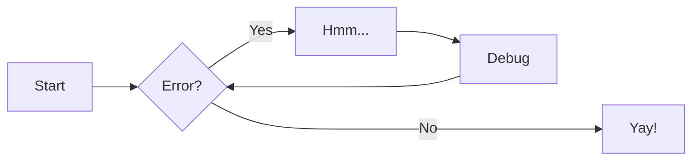

## Image with size and caption, centered

<figure markdown>
  { width="500" }
  <figcaption>Image caption</figcaption>
</figure>

## Explain words

In `assets/abbreviations.md` one can add words which will show automatically as tooltip. I.e. load cell.

## Hotkeys

Press ++esc++ to cancel or ++ctrl+alt+e++ to edit.

## Kaaviot

Mermaid tuettu:

