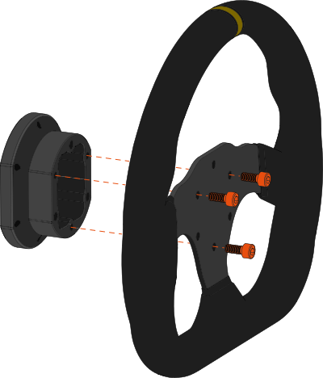

# 50.8mm / 70mm Adapter

Some formula style steering wheels may utilize a 50.8mm mounting pattern to allow the quick release to clear shift levers and other parts. 
Simucube 50.8 to 70mm Adapter can be used to mount Link Quick Release or other quick release parts with a 70mm mounting pattern to these type of wheels.

{ width="450" }
{ width="450" }

This 50.8mm adapter can be mounted to threaded and non-threaded wheels. The adapter also moves the quick release 30mm away from the wheel, 
to avoid contact with any levers.

## Package contents

{ width="450" }
{ width="450" }

| Item                     | Qty   |
| ------------------------ | ----- |
| 1. 50.8mm to 70mm Adapter     		  | 1 pc  |
| 2. Fastener kit   &ensp; &ensp; - M5x30 hex head screw   &ensp; &ensp; - M5x12 hex head screw  |   3 pcs   3 pcs|

## Installation - Wheels with through holes

### Step 1

!!! Info
    - Attach the adapter plate to a wheel with a 50.8mm mounting pattern using the three threaded holes of the adapter.
	- Use the M5x12 hex screws supplied with your quick release and a 4mm hex key.
	- *Note: Longer fasteners may be required for some wheels*

### Step 1.2

<figure markdown>
{width=450}
</figure>

!!! Info
    - For compatible wheels, locate the quick release connector inside the wheel.
	- Connect the wheel side QR wire to the circuit board of the wheel . 
	- Do not pull on the cable with force while doing this.
	- If the steering wheel does not support the data & power pass through features of Simucube 3 Quick Release, you can fold the cable inside the quick release, or remove the cable entirely.

### Step 2

!!! Info
    - Attach the wheel side quick release to the adapter plate, using the three mounting slots of the quick release.
	- Orient the quick release as shown in the figure above.
	- Use a 4mm hex key and the three (3) M5x16 hex screws **included with your wheel side quick release**.
	- **Do not use the threaded holes of the wheel side quick release.**

## Installation - Wheels with threaded holes

### Step 1

!!! Info
    - For wheels **with threads**, mount the adapter plate to the wheel using the three (3) through holes of the adapter.
	- Use the three (3) M5x30 hex screws included with your adapter and a 4mm hex key.
	
### Step 1.2

<figure markdown>
{width=450}
</figure>

!!! Info
    - For compatible wheels, locate the quick release connector inside the wheel.
	- Connect the wheel side QR wire to the circuit board of the wheel . 
	- Do not pull on the cable with force while doing this.
	- If the steering wheel does not support the data & power pass through features of Simucube 3 Quick Release, you can fold the cable inside the quick release, or remove the cable entirely.

### Step 2

!!! Info
    - Attach the wheel side quick release to the adapter plate, using the three mounting slots of the quick release.
	- Orient the quick release as shown in the figure above.
	- Use a 4mm hex key and the three (3) M5x16 hex screws **included with your wheel side quick release**.
	- **Do not use the threaded holes of the wheel side quick release.**