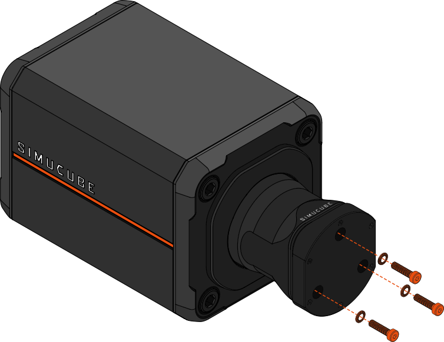

{width=550}
{width=550}

The 70mm Adapter for Simucube 3 is aimed at users who own a Simucube 3 wheelbase, but wish to use a 3rd party quick release system.
70mm adapter allows the wheelbase-side quick release part to be replaced with any 3rd party option that has a standard 70mm bolt pattern.

## Package contents

{ width="550" }
{ width="550" }

| Item                     | Qty   |
| ------------------------ | ----- |
| 1. Simucube 3 - 70mm adapter       | 1 pc  |
| 2. Fastener kit   &ensp; &ensp; - M5x20 hex head screw   &ensp; &ensp; - M5x16 hex head screw   &ensp; &ensp; - M5 locking washer  |   3 pcs   6 pcs   3 pcs |
| 2. Tool kit   &ensp; &ensp; - L-key 3 mm Hex   &ensp; &ensp; - L-key T10 Torx   |   1 pcs   1 pcs|

## Removing Link Quick Release

To begin installing the 70mm Adapter to your Simucube 3 wheelbase start by removing the original Link Quick Release male part. Do this by following the steps below:

### Step 1

{width=650}

!!! Info
	- Power off your wheelbase and unplug the power supply.
    - Remove the two (2) torx screws holding the circuit board, using a T10 torx key .
	- Remove the circuit board. A small flat head screwdriver may be used to pry around the screw holes of the board.
	- Disconnect the wire connecting the board to the wheelbase by pulling the connector.

!!! Warning
	The T10 torx screws can be damaged during removal if they are not opened with utmost care. Ensure that the key stays straight and maintain firm downwards pressure while turning the key.

### Step 2

{width=650}

!!! Info
    - Remove the three (3) hex screws using a 3mm hex key, and detach the quick release cone.

### Step 3

{width=650}

!!! Info
    - Fold the cable inside the slot in the axle of the wheelbase.

## Installing Adapter plate

After removing the original Link Quick Release male part from the wheelbase, attach the 70mm adapter plate to the motor shaft by following the instructions below:

### Step 4

{width=650}
{width=450}

!!! Info
    - Use a 4mm hex key to attach the three (3) supplied M5x20 hex screws and the locking washers to **tightly** attach the adapter plate.
	- **Pay attention to the orientation of the lock washers: The convex side of the washer should face the screw head.**
	- *Note: You may experience some resistance as the locking washer compresses during tightening.*
	
You may now attach your 3rd party quick release system to the threaded holes on the adapter plate. Use atleast three (3) of the available mounting holes.

Note that the thickness of the selected quick release part effects the lenght of the mounting screws to be used. The screws may not poke out more than 
10mm from the mounting surface of the quick release part. For thin quick release parts, additional fasteners may be required.