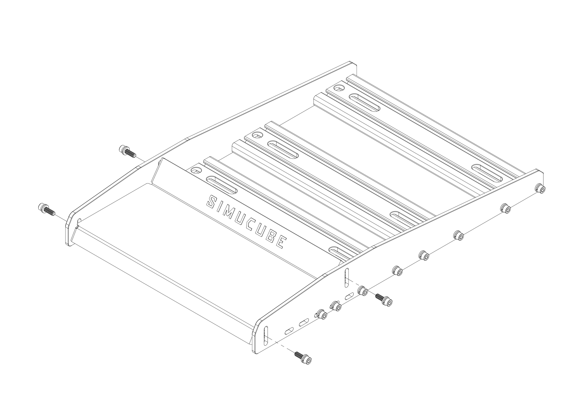
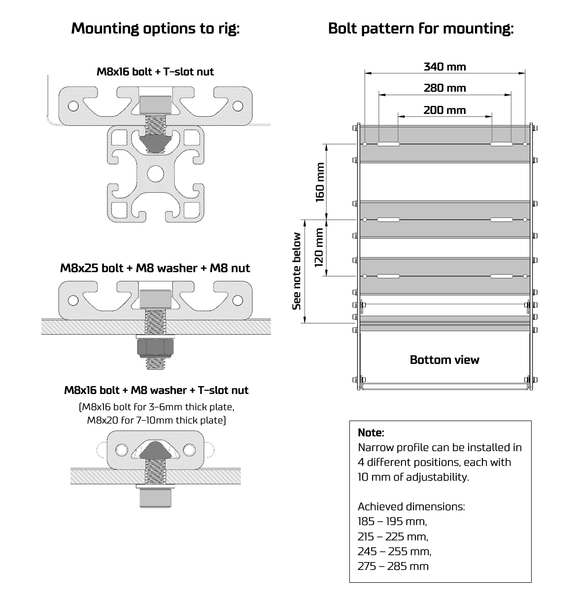

# Simucube Baseplate

Simucube Baseplate is a optional accessory that provides easy mounting, adjustability and comfort when using certain pedals. List of compatible pedals in [specifications](../ActivePedal/Specifications.md).

## Video guide

Video guide of ActivePedal Ultimate adjustments and Baseplate installation from time 1:37.

## Assembling Baseplate

Each screw joint in assembly consists of the M6 bolt, split lock spring washer and a washer. Assemble each screw as illustrated below.

Then, follow the step by step instructions as illustrated below.

Height and tilt of the foot rest can be set by loosening and tightening the following four screws in desired position.

## Mounting Baseplate to rig

Installing the baseplate to the rig depends on the rig model and construction. Most common methods are illustrated below.

## Specifications

### Compatible pedals

* Simucube ActivePedal (Ultimate & Pro)
* Heusinkveld Sim Pedal Sprint (with separately sold mounting kit)
* Heusinkveld Sim Pedal Ultimate
* Heusinkveld Sim Pedal Ultimate+
* Simtrecs ProPedal GT
* Meca CUP 1
* VRS DirectForce Pro

### Mounting options to rig

* Can be mounted to profile with 8 mm slots
* Can be mounted to plate ( supports Logitech, Thrustmaster and Fanatec bolt patterns)

### Package content

| Item                     | Qty   |
| ------------------------ | ----- |
| Side plate | 2 pc  |
| Heel plate | 1 pc  |
| Extrusion, narrow, length 360mm | 1 pc  |
| Extrusion, wide, length 360mm | 3 pc  |
| Screw kit - Assembly  &ensp; &ensp; - M6x20 allen head bolts   &ensp; &ensp; - M6 washers   &ensp; &ensp; - M6 lock washers   &ensp; &ensp; |	  20 pc   20 pc   20 pc |
| Screw kit - Installation  &ensp; &ensp; - M8x16 allen head bolts   &ensp; &ensp; - M8x20 allen head bolts   &ensp; &ensp; - M8x25 allen head bolts   &ensp; &ensp; - M8 washers   &ensp; &ensp; - M8 nylock nut   &ensp; &ensp; - M8 t-slot nut, 8mm slot   |   4 pc   4 pc   4 pc   4 pc   4 pc   4 pc |
| Hex key, 5mm | 1 pc  |
| Hex key, 6mm | 1 pc  |
| Assembly guide | 1 pc  |
