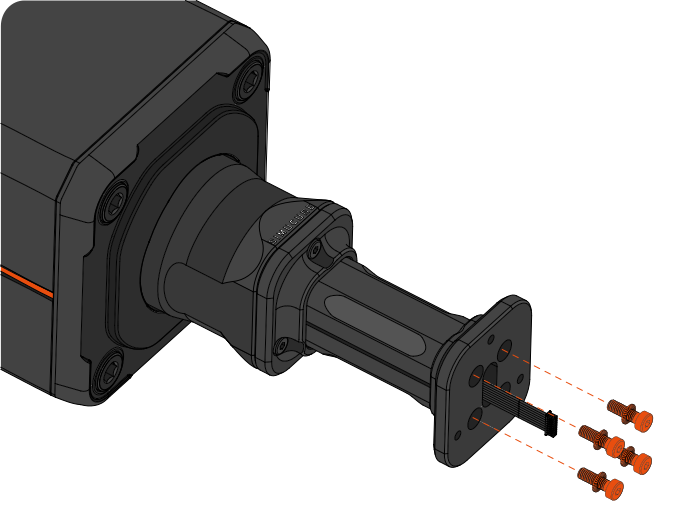
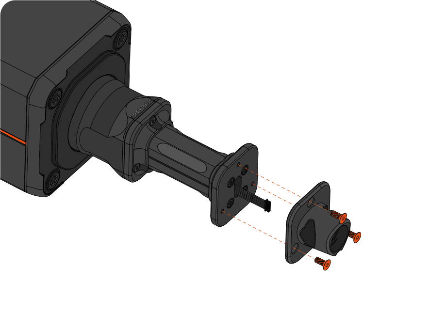
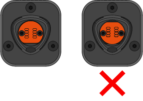

Simucube 3 wheel extension kit allows the user to improve rig ergonomics by moving the steering wheel further away from the wheelbase.
The narrow aluminium steering axle also allows the monitor to be placed as low as possible for improved vertical field of view, while still maintaining structural rigidness.

This kit comes with two extension shafts included to find your perfect lenght. The shorter shaft moves the steering wheel 100mm backwards, while 
the longer shaft moves it 200mm.

## Package contents

{ width="800" }
{ width="800" }

| Item                     | Qty   |
| ------------------------ | ----- |
| 1. Wheelbase side base plate  							 | 1 pc  |
| 2. Wheel side base plate          						 | 1 pc  |
| 3. Extension shaft, long (total extension 200mm)         	 | 1 pc  |
| 4. Extension shaft, sort (total extension 100mm)         	 | 1 pc  |
| 5. Extension cable, long						         	 | 1 pc  |
| 6. Extension cable, short						         	 | 1 pc  |
| 7. Fastener kit   &ensp; &ensp; - M5x16 allen head screw   &ensp; &ensp; - M5x12 countersunk allen head screw   &ensp; &ensp; - M5 Lock washer  |   11 pcs   3 pcs   11 pcs|
| 8. Tool kit   &ensp; &ensp; - L-key 3 mm Hex   &ensp; &ensp; - L-key T10 Torx  |   1 pcs   1 pcs|

## Removing Link Quick Release

To begin the installation of the Shaft Extension Kit, start by detaching the original Link Quick Release male part from the wheelbase. Do this by following the steps below:

### Step 1

{width=650}

!!! Info
	- Power off your wheelbase and unplug the power supply.
    - Remove the two (2) torx screws holding the circuit board, using a T10 torx key .
	- Remove the circuit board. A small flat head screwdriver may be used to pry around the screw holes of the board.
	- Disconnect the wire connecting the Link QR circuit board to the wheelbase by pulling the connector.
	- **Do not try to detach the cable from the wheelbase shaft. This will cause damage your wheelbase.**

!!! Warning
	The T10 Torx screws can be damaged during removal if they are not opened with utmost care. Ensure that the key stays straight and maintain firm downwards pressure while turning the key.

### Step 2

{width=650}

!!! Info
    - Remove the three (3) hex screws using a 3mm hex key, and detach the quick release cone.

## Assembly of extension shaft

There are two available extension shaft lenghts included in the package: 100mm & 200mm of total extension. Select the suitable extension lenght and follow the instructions below to install.

### Step 3

{width=650}

!!! Info
    - Attach either side of the selected extension shaft to the wheelbase side base plate with only **through holes**.
	- *Note: The two base plates are not identical. Do not use the base plate with three threaded holes for this step.*
	- Use four (4) supplied M5x16 screws and M5 lock washers to clamp the parts **tightly** together (sufficient torque ~6Nm) with a 3mm hex key. 
	- **Pay attention to the orientation of the lock washers: The convex side of the washer should face the screw head.**
	- *Note: You may experience some resistance as the locking washer compresses during tightening.*

### Step 4

!!! Info 
    - Select the suitable extension cable and connect it to the wheelbase.
	- Pass the connected cable through the wheel extension.
	- Use three (3) supplied M5x16 and M5 lock washers hex screws to **tightly** mount the extension to the wheelbase axle with a 3mm hex key (sufficient torque ~6Nm).

### Step 5

!!! Info
    - Attach the threaded wheel side base plate to the extension shaft. The orientation of the base plates should match.
	- Pass the cable through the slot in the base plate.
	- Use four (4) supplied M5x16 screws and M5 lock washers to clamp the parts **tightly** together (sufficient torque ~6Nm) with a 3mm hex key.

### Step 6

!!! Info
    - Attach the quick release male part to the extension with a 3mm hex key, and the three (3) m5x12 countersunk hex screws included with your package (sufficient torque ~5Nm).
	- Pass the cable through the slot in part.

### Step 7

{width=450}

!!! Info
    - Connect the cable to the circuit board, that was removed during step 1.
	- Attach the circuit board to the quick release part, while pushing the cable inside the extension shaft.
	- *Hint: If you have difficulty pushing the circuit board back to its place, you can try carefully twisting the extension cable 360 degrees.*
	- Use the two (2) torx screws that were removed during step 1 and a T10 Torx key to fasten the circuit board (max torque ~1,1 Nm).

!!! Warning
	The T10 Torx screws can be damaged during installation if incorrectly fastened. Ensure that the key stays straight and maintain firm downwards pressure while turning the key. Do not over tighten.

## Important note

{width=650}

!!! Warning
	- **Do not combine multiple extensions to increase extension lenght.**
	- Extending the steering axle over 200mm may cause damage to your wheelbase.