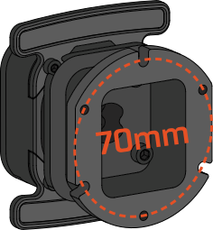

Simucube Link Quick Release offers a quick and reliable method of attaching steering wheels to your wheelbase. It features rock solid design with a stress-optimized P3G shape,
a quick locking attachment mechanism which remains silent during driving, and the support for wireless data and power transfer.

## Package contents

{ width="600" }
{ width="600" }

| Item                     | Qty   |
| ------------------------ | ----- |
| 1. Link Quick Release (incl. cable)    | 1 pc  |
| 2. Fastener kit   &ensp; &ensp; - M5x16 hex head screw   |   3 pcs|
| 3. L-key hex 3 mm      | 1 pc  |

---------------------------------------------------------------------

## Installation

Link Quick Release can be directly mounted on nearly any existing simulator steering wheel with a standard **70mm hole pattern** of either threaded or non-threaded holes. This allows the wheel to be quickly attached and detached from the wheelbase.

<figure markdown>
{width=250}
</figure>

For wheels with a smaller **50.8mm hole pattern,** a spacer-adapter is required. This part also functions with
threaded and non-threaded wheels. See more information at [50.8mm adapter](../Accessories/50.8Adapter.md).

The wireless data & power transfer features of Link Quick Release are supported on some Simucube Link compatible wheels. Whether or not these electronic features are supported by your steering wheel, Link Quick Release can still nevertheless be used for purely mechanical attachment purposes.

Follow the steps below to attach your Link Quick Release to a steering wheel.

### Connecting wheel electronics (compatible wheels only)

For compatible wheels, before mounting the quick release, locate the quick release connector inside the wheel.
Connect the cable of the Link Quick Release to the connector located on the circuit board of the wheel . 
**Do not pull on the cable with force while doing this.**

<figure markdown>
{width=450}
</figure>

For wheels with no electronic support for Link Quick Release features, the cable may be tucked inside the rectangular shaped cavity of the Quick Release.

After connecting the cable, follow the intallation instructions below based on the type of attachment holes your steering wheel uses.

### Wheels with through holes

!!! Info
	- For wheels **with no threads in** the mounting holes of the wheel, use the three (3) **threaded holes** on the Link Quick Release to mount it. 

### Wheels with threaded holes

 

!!! Info
	- For wheels **with threads** in the mounting holes of the wheel, use the three (3) **non-threaded slots** on the Link Quick Release to mount it.
