# Simucube Mount v2

{width=500}
{width=500}

>  **Simucube Mount v2 allows users to attach Simucube 2 and 3 wheelbases rigidly to several rig types while allowing for easy installation and a large adjustment range.**
>
> - CNC-machined aluminium construction ensures rigid attachment between the wheelbase and the rig.
> - Installation process is simplified with the new *"drop-down"* installation method.
> - Wheelbase tilt angle can be adjusted steplessly from -24° up to +20°.
> - Specifically designed adjustment slots create a variable pivot point, which allows the wheelbase to be tilted upwards without contacting the mounting surface.

>
> Simucube Mount v2 is compatible with all **Simucube 2** & **Simucube 3** wheelbases.

***

## Package contents

{ width="750" }
{ width="750" }

| Item                     | Qty   |
| ------------------------ | ----- |
| 1. Mount Wheelbase Bracket     		| 1 pc  |
| 2. Mount Lower Bracket     			| 1 pc  |
| 3. Fastener kit   &ensp; &ensp; - M8x18 flanged hex head screw   &ensp; &ensp; - M8x30 flanged hex head screw   &ensp; &ensp; - M6x16 hex head screw   &ensp; &ensp; - M8 washer   &ensp; &ensp; - M6 washer   &ensp; &ensp; - M8 T-slot nut  |   8 pcs   4 pcs   5 pcs   12 pcs   5 pcs   4 pcs |
| 4. L-key 5mm hex 						| 1 pc  |

***

## Dimensions

<figure markdown>
{width=750}
{width=750}
</figure>

<figure markdown>
{width=750}
{width=750}
</figure>

***

## Angle markings

<figure markdown>
{width=650}
{width=650}
</figure>

!!! Info
	- Current wheelbase angle can be roughly estimated with engraved angle markers on the side plates of the Mount.
	- When looking directly from the side, the marking aligned with the centerpoint of the screw head represents the measured angle.
	- When three consecutive markers are partly covered by the screw head, angle readout corresponds to the value of the middle marker.
	- On positive (+) angles, each marking represents +1°, whereas on negative (-) angles, each marking represents -4°.

***

## Installation method 1:
**No unmovable objects directly above wheelbase**

Simucube Mount v2 features a simplified *"drop-down"* installation method to mount your wheelbase without having to excessively balance and manoeuvre the heavy object.

If you have no unmovable monitors or other obstructions directly above your wheelbase, follow the instructions below to easily install your wheelbase using the Simucube Mount v2.

If you have a rigidly attached monitor or other obstructions above your wheelbase, see Installation option 2.

### Step 1: Attach lower bracket
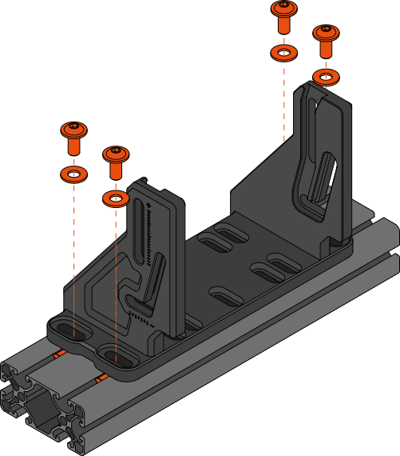{width=600}
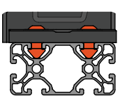{width=200}

!!! Info
	- Attach the lower bracket to your aluminium extrusion rig with the four (4) M8x18 hex screws with corresponding M8 washers using the outermost slots of the bracket.
	- Use a 5mm hex key and an appropriate torque of ~ 17Nm.
	- For rigs with different mounting patterns, use at least four M6x16 hex screws and corresponding washers with the smaller mounting slots. (Sufficient torque ~ 10Nm)

### Step 2: Attach wheelbase bracket

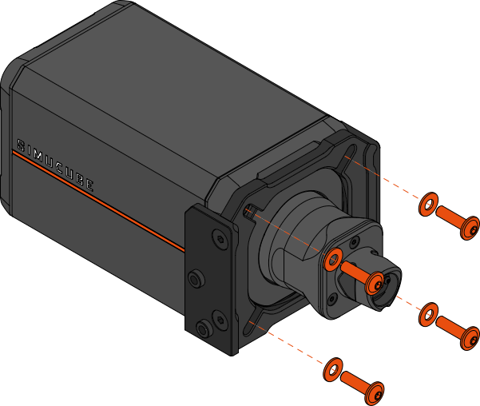{width=600}

!!! Info
	- Attach the wheelbase bracket to your wheelbase using the four (4) longer M8x30 hex screws with the corresponding M8 washers.
	- Use a 5mm hex key and an appropriate torque of ~ 17Nm.
	- *Note: Pay attention to orient the bracket as shown in the image above.*

### Step 3: Drop wheelbase into grooves

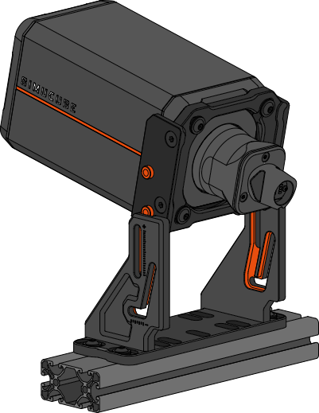{width=600}

!!! Info
	- Move your monitor and any other obstructions directly above the Mount aside.
	- Drop the wheelbase into the lower bracket by lining up the two locating pins on each side with the grooves of the lower bracket.
	
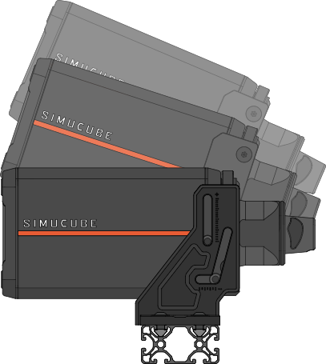{width=500}

!!! Info
	- Make sure all pins slide inside the grooves and lower the wheelbase until it reaches a perfectly horizontal position.
	- If you do not have the space above your Mount to drop the wheelbase down, see **Installation option 2**.

### Step 4: Adjust angle and lock in place

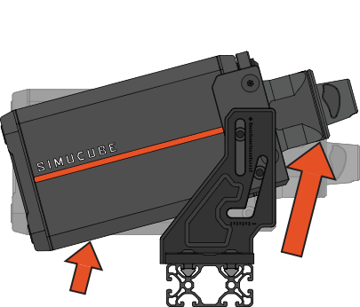{width=300}
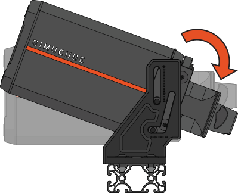{width=280}

!!! Info
	- To tilt your wheelbase upwards, lift the wheelbase upwards with both hands from **the motor shaft and the back of the wheelbase** while following the direction of the lower groove. 
	- To tilt your wheelbase downwards, push down on the motor shaft to rotate it around the end point of the upper groove.

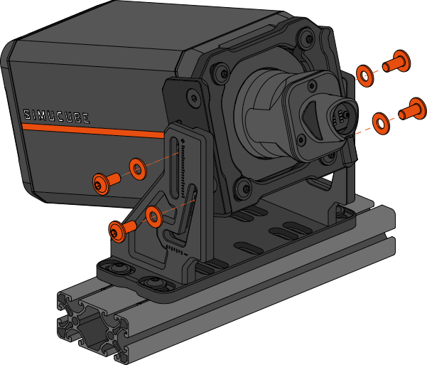{width=600}

!!! Info
	- After finding a suitable angle for your wheelbase, lock it in place using four (4) M8x18 hex screws and the corresponding washers.
	- Use a 5mm hex key and an appropriate torque of ~ 17Nm. **It is important these screws are tight.** 
	- *Hint: You can thread the screws almost all the way in before adjusting wheelbase angle, to make locking the selected angle easier.*

***

## Installation method 2:
**Wheelbase cannot be installed from above**

If installing the wheelbase from above is not possible due to unmovable monitors or other obstructions, Simucube Mount v2 can also be installed using a traditional method.

Follow the instructions below to install Mount v2 without dropping the wheelbase in place from above.

### Step 1: Assemble Mount
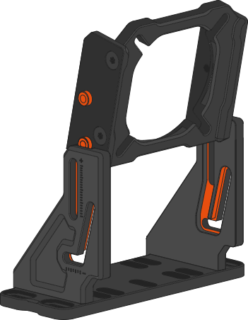{width=300}
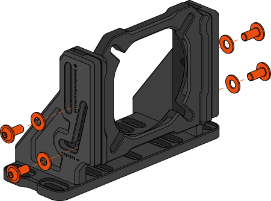{width=350}

!!! Info
	- Slide the wheelbase bracket into the lower bracket by lining up the two locating pins on each side with the grooves of the lower bracket.
	- Use four (4) supplied M8x18 screws with corresponding washers and a 5mm hex key to lock the rotation of the Mount during installation.

### Step 2: Attach Mount to rig
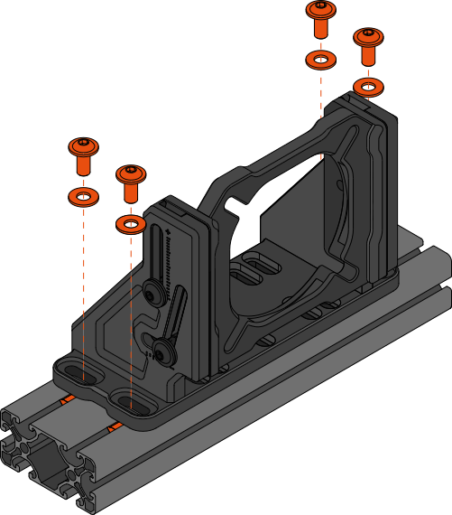{width=600}

!!! Info
	- Attach the Mount to your aluminium extrusion rig with the four (4) M8x18 hex screws with corresponding M8 washers using the outermost slots of the Mount.
	- Use a 5mm hex key and an appropriate torque of ~ 17Nm.
	- For rigs with different mounting patterns, use at least four M6x16 hex screws and corresponding washers with the smaller mounting slots. (Sufficient torque ~ 10Nm)

### Step 3: Attach wheelbase to Mount
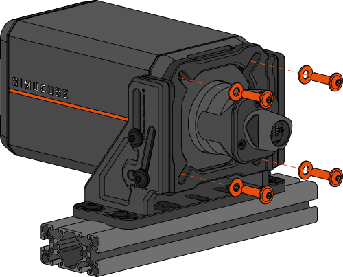{width=600}

!!! Info
	- Slide the wheelbase through the center hole of the Mount making sure the wheelbase flange slots into the bracket.
	- *Hint: If preferred, steps 1 and 2 can also be performed in a reverse order for an easier assembly process.*

### Step 4: Adjust angle and lock in place:
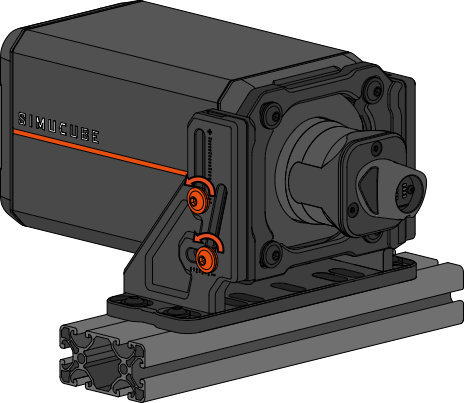{width=400}

!!! Info
	- To adjust wheelbase tilt angle, start by loosening or removing the locking screws on both sides of the Mount using a 5mm hex key.

{width=300}
{width=280}

!!! Info
	- To tilt your wheelbase upwards, lift the wheelbase upwards with both hands from **the motor shaft and the back of the wheelbase** while following the direction of the lower groove. 
	- To tilt your wheelbase downwards, push down on the motor shaft to rotate it around the end point of the upper groove.
	
{width=600}

!!! Info
	- After finding a suitable angle for your wheelbase, lock it in place using four (4) M8x18 hex screws and the corresponding washers.
	- Use a 5mm hex key and an appropriate torque of ~ 17Nm. **It is important these screws are tight.** 
	- *Hint: You can thread the screws almost all the way in before adjusting wheelbase angle, to make locking the selected angle easier.*

***

## Inverted installation:

The large negative tilt range of Simucube Mount v2 allows the wheelbase to also be mounted below the cross beam of some **compatible rigs**. This installation method can allow the monitor to be placed lower
and create additional space for the driver's legs.

This mounting option works best on rigs with tall upright profiles. A Simucube 3 Shaft Extension Kit may be used to further improve ergonomics.

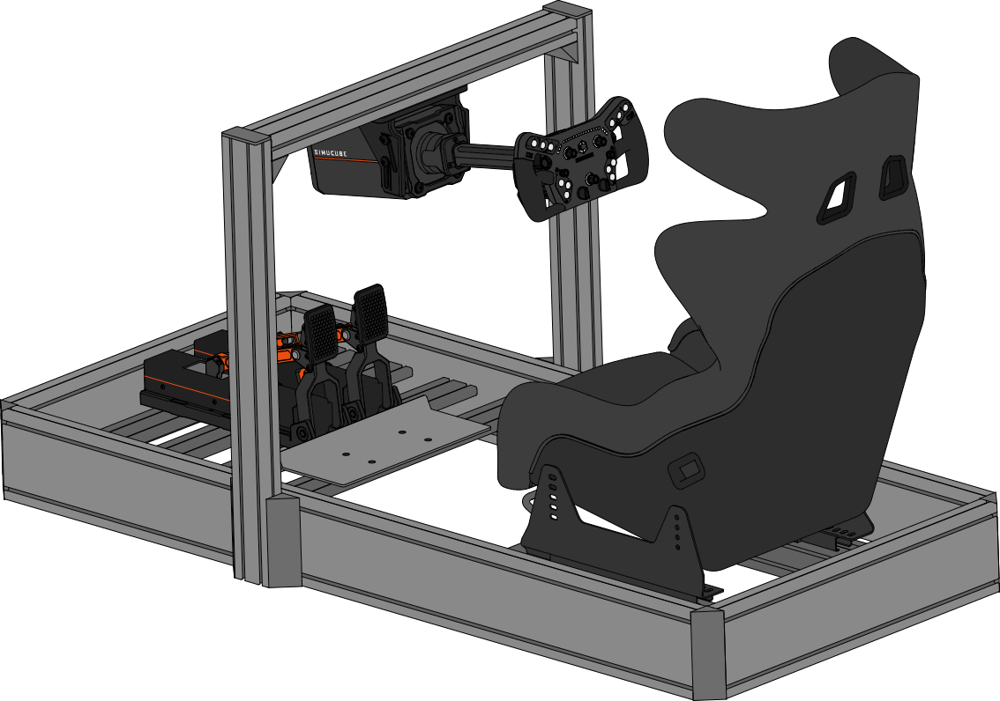{width=700}

!!! Warning
	When installing the wheelbase upside down, do not let go of the wheelbase before it has been secured with the angle locking side screws. Dropping the wheelbase may cause injuries and/or damage to the device not covered by the warranty.
	**Inverted mounting is only recommended for advanced users, and may require an additional person to help with safe installation.**

### Step 1: Attach lower bracket
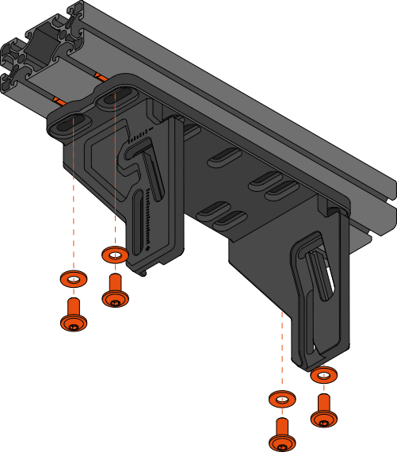{width=600}

!!! Info
	- Attach the lower bracket to the bottom of the aluminium extrusion cross beam of the rig with the four (4) M8x18 hex screws and corresponding M8 washers using the outermost slots of the bracket.
	- Use a 5mm hex key and an appropriate torque of ~ 17Nm.
	- For rigs with different mounting patterns, use at least four M6x16 hex screws and corresponding washers with the smaller mounting slots. (Sufficient torque ~ 10Nm)
	
	
### Step 2: Attach wheelbase bracket

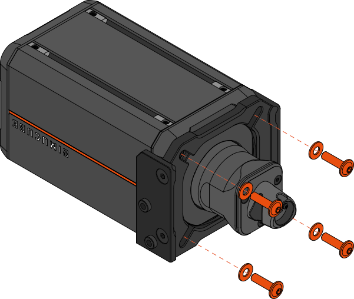{width=600}

!!! Info
	- Attach the wheelbase bracket to your wheelbase using the four (4) longer M8x30 hex screws with the corresponding M8 washers.
	- Use a 5mm hex key and an appropriate torque of ~ 17Nm.
	- *Note: Pay attention to orient the bracket as shown in the image above.*
	
### Step 3: Lift the wheelbase into the bracket
	
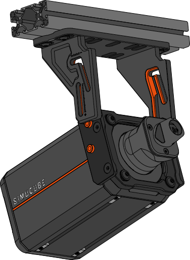{width=250}
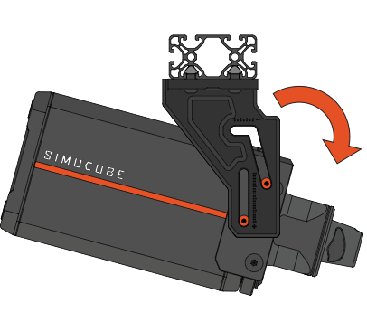{width=350}

!!! Info
	- With two hands, lift the wheelbase into the Mount by aligning the grooves of the lower bracket with the pins of the wheelbase bracket.
	- Lift the wheelbase upwards until you reach the top of the groove. Then start rotating the wheelbase forwards while simultaneously lowering it so that the wheelbase reaches the position where it points towards the ground.
	
!!! Warning
	**Do not let go of the wheelbase before it has been secured in place with screws. Incorrect wheelbase positioning during this step may lead to the device dropping.**

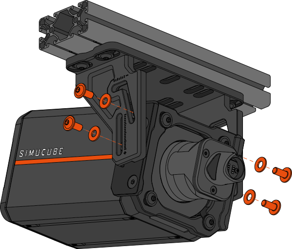{width=350}
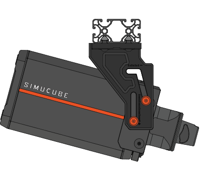{width=350} 

!!! Info
	- Without letting go of the wheelbase, thread in all four (4) M8x18 hex screws and corresponding M8 washers through the adjustment slots of the bracket. Do not fully tighten these screws yet.
	- **You may now carefully stop supporting the wheelbase, while simultaneously observing that the device does not begin to fall.**
	
### Step 4: Adjust angle and lock in place

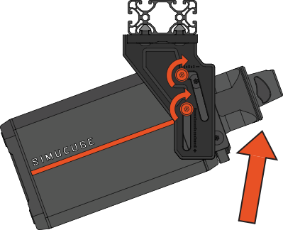{width=450}

!!! Info
	- With the side screws loosely threaded, you can now lift the wheelbase back up to the horizontal position and adjust the tilt angle.
	- After setting the wheelbase tilt angle, tighten the four side screws.
	- Use a 5mm hex key and an appropriate torque of ~ 17Nm. **It is important these screws are tight.** 

