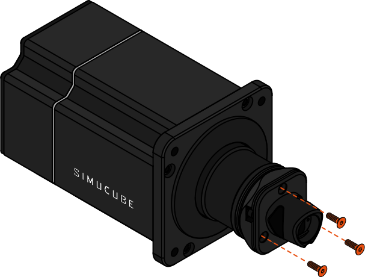

{ width="450" }
{ width="450" }

The Link Quick Release Adapter for Simucube 2 allows users to mount the new Simucube Link Quick Release to their existing Simucube 2 wheelbase to utilize the improved locking mechanism of Link Quick Release. 

**Simucube 2 wheelbases do not support the wireless data and power transfer features of Link Quick Release.** Data transfer must still be performed via bluetooth connection or an external cable.

## Package contents

{ width="600" }
{ width="600" }

| Item                     | Qty   |
| ------------------------ | ----- |
| 1. Link Quick Release male side     | 1 pc  |
| 2. Simucube 2 - Link Quick Release Adapter      | 1 pc  |
| 3. Fastener kit   &ensp; &ensp; - M5x20 hex head screw   &ensp; &ensp; - M5x12 hex head countersunk screw   |   4 pcs   3 pcs |
| 3. Tool kit   &ensp; &ensp; - L-key 4 mm Hex   &ensp; &ensp; - L-key 3 mm Hex   |   1 pcs   1 pcs |

## Installation option 1

To replace your existing original quick release (SQR1) system with Link Quick Release, the original wheelbase side quick release part may be replaced by following the steps below.
This mounting option provides the most rigid connection between the wheelbase and the quick release.

### Step 1

{width=650}

!!! Info
	- Power off your wheelbase and unplug the power supply.
    - Remove the three (3) hex screws securing the quick release part, using a 4mm hex key.
	- *Note: These screws may require moderate force to untighten.*

### Step 2

{width=650} 

!!! Info
	- Use a 4mm hex key with the three (3) of the M5x20 hex screws included in the package to secure the adapter plate to the shaft of the wheelbase. 

### Step 3

{width=650}

!!! Info
	- Use the three (3) supplied countersunk M5 screws with a 3mm hex key to secure the quick release to the adapter plate.

## Installation option 2

If you wish to keep using steering wheels with the original quick release female part still attached, Link Quick Release can be used in conjunction with original quick release
by following the steps below. **Note that the wedge shaped SQR1 wheel side part is not included with this adapter.**

### Step 1

{width=650}

!!! Info
    - Attach the adapter plate to a SQR1 female part *(not included)* using the four threaded holes of the adapter.
	- Use all four (4) supplied M5x20 hex screws and a 4mm hex key.
 
### Step 2
 
{width=650}

!!! Info
    - Attach the Link Quick Release male part using the three threaded holes of the adapter.
	- Use the three (3) supplied M5x16 countersunk hex screws and a 3mm hex key.
	
### Step 3

{width=650}

!!! Info
    - Secure the assembly to the wheelbase using the original SQR1 male part and locking pin.
	- You may now use either of the quick release systems to detach steering wheels.
