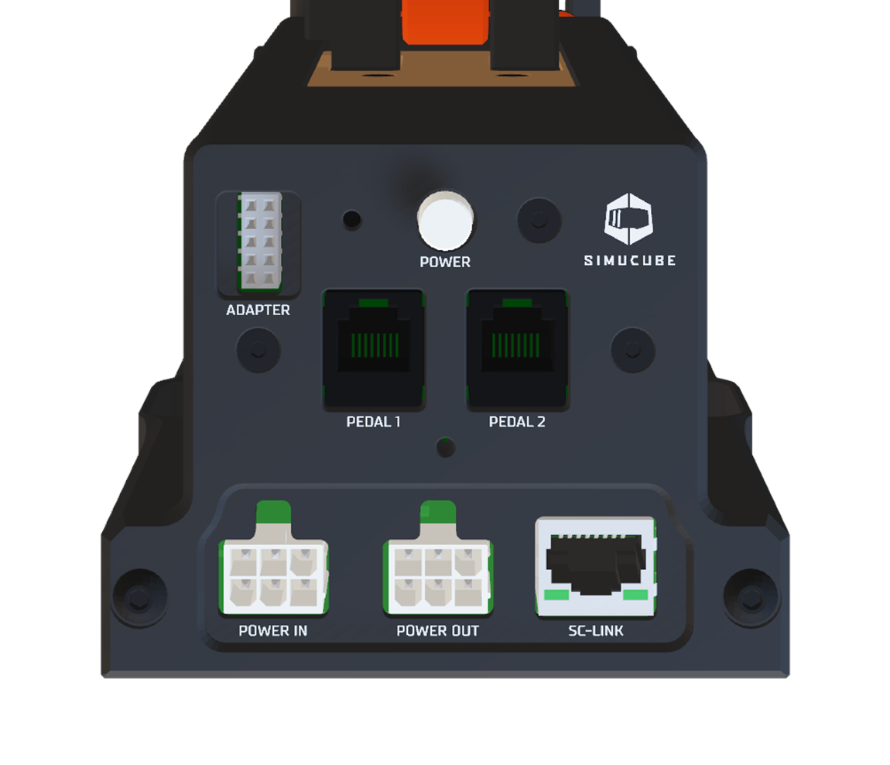

## Overview

Description of ports below.

| Port              | Description                                      | Usage                                                                                                                                           |
| ----------------- | ------------------------------------------------ | ----------------------------------------------------------------------------------------------------------------------------------------------- |
| POWER IN          | DC power supply input                            | Connect power source (DC power supply or POWER OUT of another pedal)                                                                            |
| POWER OUT         | DC power output for the next ActivePedal         | Power source for the next daisy chained ActivePedal                                                                                             |
| SC-LINK           | Simucube Link port                               | Connect Simucube Link Hub directly or through Ethernet switch here                                                                              |
| PEDAL 1 & PEDAL 2 | Port for external load cell based passive pedals | Connect optional external passive pedal(s) here. Before connecting ensure if the passive pedal is directly compatible, or is an adapter needed. |
| ADAPTER           | Expansion port reserved for future use           | Do not connect                                                                                                                                  |
| POWER             | Power on/off button                              | When pressed, device is powered on                                                                                                              |

## Typical installations

The illustration below demostrates the typical configurations of ActivePedal. ActivePedal kits will come with the necessary cables.

!!! Info "Connecting passive pedals"
    Passive pedals that are not designed for ActivePedal connector will require an adapter cable. Check navigate to Accessories section for current availability. 

    For example Simucube Throttle is directy compatible (no adapter needed) and Heusinkveld pedals require an adapter cable.

!!! Warning
    To avoid damaging devices and prevent physical hazards, make changes to cabling only when DC power source has been **fully unplugged** from the mains input (house wall AC power socket). Powering off with POWER button alone is not sufficient.