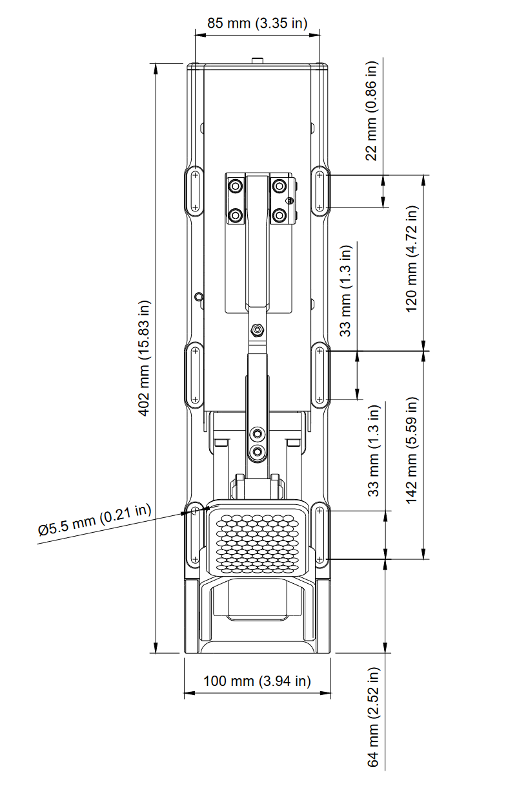

## Dimensions

## Pedal travel range

Illustration of maximum pedal travel range when combining motorized movement range *and* the pedal offset adjustment range. For further details, see [mechanical adjustments](Mechanical%20adjustments.md) page. In this illustration:

* Pedal face height adjustment in the middle position
* Pedal travel & force range has been set into the longer stroke option
* Pedal face angle in the "least tilted" option

## Mounting hole footprint

Printable footprint with dimensions (A4 size, print in actual size)

[:material-download-circle: Simucube ActivePedal footprint](assets/activepedal-mounting-hole-dimensions.pdf)

## 3D models

[:material-download-circle: Simucube ActivePedal (2023)](assets/ActivePedal 2023 3D model.step)

[:material-download-circle: Simucube ActivePedal standard pedal face (2023)](assets/ActivePedal 2023 pedal face 3d model.step)

[:material-download-circle: Simucube Baseplate (2023)](assets/Baseplate 2023 3d model.step)

Granite Devices Inc. is the copyright owner of all models and drawings. All rights reserved. For commercial use or reproduction, contact Granite Devices for permissions.
