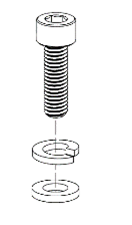
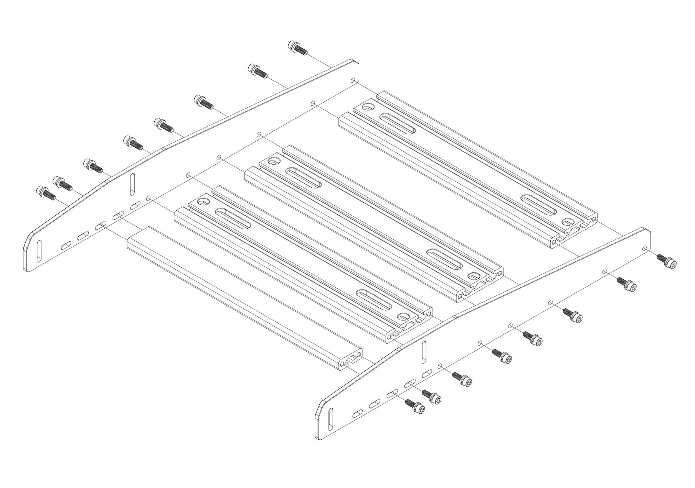
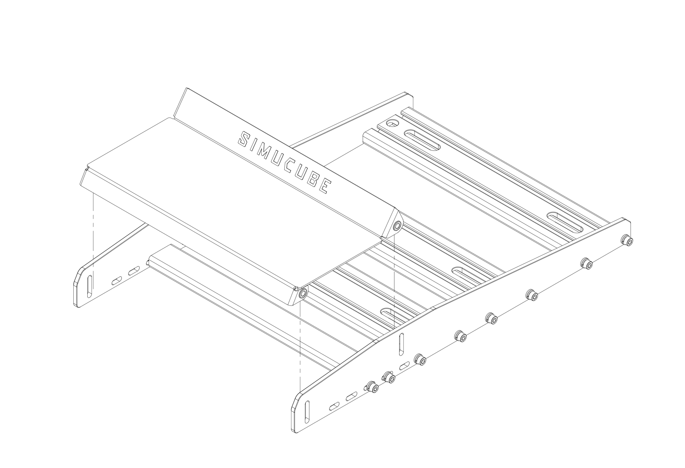
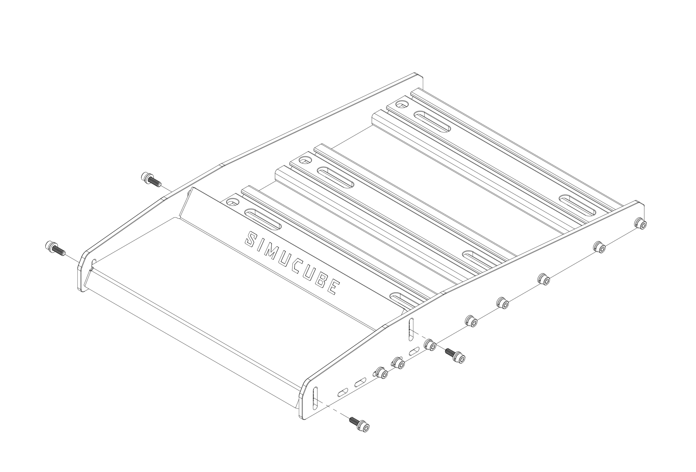
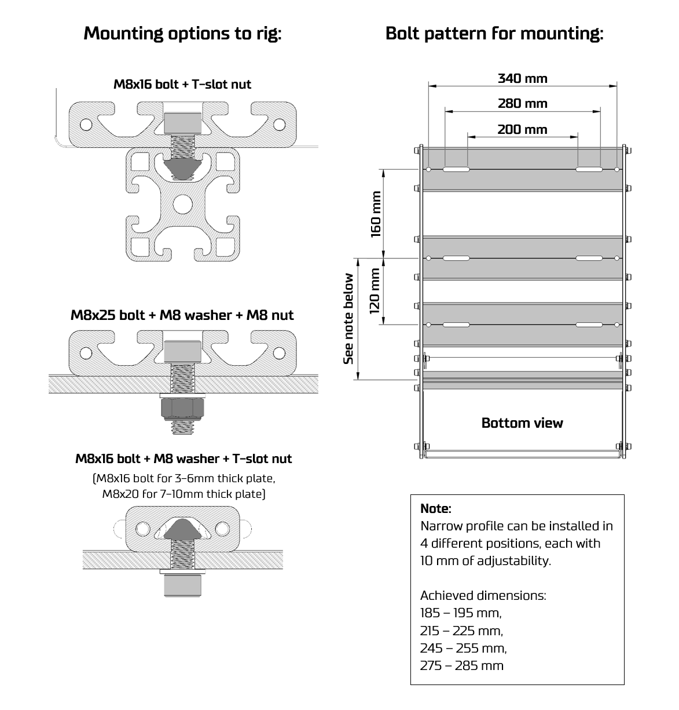

# Simucube Baseplate

Simucube Baseplate is a optional accessory that provides easy mounting, adjustability and comfort when using certain pedals. List of compatible pedals in [specifications](Specifications.md#simucube-baseplate).
 
## Assembling Baseplate

Each screw joint in assembly consists of the M6 bolt, split lock spring washer and a washer. Assemble each screw as illustrated below.

Then, follow the step by step instructions as illustrated below.

## Mounting Baseplate to rig

Installing the baseplate to the rig depends on the rig model and construction. Most common methods are illustrated below.

# Mounting ActivePedal directly to the rig

ActivePedal may be mounted also without Baseplate directly to the rig. Installation method depends on the rig model and construction. Most common methods are illustrated below.

<figure markdown>
{ width="350" }
<figcaption>Mounting on slotted profile with T nuts</figcaption>
</figure>

<figure markdown>
{ width="350" }
<figcaption>Mounting on through-hole plate</figcaption>
</figure>

# ActivePedal mounting 

In all above installation methods, ActivePedal itself is mounted by clamping it down by 4 to 6 pcs of M5 theaded screws with washers. 

For ActivePedal footprint dimensions, see [specifications](Specifications.md).

!!! Info
    Minimum of four (4) screws must be used in clamping, but use all six (6) if possible. Tighten screws to sufficient torque (~2 Nm).

!!! Tip
    *If* you're limited using four (4) screws *and* you can choose which ones to use, then prefer to use the **front** side and the **back** side screw holes of the pedal. This likely yields stiffer installation which in turn helps the dynamic performance and reduces the chance of oscillation.

