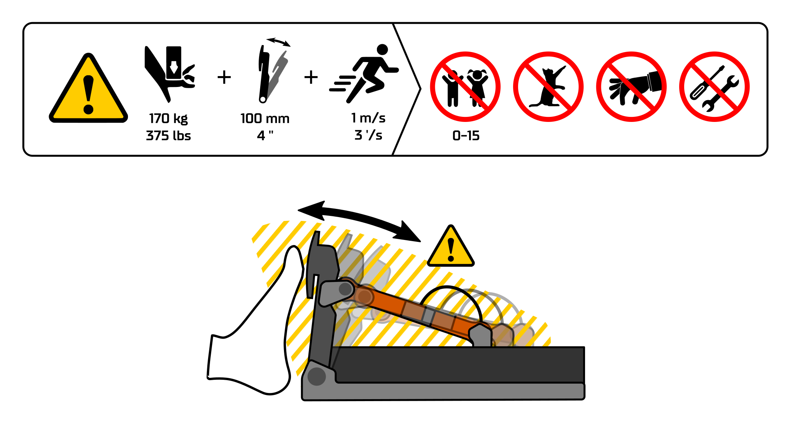

## :flag_gb: Safe use 

Device's motor powered moving parts may induce serious injury. Keep the moving parts clear and free to move while the power cord is plugged in.

Only physically fit adult person may operate the device. Always keep children and pets away from the device.

While powered on, touch the pedal face only with the ball of the foot and be prepared for sudden and strong push, pull or oscillating motion.

### Hazards

- Moving parts
- Pinch point
- High forces
- Fast motion
- Sudden movement
- Strong vibration

## :flag_de: Sichere Verwendung

Das Gerät darf nur von einer körperlich gesunden erwachsenen Person bedient 
werden. Das Gerät darf nicht in der Nähe von Kindern oder Tieren betrieben werden. 

Halten Sie die beweglichen Teile frei und bewegen Sie sie nicht unter Strom. 
Körperteile, Tiere, Kabel und andere Gegenstände von den beweglichen Teilen fernhalten. 

Eingeschaltete Pedalfläche nur mit dem Fußballen berühren. Achten Sie auf 
plötzliche und starke Druck-, Zug- oder Pendelbewegungen

### Gefahren

- Bewegliche Teile
- Quetschungsbereich
- Hohe Kräfte
- Schnelle Bewegung
- Plötzliche Bewegung
- Starke Vibration

## :flag_es: Uso seguro 

El dispositivo solamente se puede operar por una persona adulta en buena forma física. No encienda el dispositivo cerca de niños o animales. 

Mantenga las piezas móviles despejadas y libres para moverse mientras esté encendido. Mantenga alejados partes del cuerpo, animales, cables y demás elementos. 

Cuando esté encendido, toque la cara del pedal solamente con la punta del pie y esté preparado para un movimiento oscilante, de empuje o tracción repentino y fuerte.

### Peligros

- Piezas móviles
- Punto de fijación
- Fuerzas elevadas
- Movimiento rápido
- Movimiento repentino
- Vibraciones fuertes

## :flag_fr: Utilisation en toute sécurité

Seule une personne adulte considérée comme apte sur le plan physique peut utiliser l'appareil. Ne faites pas fonctionner l’appareil à proximité d’enfants ou d'animaux.

Veillez à ce que les pièces mobiles soient dégagées et puissent se déplacer librement lorsqu'elles sont sous tension. Éloignez les parties du corps, les animaux, les câbles et 
autres objets.

Lors de la mise sous tension, touchez la surface de la pédale uniquement avec la pointe du pied et préparez-vous à un mouvement soudain et puissant de poussée, de traction ou d'oscillation. 

### Dangers

- Pièces mobiles
- Point de pincement
- Forces élevées
- Déplacement rapide
- Mouvement soudain
- Fortes vibrations

## :flag_it: Utilizzo sicuro

Il dispositivo può essere azionato unicamente da persone adulte e fisicamente idonee. Non accendere il dispositivo in prossimità di bambini o animali. 

Con il dispositivo acceso, assicurarsi che le parti mobili possano muoversi liberamente e senza ostacoli. Tenere a distanza parti del corpo, animali, cavi e altri oggetti.

All’accensione, premere la superficie del pedale solo con l’avampiede e prepararsi 
a forti movimenti improvvisi di spinta, trazione o oscillazione.

### Pericoli

- Parti mobili
- Punto di schiacciamento
- Forze elevate
- Movimento rapido
- Movimento improvviso
- Forti vibrazioni

## :flag_pt: Utilização segura

O dispositivo apenas pode ser utilizado por uma pessoa adulta fisicamente apta. Não ligue o dispositivo próximo de crianças ou animais.

Mantenha as peças em movimento desimpedidas e livres para se moverem quando o dispositivo estiver ligado. Mantenha afastadas partes do corpo, animais, cabos e outros artigos.

Quando ligado, toque no pedal apenas com a almofada plantar do pé e esteja preparado para qualquer movimento súbito e forte de empurrar, puxar ou oscilar.

### Riscos

- Peças em movimento
- Ponto de entalamento
- Forças elevadas
- Movimento rápido
- Movimento súbito
- Vibração forte

## :flag_fi: Turvallinen käyttö

Laitteen moottoroidusti lilikkuvat osat voivat aiheuttaa vakavan vamman. Pidä liikkuvat osat vapaana esineistä ja kehon osista aina kun virtajohto on kytketty.

Vain fyysisesti terveet aikuiset ihmiset saavat käyttää laitetta. Pidä lapset ja lemmikkieläimet aina loitolla laitteesta.

Kun laite on kytketty päälle, kosketa poljinosaa ainoastaan päkiällä ja ole valmiina yhtäkkisiin voimakkaisiin liikkeisiin ja tärinään.

### Vaarat

- Liikkuvia osia
- Leikkausvaara
- Suuret voimat
- Nopea liike
- Yhtäkkinen liike
- Voimakas tärinä
