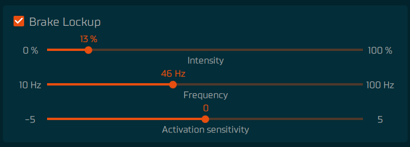

The effects use telemetry from a simulator to create different kinds of effects. The effects have limited simulator support but the support will keep increasing as the time goes on. See [Game setup](../games/index.md) for complete list of supported games and effects, and required steps to enable the telemetry support from the game.

## Motor vibration

Motor vibration is a vibration effect which frequency changes based on car RPM.

- Frequency multiplier: Used to change the vibration frequency range.
- Intensity: Used to adjust how powerful the vibration is.
- Low and high RPM balance: Used to the change the intensity based on RPM.

## ABS

ABS effect simulates brake ABS feeling when ABS activates.

- Frequency: Frequency of ABS pulses when ABS activates.
- Intensity: Used to adjust how powerful the ABS effect is.
- Smoothness: Used to adjust how coarse the effect feels.

## Traction control

Traction control activation can be felt, when this effect is enabled.

- Frequency: Frequency of pulses when traction control activates.
- Intensity: Used to adjust how powerful the effect is.

## G-force

The effect simulates feeling of G-forces pushing the driver towards the seat belts and the pedals during braking and the sinking in the seat when accelerating.

The effect has two sides, the movement and the texture. The movement is slow adjustment of the pedals position that causes the main feeling of the g-forces. The texture side provides small sharper effects that react to shorter changes in the acceleration of the car like switching gears or colliding.

Movement speed controls how quickly movement effect reaches the maximum pedal movement. Increasing it will provide shorter and sharper effect. Max pedal movement specifies how much the pedal position can differ from its normal position based on the force curve and other pedal feel adjustments.

## Brake threshold vibrations

Brake threshold vibrations allow getting notification when the game input reaches the defined trigger level. This allows optimizing braking patterns to avoid tire wear or lock up. This effect doesn't require any telemetry data from the game so it is always available regardless of the game.

Trigger input level slider defines the brake game input that must be reached for the effect to activate. Intensity slider controls the strength of the first vibration and vibrations are reduced from that based on the fade slider value. Setting fade to 100% means that effect is only single vibration

that occurs when going past the trigger level. Effect resets when going below 20% game input.

Effect frequency slider controls the frequency of the vibrations.

## Clutch bite point

Clutch bite point effects gives vibrations when the game input is near the defined trigger level. Vibration is stronger closer the pedal is to the trigger point. Effect feel is controlled by intensity slider which increases the strength of the vibrations and frequency slider that controls the frequency of the effect. Trigger smoothness slider controls the width of the trigger zone, increasing it will make the effect less pin point around the defined trigger level.

## Brake Lockup

Gives vibration feedback when brakes/wheels lock during braking. Intensity slider controls the amplitude of the vibration. Activation sensitivity affects how easily effect triggers on micro-lockups that occur in trail braking, when one of the wheel briefly locks when turning in a corner. Higher activation sensitivity will trigger the effect more easily and often.

Effect strength and frequency change with the car speed and lockup severity.

