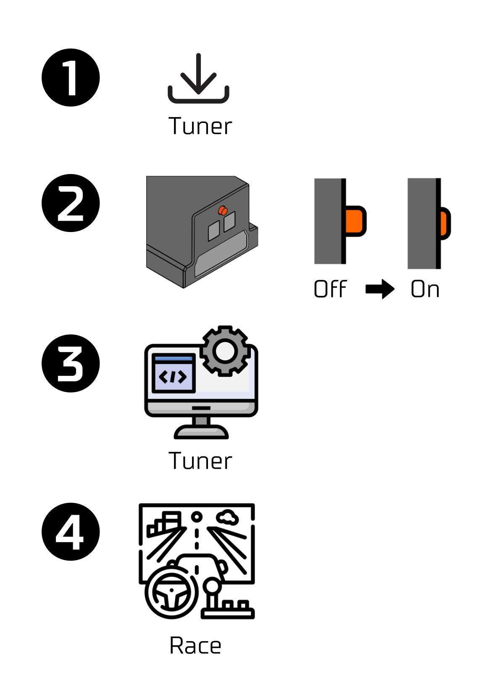

# First use

{ width="450" }

## 1. Install Tuner

Simucube Tuner is a configuration software for ActivePedals. To get started [download Tuner](../../Tuner/Download.md) and launch the installer.

## 2. Check cabling

If you haven't done connections yet, see [cabling](../Cabling.md).

## 3. Power on

After the installation steps are completed it is time to turn on the ActivePedal. This is done by pressing the button on the backside of the pedal.

## 4. Software configuration

### Device state indicators

On a device panel there may be a colored circle beside the device name. 

- Nothing: Everything is ok.
- Yellow: Pedal has not been configured correctly.
- Red: Something is wrong with the ActivePedal and it has faulted.

### Firmware update

ActivePedal is shipped without firmware. Therefore, when the Simucube Tuner software is started for the first time, firmware update is needed. This is also indicated on a top left corner of the software. Press the indication text or bottom left corner "firmware update" -button to open a pop-up which tells all the devices that can be updated. Updating the device firmware is done by pressing the update button. Close pop-up when ready.

### First startup

When the firmware is updated, the ActivePedal is seen as a new device in device panel on the left side of the application. There is a yellow indicator which means that device has not been configured correctly yet. Press the device on the device panel.
As part of the first time setup, user is asked to calibrate the force sensor. Force sensor calibration button is highlighted. Press the button to calibrate the force sensor.

!!! Info
    Do not press or move pedal when performing calibration or while saving configuration. Instead let pedal stay untouched until the calibration dialog is closed.

More about configuration and calibration on the next section.

## 5. Test drive

Launch your simulator and take your first test drive.