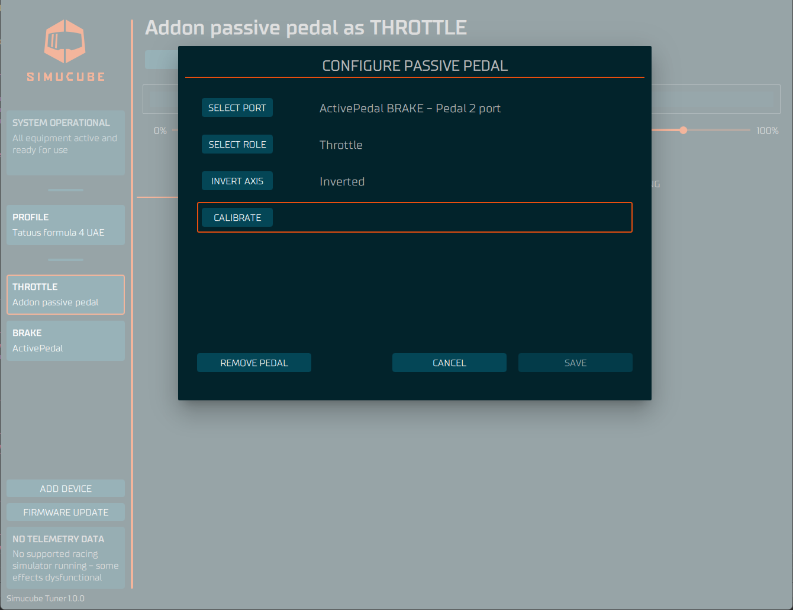
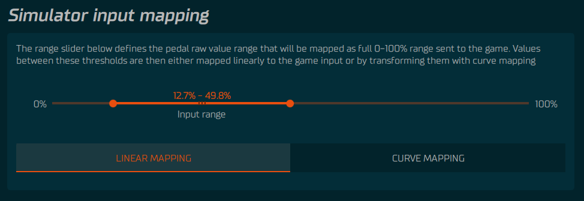
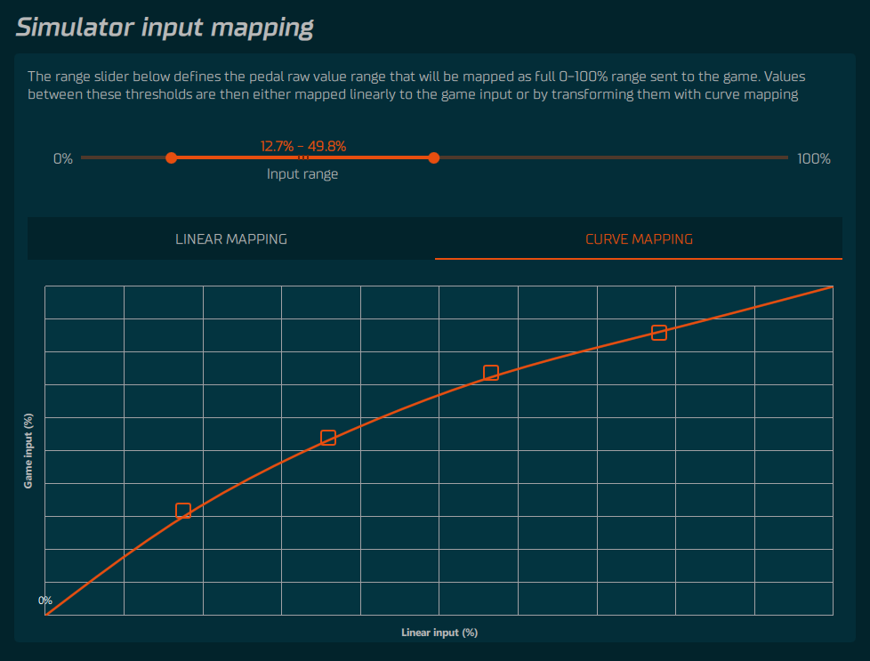

Passive pedals can be used with an ActivePedal. To use external pedals connected to ActivePedal they need to be added as a device to Tuner.

## Adding passive pedal

To add passive pedal, press Add device -button found on bottom left corner of the Tuner and select "Passive pedal". Now a new device is seen on a device panel. The device has not been configured and therefore it shows yellow circle (not configured). Press the passive pedal on the device panel.

## Initial configuration and calibration

On a passive pedal configure view select to which port the passive pedal is connected (1 or 2) and select pedal role: brake, throttle or clutch. 

To calibrate the passive pedal, press the calibrate button. Then fully press the passive pedal and release it a few times. This way the range of the pedal is recorded. After this is done, press ok. Invert axis if needed.

## Passive pedal input mapping and dead zones

From the main passive pedal view, the input range slider is used to setup dead zones for your pedal. The range slider defines the pedal raw value range that will be mapped as full 0-100% range sent to the game.

The force data can be sent to the simulator directly by using linear mapping or it is also possible to customize how the force data is sent to the simulator by selecting "curve mapping". The custom mapping setup is done by dragging nodes on curve mapping graph.

