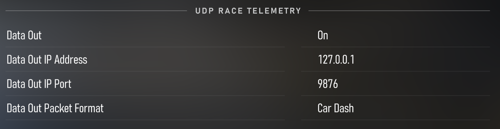

# Forza Motorsport 8

### Setup

Telemetry needs to be enabled in-game from the settings menu. Navigate to  SETTINGS > GAMEPLAY & HUD > "UDP RACE TELEMETRY" header and set:

1. Data out: ON
2. Data out IP Adress: 127.0.0.1
3. Port: 9876
4. Data out packet format: Car Dash

## FAQ

### Tuner detects the game running but says "Waiting for telemetry data from the game" even when simulation is already running

This indicates that Tuner does not receive telemetry data from the game. This can be due to configuration not matching
the above default configuration.
 
This game uses UDP technology to deliver telemetry data. Only one application can listen to a single UDP port at once.
That primary telemetry receiver must then forward the telemetry data for other application that require data.
So if any other app is using this game's telemetry data (i.e. Simhub), then Tuner connection to data may be blocked.

Instead use some other port in the game and in SimHub (for example 9877),
and then forward the telemetry data to Tuner and port 9876 following [these instructions](https://github.com/SHWotever/SimHub/wiki/Sharing-UDP-data-with-other-applications).