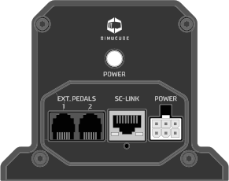

## Overview

Description of ports below.

{width="650"}

| Port              | Description                                      | Usage                                                                                                                                           |
| ----------------- | ------------------------------------------------ | ----------------------------------------------------------------------------------------------------------------------------------------------- |
| POWER             | DC power supply input                            | Connect power source (DC power supply)                                                                                                          |
| SC-LINK           | Simucube Link port                               | Connect Simucube Link Hub directly or through Ethernet switch here                                                                              |
| EXT. PEDALS       | Port for external load cell based passive pedals | Connect optional external passive pedal(s) here. Before connecting ensure if the passive pedal is directly compatible, or is an adapter needed. |
| POWER             | Power on/off button                              | When pressed, device is powered on                                                                                                              |

## Typical installations

The illustration below demostrates the typical configurations of ActivePedal Pro.

!!! Info "Connecting passive pedals"
    Passive pedals that are not designed for ActivePedal connector will require an adapter cable. Navigate to Accessories section for current availability. 

    For example Heusinkveld pedals require an adapter cable.

{width="900"}
{width="900"}

!!! Warning
    To avoid damaging devices and prevent physical hazards, make changes to cabling only when DC power source has been **fully unplugged** from the mains input (house wall AC power socket). Powering off with POWER button alone is not sufficient.