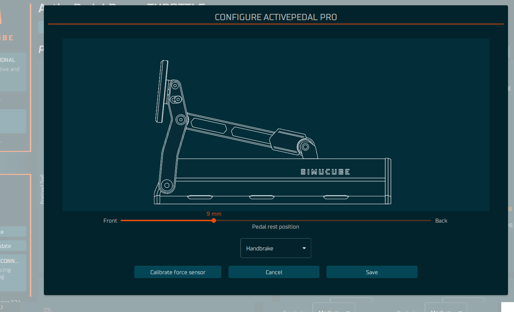

## Configuration

When the device tab is viewed for the very first time, the device configuration window is displayed automatically and calibration is forced. After this, the configuration can be launched from a configure -button on top of the device window.

!!! Info
    Follow the setup procedure in the following order.

### 1 - Set pedal starting position

Set pedal starting position by moving pedal rest position slider. Pedal moves to the position when mouse button is released. The pedal starting position affects on maximum movement range of the pedal -- the more forward the position, the greater the travel range of the pedal. The rest position can also be used to align the pedal plate position.

### 2 - Set pedal role

Pedal role drop-down menu is used to select the role of the pedal -- Brake, Throttle, Clutch or Handbrake. If more than one pedal has the same role or the role has not been selected, a yellow circle will indicate a configuration error.

### 3 - Perform calibration

The ActivePedal Pro calibration measures forces during calibration to suit a variety of scenarios. Press the "Calibrate force sensor" button to begin the calibration process.

It is recommended to calibrate the force sensor everytime the ActivePedal Pro is moved reattached or when the physical rod configuration has been changed.

!!! Info
    Do not press or move pedal when performing calibration or while saving configuration -- wait until the calibration dialog is closed.

## Mechanical Adjustments
Pedal face angle and height may be mechanically adjusted with the included tool.

### Pedal face height

To adjust the height of pedal face:

1. Loosen, don’t remove, the two (2) screws fixing the pedal, one on each side
2. Adjust the pedal height
3. Tighten the screws to approximately 4 - 5 Nm torque

{width="300"}
{width="300"}

### Pedal face angle

To adjust the angle of the pedal face:

1. Loosen, don’t remove, the four (4) fixing screws, two on each side
2. Set the pedal angle
3. Tighten the screws to approximately 4 - 5 Nm torque

{width="300"}
{width="300"}
