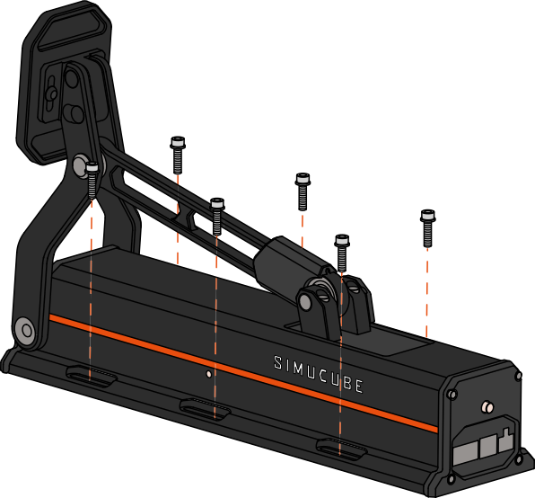

## ActivePedal Pro mounting 

ActivePedal Pro is mounted to the rig or baseplate by clamping it down by 4 to 6 pcs of M5 theaded screws with washers. 

For ActivePedal Pro footprint dimensions, see [specifications](Specifications.md).

!!! Info
    Minimum of four (4) screws must be used in clamping, but use all six (6) if possible. Tighten screws to sufficient torque (~2 Nm).

    *If* you're limited using four (4) screws *and* you can choose which ones to use, then prefer to use the **front** side and the **back** side screw holes of the pedal. This likely yields stiffer installation which in turn helps the dynamic performance and reduces the chance of oscillation.

## Mounting with Simucube Baseplate

Simucube Baseplate is a optional accessory that provides easy mounting, adjustability and comfort when using certain pedals. 

For more info and assembly instructions, see [Simucube Baseplate](../ActivePedal/Baseplate.md).

## Mounting directly to the rig

ActivePedal Pro may be mounted also without Baseplate directly to the rig. Installation method depends on the rig model and construction. Most common methods are illustrated below.

<figure markdown>
{ width="350" }
{ width="350" }
<figcaption>Mounting on slotted profile with T nuts</figcaption>
</figure>

<figure markdown>
{ width="350" }
{ width="350" }
<figcaption>Mounting on through-hole plate</figcaption>
</figure>

