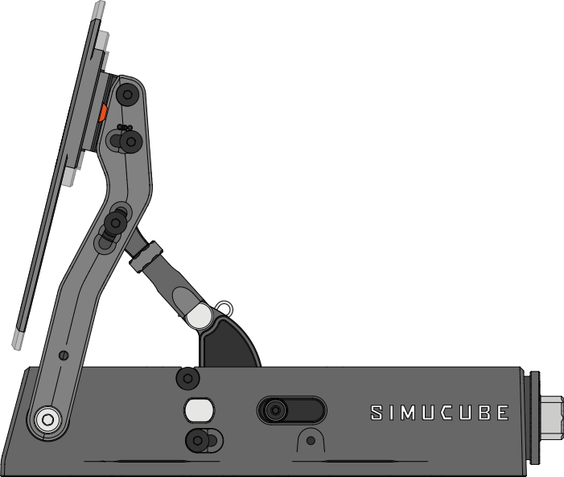
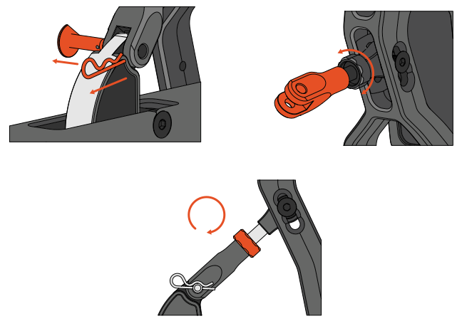
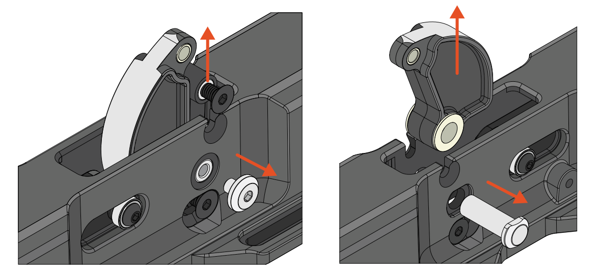
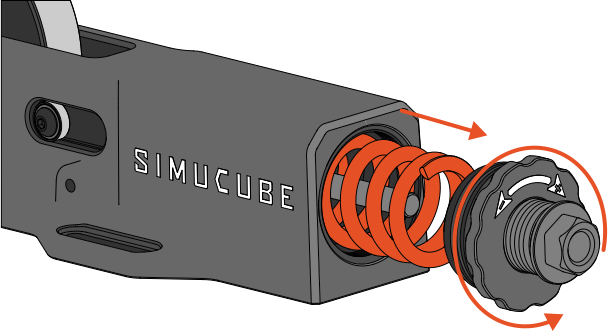
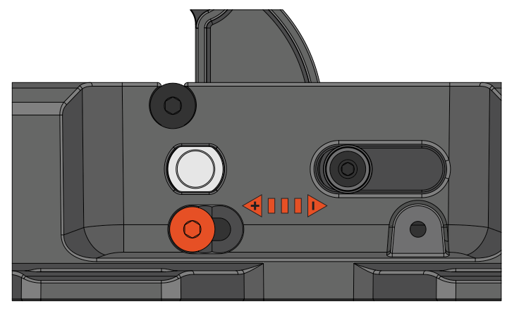

# Mechanical adjustments

Pedal face height, angle and force curve refinement are adjusted with the included Hex key. Tilt adjustment requires no additional tools.

 
 

## Pedal face height

To adjust the height of pedal face:

1. Loosen, don’t remove, the two (2) screws fixing the pedal, one on each side
2. Adjust the pedal height
3. Tighten the screws to approximately 3 Nm torque

{width="600"}

 
 

## Pedal face angle

To adjust the angle of the pedal face:

1. Loosen, don’t remove, the four (4) fixing screws, two on each side
2. Set the pedal angle
3. Tighten the screws to approximately 3 Nm torque

{width="600"}

 
 

## Pedal tilt

1. Remove the cotter pin
2. Pull out the clevis pin
3. Lift the arm and loosen the locknut.
4. Twist the the arm counter-clockwise to extend the arm.
5. Reverse steps and tighten the locknut with fingers towards the end of the arm.

### Important note
Always make sure to tighten the locknut to prevent play in the Co-Pedal arm-assembly.

{width="600"}
{width="600"}

 
 

## Profile replacement

1. Loosen the end stop screws
2. Lift the end stop to release tension from the profile
3. Remove the pivot axis screw
4. Push out the pivot axis & remove the profile
5. Reverse steps in the same order

### Important note
When changing the profile part, remember to also change the spring, to have the correct force profile.

{width="800"}

 
 

## Spring replacement

### Important note
Before changing the spring, loose the preload to make it easier to open the Co-Pedal end cap. You can use the supplied spring tool to loosen the preload. You can use the same tool to open the Co-Pedal end, if it is too tight to open by hand.

{width="600"}

 
 

## Force curve

1. Loosen the screws on pedal lever
2. Move the now sliding joint to desired position
3. Tighten screws to approximately 3 Nm torque

{width="600"} {width="600"}
                                           {width="600"}
 
 

{width="600"}
{width="600"}
										   

 
 

## Preload & travel adjustment

Co-Pedal has adjustments for preload & travel. Choose the positions according to your preferred feel.

### Preload

Use the supplied spring tool to adjust the preload.

{width="600"} {width="600"}
                                           {width="600"}

{width="600"}
{width="600"}

### Travel

When adjusting the travel, make sure both countersunk screws are positioned in the same position on both sides of the Co-Pedal. Tighten both screws alternately before applying the final torque on both screws. 
										   
{width="600"} {width="600"}
                                           {width="600"}
