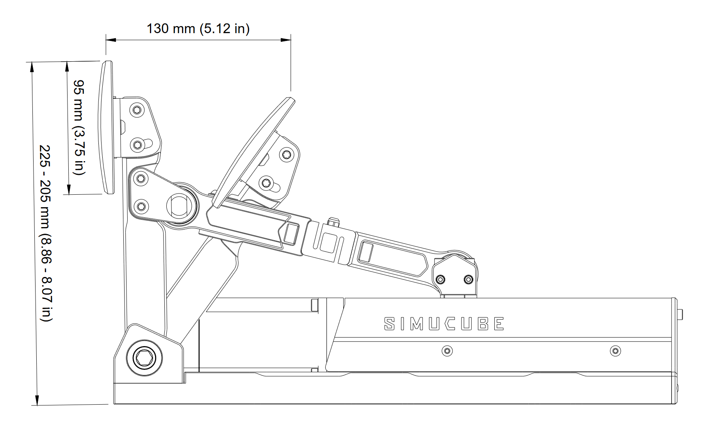

## Mounting hole footprint

## Pedal travel range

Illustration of maximum pedal travel range when combining motorized movement range *and* the pedal offset adjustment range. For further details, see [mechanical adjustments](../../ActivePedal/Mechanical%20adjustments.md) page. In this illustration:

* Pedal face height adjustment in the middle position
* Pedal face angle in the "least tilted" option

