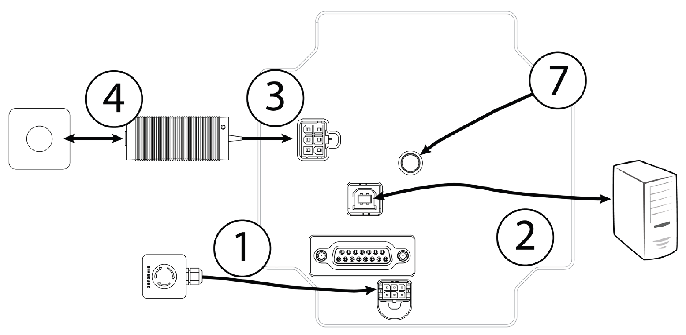
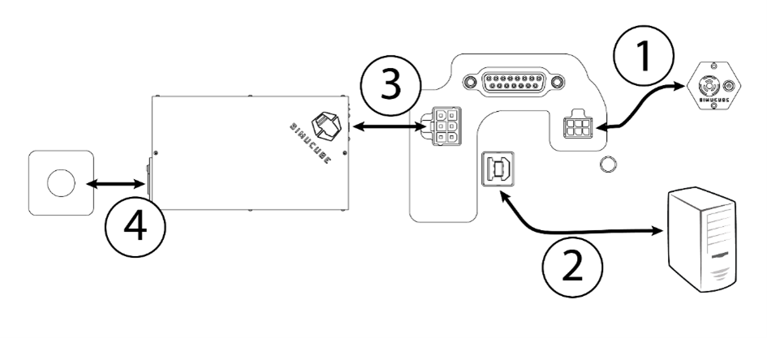
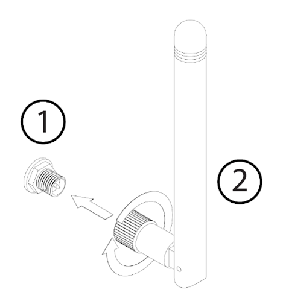

## Overview

!!! Warning
    To avoid damaging devices and prevent physical hazards, make changes to cabling only when DC power source has been **fully unplugged** from the mains input (house wall AC power socket). Powering off with POWER button alone is not sufficient.

!!! Warning
    Read and understand this chapter fully. Do not operate the product if you haven’t fully read or understood this document. Check that main power switch at the back is off and all cables are unplugged before proceeding.

The illustration below demostrates the wiring configuration of Simucube 2 Sport and Pro. The Simucube 2 Pro revision 1 units come with two power supplies and associated cables.

The illustration below demostrates the wiring configuration of Simucube 2 Ultimate.

### Order of making connections

Numbers here refer to the numbers in the above images.

1.	Connect remote Torque off button box to Simucube 2’s TORQUE OFF connector.
2.	Connect USB cable from Simucube 2 to PC.
3.	Connect power supply/supplies to Simucube 2 POWER IN connectors. 

!!! Info
    Always connect POWER IN connector(s) on Simucube 2 first before connecting power supply to the AC outlet.

## Antenna installation

1. Locate the antenna connector at the back of your Simucube 2 wheelbase.
2. Take the supplied antenna (Disclaimer: use ONLY the supplied antenna) and insert it into
the antenna connector. Make sure you are inserting it in a straight orientation. Gently twist
the knurled surface at the end of the antenna in clockwise direction approximately 3 turns.
DO NOT use any tools in the installation, only screw the antenna in place with your fingers.

You can now use the joint in the antenna to adjust antenna so that it is not in the way of other
connectors/obstacles. In normal usage the orientation has little effect to received signal
strength.

!!! Info
    Do not overtighten the antenna.