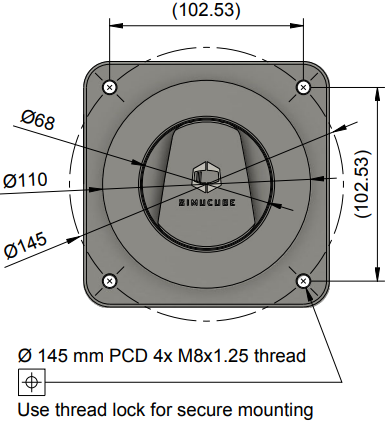
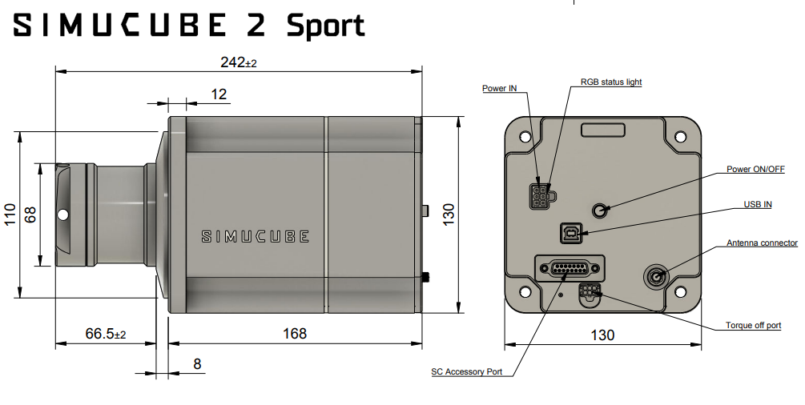
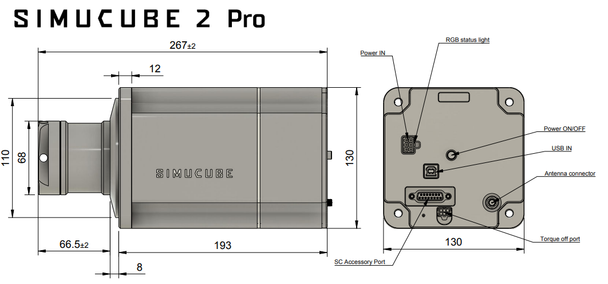
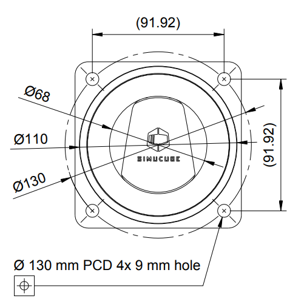
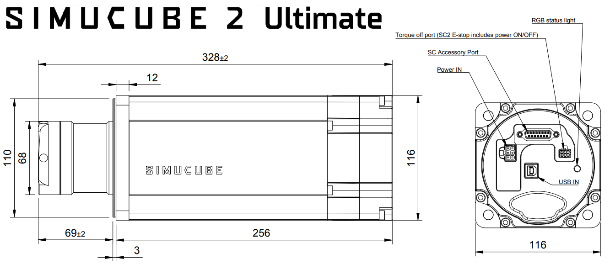

## Dimensions (Simucube 2 Sport and Pro)

## Dimensions (Simucube 2 Ultimate)

## 3D models

The back panel of Simucube 2 Pro R2 is the same as Simucube 2 Sport R2.

[:material-download-circle: Simucube 2 Sport R2](assets/simucube2_r2_sport_full_simplified v2.iges)

[:material-download-circle: Simucube 2 Pro R1](assets/simucube2_r1_pro_full_simplified v1.step)

[:material-download-circle: Simucube 2 Ultimate ](assets/simucube2_ultimate_full_simplified.step)

Granite Devices Inc. is the copyright owner of all models and drawings. All rights reserved. For commercial use or reproduction, contact Granite Devices for permissions.

## Disclaimer

Simucube 2 product appearance might differ form the illustrations on this online user guide and from the pictures at simucube.com website.