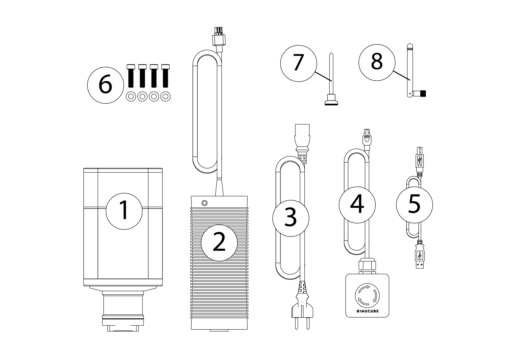
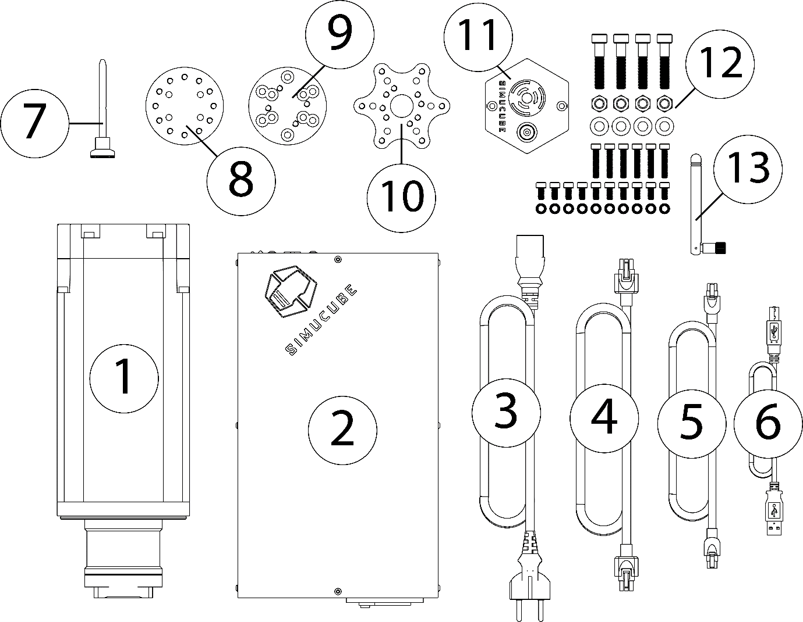

## Required items to make use of Simucube 2 wheelbase

* **Simucube 2 wheelbase**
* A fully functioning simracing system
	* A sturdy sim racing rig
	* Gaming computer with an available USB port
	* Steering wheel

## Simucube 2 package contents

### Simucube 2 Sport and Pro

| Item                     | Qty   |
| ------------------------ | ----- |
| 1. Simucube 2 wheelbase           | 1 pc  |
| 2.  Power adapter and DC cable        | 1 pc  |
| 3.  AC power cord        | 1 pc |
| 4. Torque off button and cable           | 1 pc  |
| 5. USB cable             | 1 pc  |
| 6. Fixings for wheelbase (only M8 bolts, locking washers) | 1 pc  |
| 7. Quick Release locking pin | 1 pc  |
| 8. External antenna for Simucube Wireless Wheel signal reception | 1 pc |

### Simucube 2 Ultimate

| Item                       | Qty   |
| -------------------------- | ----- |
| 1. Simucube 2 wheelbase            | 1 pc  |
| 2. Power supply           | 1 pc  |
| 3. AC power cord | 1 pc  |
| 4. DC power cord             | 1 pc |
| 5. Torque off button cable | 1 pc |
| 6. USB cable | 1 pc |
| 7. Quick Release locking pin | 1 pc  |
| 8-10. Quick release kit parts | 1 each |
| 11. Premium Torque Off Button | 1 pc |
| 12. Screw kit for wheelbase fixing and Quick Release Kit | 1 pc |
| 13. External antenna for Simucube Wireless Wheel signal reception | 1 pc |

### Disclaimer

Simucube 2 product appearance might differ form the illustrations on this online user guide and from the pictures at simucube.com website.

