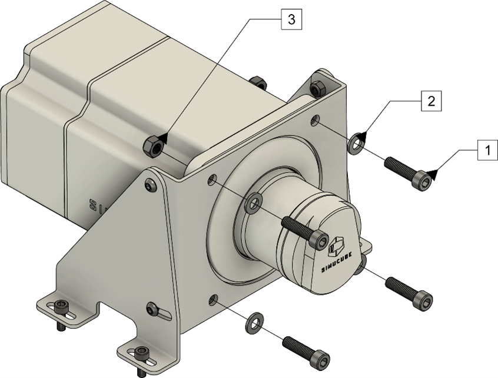
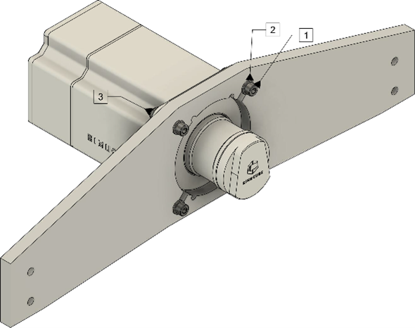

## Simucube 2 mounting

Simucube 2 wheelbase must always be mounted rigidly on to the simulator rig for user safety.

Sport and Pro models have threaded mounting holes in the front flange, so locking nuts are not required.

### Front mounting with a separate Mount
Simucube 2 supports front mounting to popular sim racing rigs by using a mounting brackets such as the Simucube Mount product.

Mount Simucube 2 as shown in above figure. Sport and Pro models are mounted with 30mm M8 bolts with 1.25mm thread pitch (1) and M8 flat washers (2). Simucube 2 Ultimate is mounted through-the motor flange with bolts (1), washers (2) and a M8 locking nuts (3).

### Front mount in to the rig
Simucube 2 supports front mounting to popular sim racing rigs directly.

Mount Simucube 2 as shown in above figure. Sport and Pro models are mounted with 30mm M8 bolts with 1.25mm thread pitch (1) and M8 flat washers (2). Simucube 2 Ultimate is mounted through-the motor flange with bolts (1), washers (2) and a M8 locking nuts (3).
