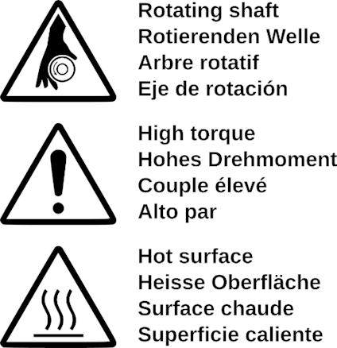
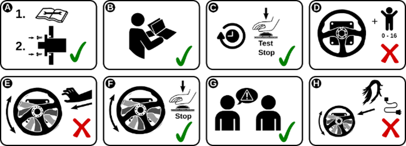

### Hazards

!!! Info
    Familiriaze yourself with the potential hazards by reading this page before starting to use the Simucube 2 wheelbase.

- Rotating high torque parts
    - Shaft torque up to 32 Nm
    - Shaft rotation speed up to 360 RPM
    - Shaft mechanical power up to 600 W

- Hazard of entangling to rotating parts
    - Pull force may exceed 130 kg / 270 lbs / 800 N when wire, rope, hair or similar object tangles on 5 cm / 2" spool diameter (such as output shaft of the device)

- Hot surface
    - Device surface temperature may reach 70 degrees C or 158 degrees F.
    - Sudden rotation / vibration
    - Device may start producing motion unexpectedly

---

- A.Mount device securely to a rigid platform before use. Fix Simucube 2 to a proper table mount or a racing rig that is Simucube 2 compatible with all four fixings screws that are included. Do not use other types of fixings. Never operate the product without fixing it first as instructed in this User Guide. 
- B. Read this user guide completely before installing or operating the device.
- C. Test functioning of the Torque off button before each usage session.
- D. Keep children away from the device.
- E. Do not attempt to stop freely rotating parts by grabbing.
- F. Always use the Torque off button or power off the device to stop and prevent motion.
- G. Instruct other users of the device about the safe usage.
- H. Keep hair, cables, clothing and other entangling items clear from the rotating parts.

---
### Other safety notes and precautions

- Simucube 2 Ultimate is intended for professional use only. Usage under other conditions is under user's own responsibility.
- Do not grab, hold or insert fingers, etc objects to the rotating parts in a way where letting go immediately is not always possible.
- Do not operate Quick Release when the device is powered ON and connected to a PC, with the Torque Off button not pressed.
    - Always disable torque by pressing Torque off button before removing or attaching wheel 
    - Do not release Torque off button unless Quick Release has been securely clamped with Quick Release locking pin
- Do not set torque level higher than the level user can safely hold with a single hand grip
- If torque gets too high to control safely, let both hands off the wheel and press the Torque off button
- Preventing motion by the means of True Drive or simulator software are not reliable ways to prevent motion
- Device user must be an adult and physically and mentally fit person
- Usage of the device is allowed only by an instructed person who understands and follows the above safety instructions
- If the device becomes damaged in any way, stop using it immediately and contact the reseller
- Using the vibration and force feedback may cause damage to your health
- Do not open the casing of the device or the power supply. There are no user serviceable parts inside, and disassembling without specific instructions will void manufacturer’s warranty.
- Do not use the device with a power source other than the power supply packaged with the Simucube 2 or received from an authorized reseller. Do not operate SC2 Pro Revision 1 model (two power supply units) with only one power supply connected and powered.
- Do not use the device with any cables other than the cables packaged with the Simucube 2 or received from an authorized reseller
- The Simucube Accessory Port is a female D15 connector on the back of the device. Its signal
levels are from 0 to 5 Volts. Do not connect any unknown devices to this connector. The
port is not a serial port connector although the mechanical connector is the same as a 15-
pin serial port.
- This product has magnets which may interfere with pacemakers, defibrillators and programmable shunt valves or other medical devices. Do not put this product close to these medical devices and the person who use any of these medical devices. Consult your doctor before using this product, if you have any concerns.
- Simucube 2 Ultimate power supply is not intended to withstand physical stress. Do not damage or mishandle the power supply.
- Operating environment:
  - 15°C – 30°C room temperature, non-condensing humidity
  - Do not expose the Simucube 2 device to direct sunlight
  - Indoor use only
  - Simucube 2 Ultimate power supply is IP30 rated.

## :flag_gb: Safe use 

Device's motor powered moving parts may induce serious injury. Keep the moving parts clear and free to move while the power cord is plugged in.

Only physically fit adult person may operate the device. Always keep children and pets away from the device.

While the wheelbase is powered on, operate the Quick Release only when the Safe torque off button is pressed.

## :flag_de: Sichere Verwendung

Das Gerät darf nur von einer körperlich gesunden erwachsenen Person bedient 
werden. Das Gerät darf nicht in der Nähe von Kindern oder Tieren betrieben werden. 

Halten Sie die beweglichen Teile frei und bewegen Sie sie nicht unter Strom. 
Körperteile, Tiere, Kabel und andere Gegenstände von den beweglichen Teilen fernhalten. 

Eingeschaltete Pedalfläche nur mit dem Fußballen berühren. Achten Sie auf 
plötzliche und starke Druck-, Zug- oder Pendelbewegungen

### Gefahren

- Bewegliche Teile
- Quetschungsbereich
- Hohe Kräfte
- Schnelle Bewegung
- Plötzliche Bewegung
- Starke Vibration

## :flag_es: Uso seguro 

El dispositivo solamente se puede operar por una persona adulta en buena forma física. No encienda el dispositivo cerca de niños o animales. 

Mantenga las piezas móviles despejadas y libres para moverse mientras esté encendido. Mantenga alejados partes del cuerpo, animales, cables y demás elementos. 

Cuando esté encendido, toque la cara del pedal solamente con la punta del pie y esté preparado para un movimiento oscilante, de empuje o tracción repentino y fuerte.

### Peligros

- Piezas móviles
- Punto de fijación
- Fuerzas elevadas
- Movimiento rápido
- Movimiento repentino
- Vibraciones fuertes

## :flag_fr: Utilisation en toute sécurité

Seule une personne adulte considérée comme apte sur le plan physique peut utiliser l'appareil. Ne faites pas fonctionner l’appareil à proximité d’enfants ou d'animaux.

Veillez à ce que les pièces mobiles soient dégagées et puissent se déplacer librement lorsqu'elles sont sous tension. Éloignez les parties du corps, les animaux, les câbles et 
autres objets.

Lors de la mise sous tension, touchez la surface de la pédale uniquement avec la pointe du pied et préparez-vous à un mouvement soudain et puissant de poussée, de traction ou d'oscillation. 

### Dangers

- Pièces mobiles
- Point de pincement
- Forces élevées
- Déplacement rapide
- Mouvement soudain
- Fortes vibrations

## :flag_it: Utilizzo sicuro

Il dispositivo può essere azionato unicamente da persone adulte e fisicamente idonee. Non accendere il dispositivo in prossimità di bambini o animali. 

Con il dispositivo acceso, assicurarsi che le parti mobili possano muoversi liberamente e senza ostacoli. Tenere a distanza parti del corpo, animali, cavi e altri oggetti.

All’accensione, premere la superficie del pedale solo con l’avampiede e prepararsi 
a forti movimenti improvvisi di spinta, trazione o oscillazione.

### Pericoli

- Parti mobili
- Punto di schiacciamento
- Forze elevate
- Movimento rapido
- Movimento improvviso
- Forti vibrazioni

## :flag_pt: Utilização segura

O dispositivo apenas pode ser utilizado por uma pessoa adulta fisicamente apta. Não ligue o dispositivo próximo de crianças ou animais.

Mantenha as peças em movimento desimpedidas e livres para se moverem quando o dispositivo estiver ligado. Mantenha afastadas partes do corpo, animais, cabos e outros artigos.

Quando ligado, toque no pedal apenas com a almofada plantar do pé e esteja preparado para qualquer movimento súbito e forte de empurrar, puxar ou oscilar.

### Riscos

- Peças em movimento
- Ponto de entalamento
- Forças elevadas
- Movimento rápido
- Movimento súbito
- Vibração forte

## :flag_fi: Turvallinen käyttö

Laitteen moottoroidusti lilikkuvat osat voivat aiheuttaa vakavan vamman. Pidä liikkuvat osat vapaana esineistä ja kehon osista aina kun virtajohto on kytketty.

Vain fyysisesti terveet aikuiset ihmiset saavat käyttää laitetta. Pidä lapset ja lemmikkieläimet aina loitolla laitteesta.

Kun laite on kytketty päälle, käytä Quick Release toimintoa vain Torque Off nappi pohjaan painettuna.

### Vaarat

- Liikkuvia osia
- Leikkausvaara
- Suuret voimat
- Nopea liike
- Yhtäkkinen liike
- Voimakas tärinä
