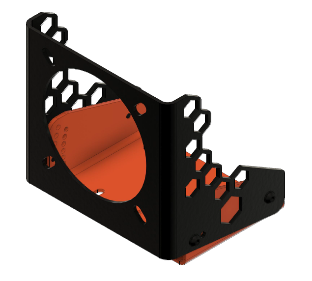
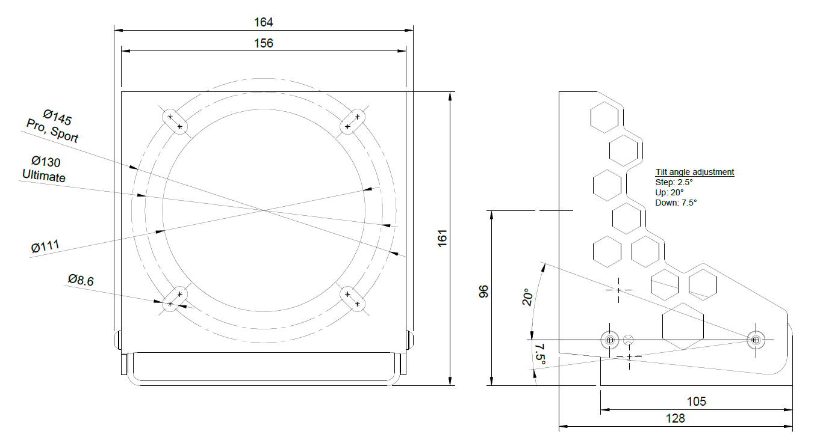
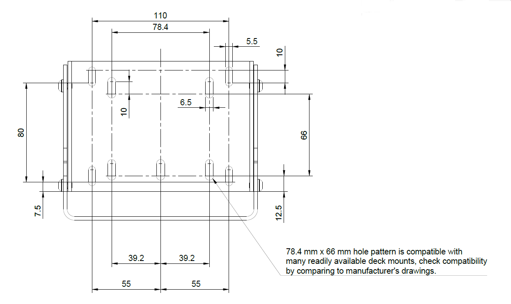
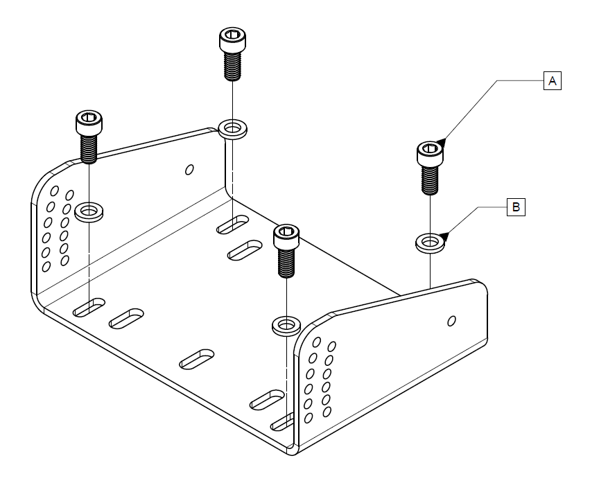
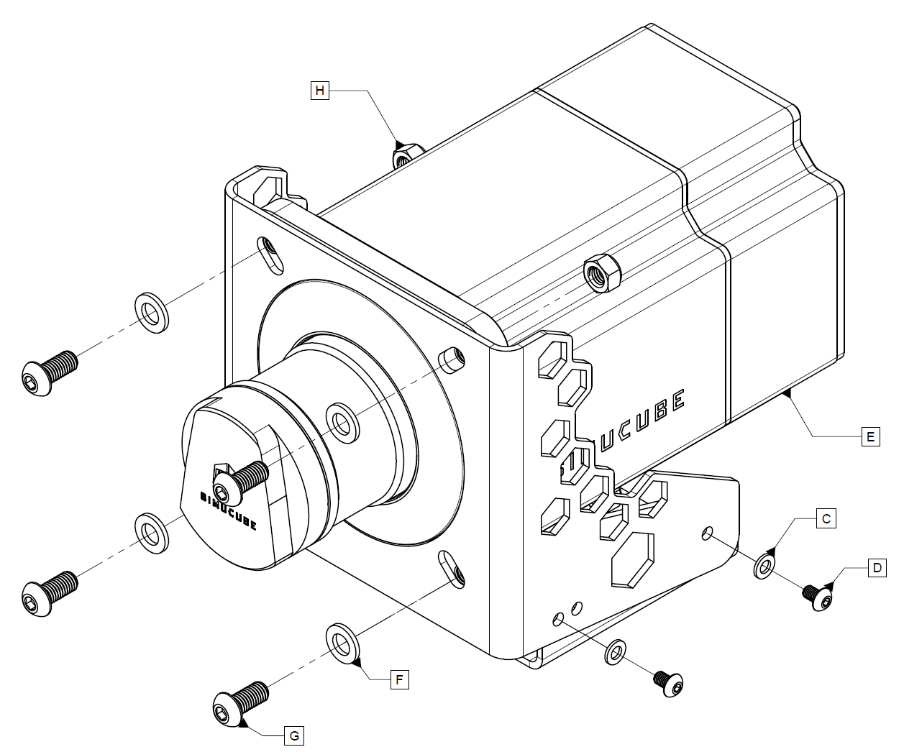

## Simucube Mount

Simucube Mount is a product that enables to install the Simucube 2 wheelbase to a rig with bottom mount holes.

### Dimensions

All dimensions are in mm.

### Drilling pattern

Print this file on A4 in 1:1 scale.

[:material-download-circle: Simucube Mount drilling pattern](assets/simucube_mount_drilling_guide_2021-08-12.pdf)

### Installation

See [Simucube 2 Mounting](Mounting.md) page for installing the wheelbase on to the mount. Nuts are only required for Simucube 2 Ultimate.
