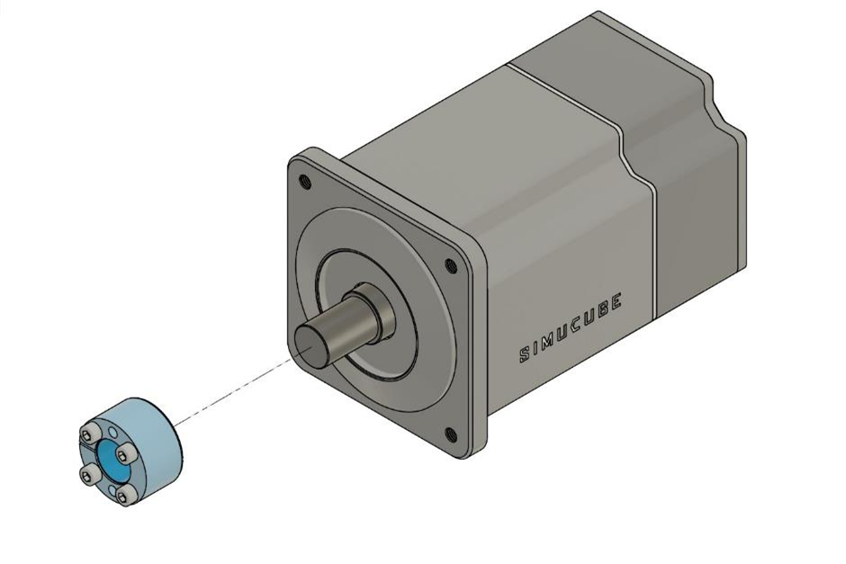
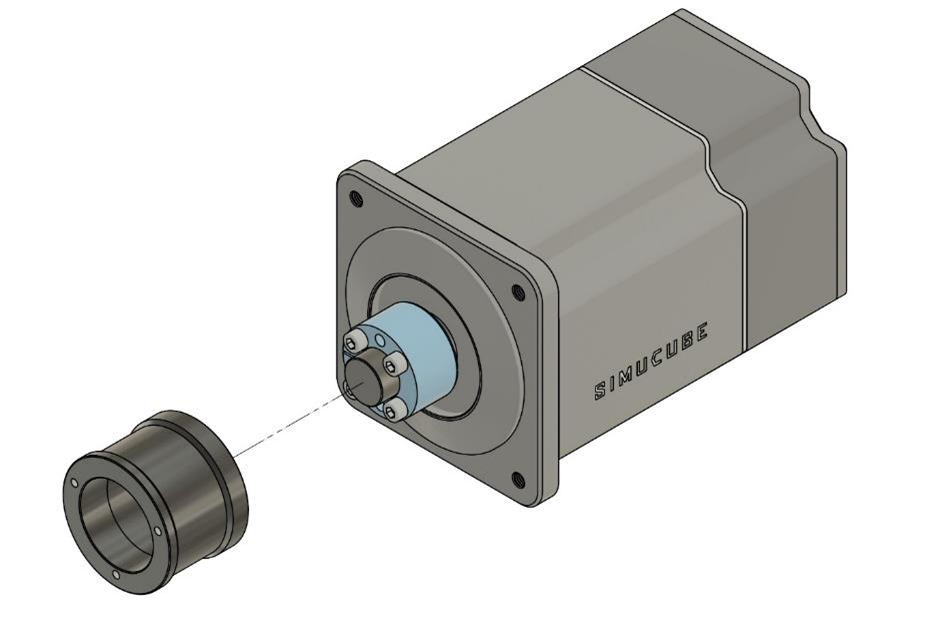
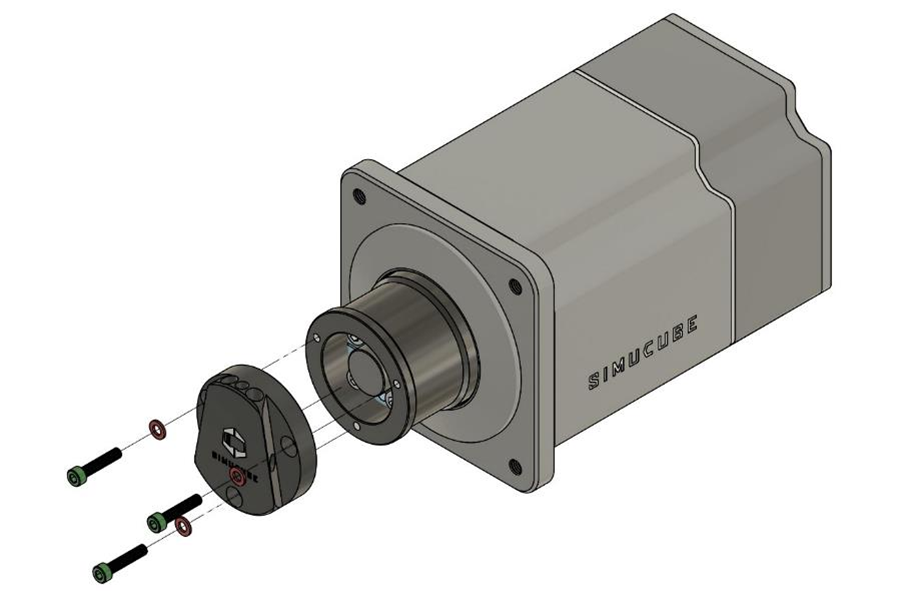

## Overview

Simucube 2 Quick Release is pre-installed on every Simucube 2 wheel base. It has also been on sale for motors with 22 mm or 24 mm shaft diameter. 22 mm shaft is used on the popular Simucube 1 era Mige motors.

When installing the SQR (Simucube Quick Release) system ensure that the motor shaft diameter is compatible with the SQR.
The SQR motor side can be disassembled and re-installed in case of slipping or other problems relating to tightness, or if for some reason the black hub has slipped too close to the motor and appears to be touching it.

This part of the user guide shows how the quick release can be mounted and adjusted to the motor.

### Quick release locking pin adjustment

The tightness of the locking pin can be adjusted. Follow the instructions in the below video.

### Motor side disassembly

Open the three bolts on the top of SQR and remove the motor side plate.
If you do not want to lose the SQR position, draw some markings to remember the SQR position related to the motor shaft. This is not critical since the wheel center point can be reset in the software.

Open the four cone clamp bolts and remove the cone clamp and the SQR outer tube. If the cone clamp can’t be removed after opening the four bolts, it can be opened by screwing one or two cone clamp bolts to the two empty threaded holes.

### Motor side assembly

Clean the motor shaft and the cone clamp from possible grease with a dry paper towel.

Insert the cone clamp to the motor shaft. If installing to anything else than the Simucube 2 wheelbase, ensure that the clamp is in the middle of the shaft.

!!! Info
    Please note, that the conical shaft clamp can be easily deformed and taking it fully apart should not be required.
    When assembling/re-assembling the shaft clamp, please make sure that the gap on the outer and inner ring on the clamp parts are at opposing sides.
  

Insert a paper towel or any suitable thin and soft sheet to prevent the SQR outer tube touching the front plate of the motor.

Insert the adapter around the cone clamp and the motor shaft. Tighten the four cone clamp bolts evenly, starting from opposite sides. Go over the bolts multiple times to ensure tightness. Recommended tightening torque for these four bolts is 5-10 Nm. 

!!! Warning
    Do not tighten the bolts if it appears that the outer tube is tightening against the paper towel and the motor. This can damage the motor bearings. Instead, loosen bolts, create more gap between the motor and the tube, and start tightening again.
  
  

Remove the paper towel, insert the motor side plate and tighten its three bolts. The original bolts are M5x25 hex head bolts and the washer are locking washers.

