## Overview

Simucube 2 is a solid quick release system for connecting quickly detachable sim racing wheel to the wheelbase. Simucube 2 wheelbase comes with the wheelbase side parts, and the Quick Release Wheel-side kit is installed on to the wheel.

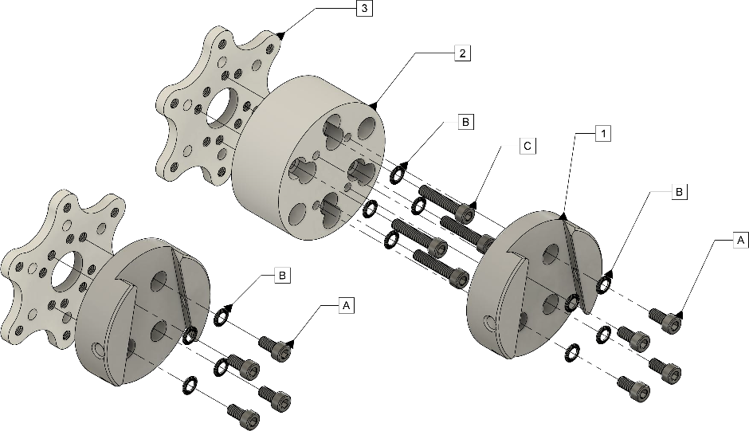

## Installation options

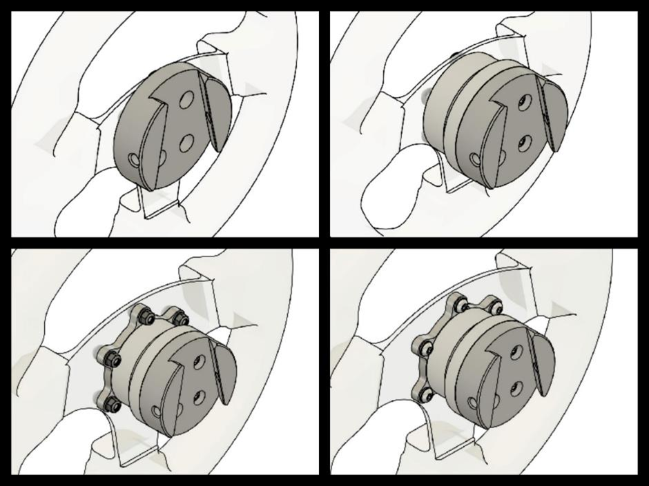

The included wheel side SQR (Simucube Quick Release) system can be assembled in multiple
configurations to best suit your wheel and button box combination.
Standard configurations in the above image include (1) 50.8 mm PCD (pitch circle diameter) front mounting without the spacer, (2) 50.8 mm PCD front and back mounting with the spacer and (3+4) 70 mm PCD front and back mounting.

Various installation options are explained in this video, and also in text below.

### 50.8 mm PCD front mounting without spacer

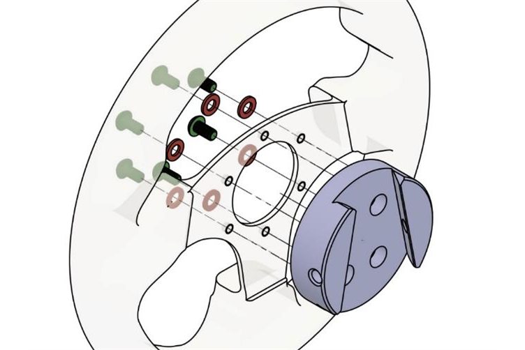
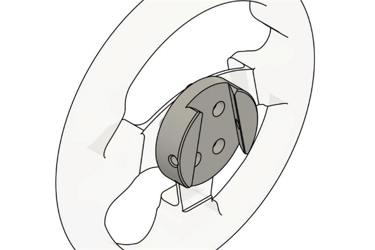

It is possible to use the SQR without a spacer, but the use of the spacer is recommended as itgives the user more space to use the locking pin. To attach the wheel side plate to your wheel, use suitable M5 screws and washers (3 or 6 screws depending on your wheel type) from the included ones or use your own if suitable length is not found. In case you have a need to find longer/shorter screws, the correct screw thread type is M5 size with 0.8 mm pitch.

### 50.8 mm PCD front and rear mounting with spacer

#### Rear mounting
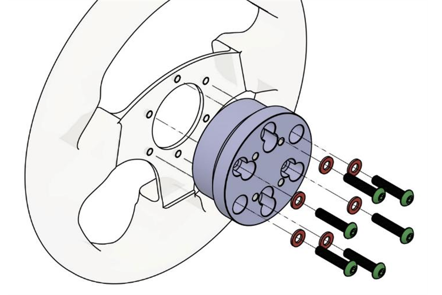
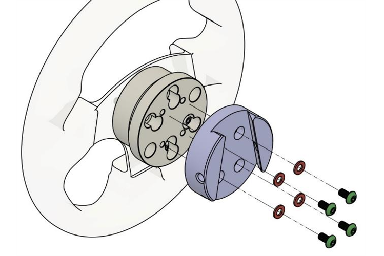

To rear-mount your wheel (if you have threads in the rear of your wheel/button box), you will need 3 or 6 M5 screws with a length depending on your wheel and button box thickness and 1 washer per screw. Align the four middle threaded holes as in the image and attach the screws in the order as illustrated.

Use four of the included 10mm long M5 screws and 4 washers to attach the wheel side plate to the spacer as illustrated. Note: Do not use excessive torque to avoid damaging the threads in the SQR aluminum parts.

#### Front mounting

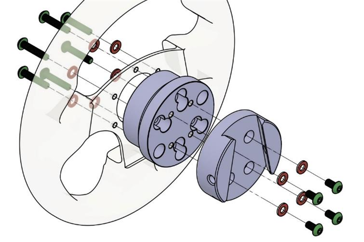
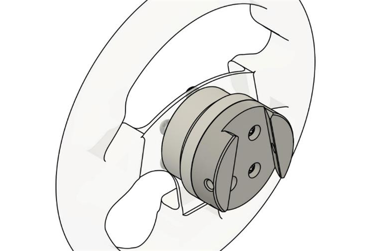

To front-mount your wheel, you will need 3 or 6 M5 screws and a washer per screw. The right length for these screws is approximately 35-39mm + the thickness of your wheel and button box since the screws attach to the threads in the wheel side plate. 

Use four of the included 10mm long M5 screws and 4 washers to attach the wheel side plate to the spacer as illustrated. Align the four middle threaded holes as in the image and attach the rest of the screws as illustrated.

### 70 mm PCD front and rear mounting, with spacer

!!! Info
    Consider the mounting orientation of the final wedge shaped part. The Simucube 2 Quick Release works best when the wedge is lowered on to the motor shaft in an up to down motion when the wheel is oriented in horizontally, as illustrated in the final picture. The various mounting holes on the 70 mm adapter plate and the spacer part allows to adjust the orientation of the final wedge part.
	
#### Front mounting of the 70mm adapter
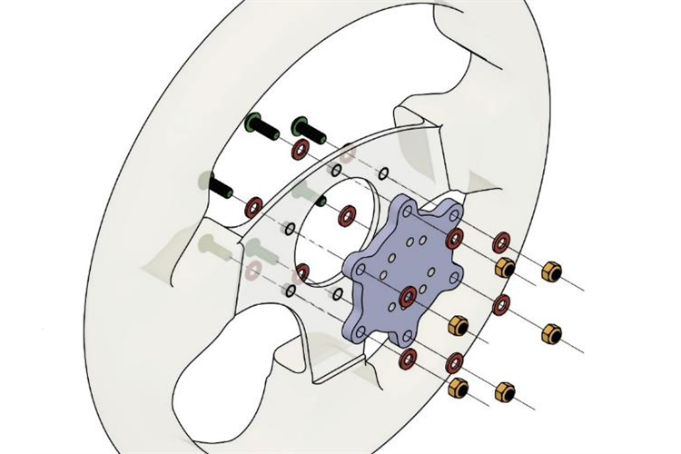

To front-mount your wheel, you need 6 M5 screws with a length depending on your wheel and button box thickness, 2 washers per screw and 1 locking nut per screw. Align the eight middle threaded holes as in the image and attach the screws in the order as illustrated.

#### Rear mounting of the 70mm adapter
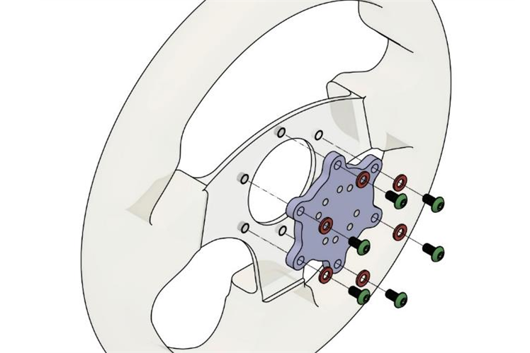

To rear-mount your wheel (if you have threads in the rear of your wheel/button box), you will need 6 M5 screws with a length depending on your wheel and button box thickness and 1 washer per screw. Align the eight middle threaded holes as in the image and attach the screws in the order as illustrated.

#### Rest of the assembly
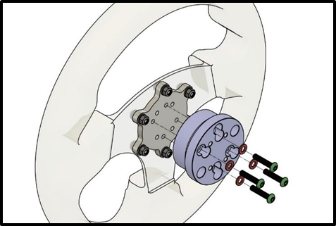

In both cases use four of the included 25 mm long M5 screws and 4 washers to attach the wheel side plate to the spacer as illustrated. Note: Do not use excessive torque to avoid damaging the threads in the SQR aluminum parts.

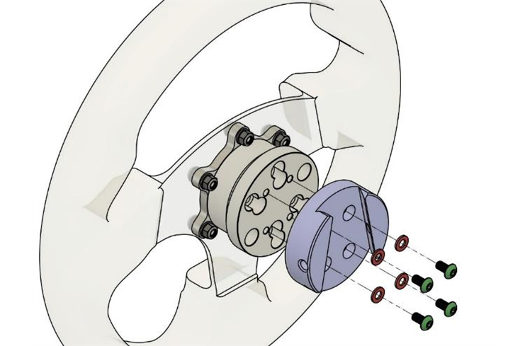

In both cases use four of the included 10 mm long M5 screws and 4 washers to attach the wheel side plate to the spacer as illustrated. Note: Do not use excessive torque to avoid damaging the threads in the SQR aluminum parts.

### 70 mm PCD front and rear mounting, without spacer

Due to the diameter of the wheel side SQR plate, use of the 70 mm adapter without the spacer is not possible with the included hardware.
