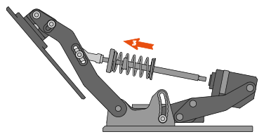
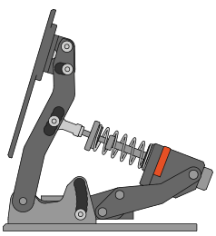

# Mechanical adjustments

Pedal face height, angle, force curve and tilt may be mechanically adjusted with the included Torx key.

 
 

## Pedal face height

To adjust the height of pedal face:

1. Loosen, don’t remove, the two (2) screws fixing the pedal, one on each side
2. Adjust the pedal height
3. Tighten the screws to approximately 3 Nm torque

{width="400"}

 
 

## Pedal face angle

To adjust the angle of the pedal face:

1. Loosen, don’t remove, the four (4) fixing screws, two on each side
2. Set the pedal angle
3. Tighten the screws to approximately 3 Nm torque

{width="400"}

 
 

## Pedal tilt

1. Loosen the two (2) screws on pedal subframe
2. Move the now sliding subframe to desired position
3. Tighten screws to approximately 3 Nm torque

{width="400"}

 
 

## Force curve

1. Loosen the screw on pedal lever
2. Move the now sliding joint to desired position
3. Tighten screw to approximately 5 Nm torque

{width="400"} {width="400"}
                                           {width="400"}
										   
 
 

## Spring replacement

1: Apply pressure to pedalface
 
2: Unscrew end stop

{width="400"}
 

3: Release pressure slowly from pedalface and slide shaft assembly out

 

4: Remove spring

{width="440"}
 

5: Remove plastic ring from spring

{width="120"}

 

6: Install new spring by reversing the previous steps. Note that plastic ring should point to rear of the Throttle. Ring protects aluminium part from scratches.
 
 

{width="400"}
{width="400"}

Pre-installed spring is red curve on diagram, extra spring included in package is blue curve.

 
 

## Preload & travel adjustment

Throttle has adjustments for preload & travel. Choose the positions according to your preferred feel.

{width="400"} {width="400"}
                                           {width="400"}
										   
{width="400"} {width="400"}
                                           {width="400"}
