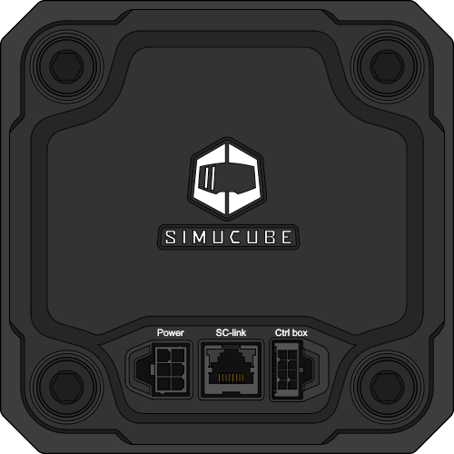

## Overview of ports

All three available connection ports of the Simucube 3 wheelbase can be found on rear of the device. Port functions are listed in the table below:

<figure markdown>
{width="600"}
</figure>

| Port              | Description                                      | Usage                                                                                                                                           |
| ----------------- | ------------------------------------------------ | ----------------------------------------------------------------------------------------------------------------------------------------------- |
| POWER	            | DC power supply input                            | Connect to DC power supply                                                                         										     |
| SC-LINK           | Simucube Link port                               | Connect to Simucube Link Hub directly, or through Ethernet switch                                                                               |
| Ctrl box          | Port for Control box                             | Connect to Simucube Control box                                                                                                 |

## Wheelbase installation

The illustration below demostrates how to connect a Simucube 3 wheelbase to a PC by using Simucube Link Hub *(sold separately)*.

!!! Info "Note"
    Simucube 3 Wheelbase can not be connected directly to a PC. Simucube Link Hub is required for inputs to register.

{width="900"}
{width="900"}

!!! Warning
    To avoid damaging devices and prevent physical hazards, make changes to cabling only when DC power source has been **fully unplugged** from the mains input (house wall AC power socket). Powering off with POWER button alone is not sufficient.
	
## Wheelbase + Active pedals

To connect multiple Simucube devices to a single Simucube Link Hub, such as Active Pedals, an ethernet switch is required. One such configuration with two Active Pedal Pros is demonstrated in the illustration below.

{width="900"}
{width="900"}
