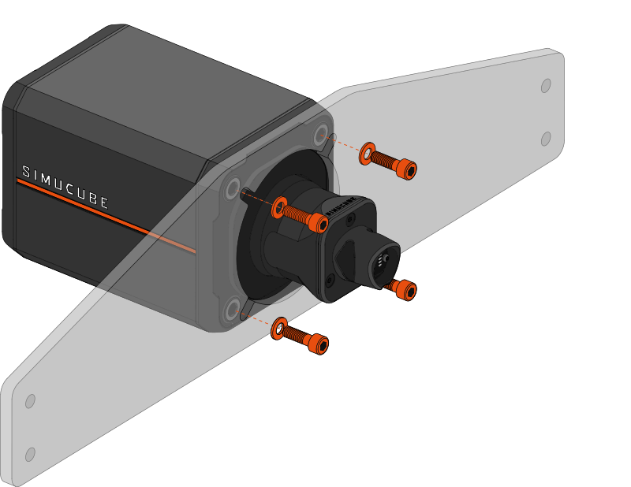
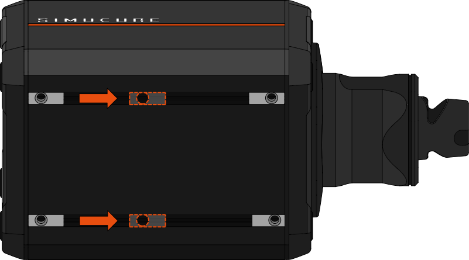
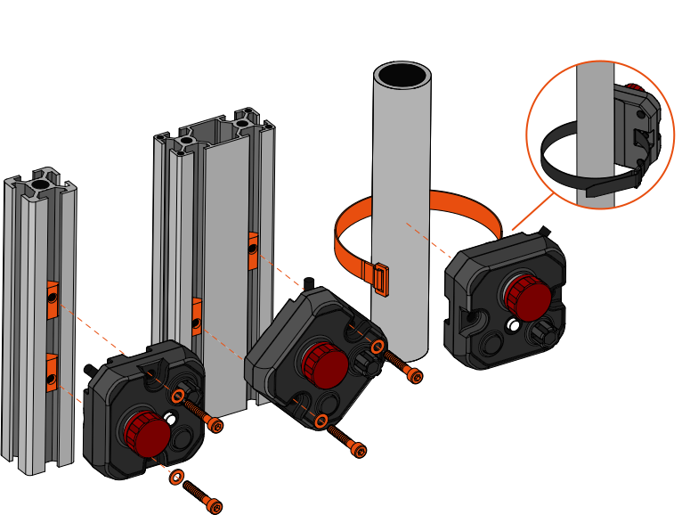

## General information about mounting 

All Simucube 3 Wheelbases can be mounted in two different ways depending on the requirements of the rig.
The front mounting points allow the wheelbase to be secured against a vertical surface, whereas the bottom
mounting points allow for an adjustable attachment to a horizontal surface.

In both cases it is important to use all four (4) available mounting points to ensure a rigid attachment. 
Note that the thickness of the mounting plate has an effect on the required mounting hardware. For plates with certain thicknesses, additional screws may be 
required.

For Simucube 3 Sport, Pro, and Ultimate dimensions and space requirements, see [specifications](Specifications.md) or [drawings & 3D models](Drawings.md).

## Front mount

Simucube 3 can be mounted by it's front face by using the four (4) threaded M8 holes located behind the hexagonal holes of the stand off screws. 
The depth of these mounting holes is 21mm (≈13/16") from the round mounting surface of the stand off screws. The diameter of the mounting pattern is 135mm.

### Choosing the correct fasteners

!!! Warning
	**It is important to choose the correct length screws to avoid breaking the threads:**

	- The screws may not poke out more than 21mm (≈13/16") from the mounting surface.
	- Always use the supplied washers when mounting the wheelbase.
	- *Hint: Your Simucube 3 is supplied with four M8x35 and four M8x30 screws:*
		* *The longer M8x35 screws are meant for mounting plates with a thickness of 13 — 18mm (≈1/2" — 3/4").*
		* *The shorter M8x30 screws are meant for 7 — 12mm thick plates (≈1/4" — 1/2").*

### Installing the wheelbase

!!! Warning
	**Do not remove the hex caps of the wheelbase. The screw will pass through the hexagonal hole.**

!!! Info
    - Use four (4) of the supplied M8 screws and corresponding washers to secure the wheelbase to a vertical mounting plate. 
	- Tighten the screws to a sufficient torque ~ 20 Nm.
	- *Hint: A second person may be required to hold the wheelbase in place while installing the screws.*

## Bottom mount

Simucube 3 can be alternatively mounted by it's bottom face, in case front mounting is not available. This is done by using the four (4) T-slot nuts located on the bottom of the wheelbase.
The width of the bottom mounting bolt pattern is 78.4mm, whereas the depth can be adjusted to match the mounting plate.

### Bottom mount fasteners

!!! Warning
	**It is important to choose the correct length screws to avoid breaking the threads:**

	- The screws may not poke out more than 9mm (≈3/8") from the mounting surface.
	- Always use the supplied washers when mounting the wheelbase.
	- *Hint: Your Simucube 3 is supplied with four M6x16 screws, which are suitable for mounting plates with the thickness of around 5 — 7mm (≈3/16" — 1/4").*

### Installing the wheelbase

!!! Info
	- Adjust the T-nuts located in the bottom of the wheelbase to correspond to the bolt holes on the mounting plate. 
	- A screw may be used as a lever to move the T-nuts inside the groove.

!!! Info
    - Use the four (4) supplied M6x16 screws and corresponding washers to secure the wheelbase to a horizontal mounting plate.
	- If the threads do not line up with the mounting holes, readjust the T-nuts.
	- Adjust the mounting position by sliding the wheelbase backwards/forwards with the screws loosely attached.
	- Tighten the screws to a sufficient torque ~ 10 Nm.

## Control Box mounting

For safe operation, it is important to mount your Control Box securely in an easily reachable position. 
Ideally, the torque off button should be placed in a position where it can be reached **both** by the users hand and the leg.

!!! Info
	- For aluminium extrusion profile rigs with one or more 8mm slots, mount the Control Box using the supplied T-nuts and M5x30 screws. 
	- For tubular profile rigs, use the supplied hook & loop tie to tightly secure the Control Box to the rig.
