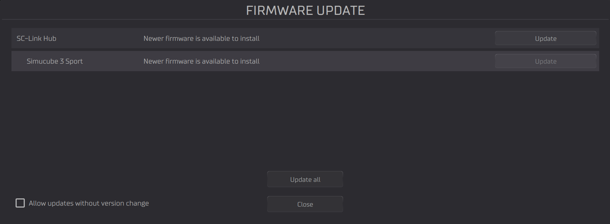
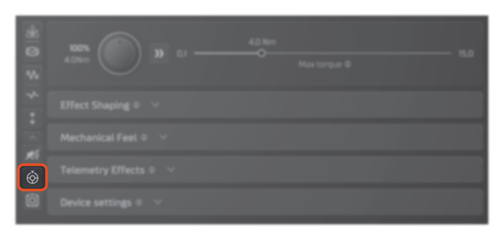
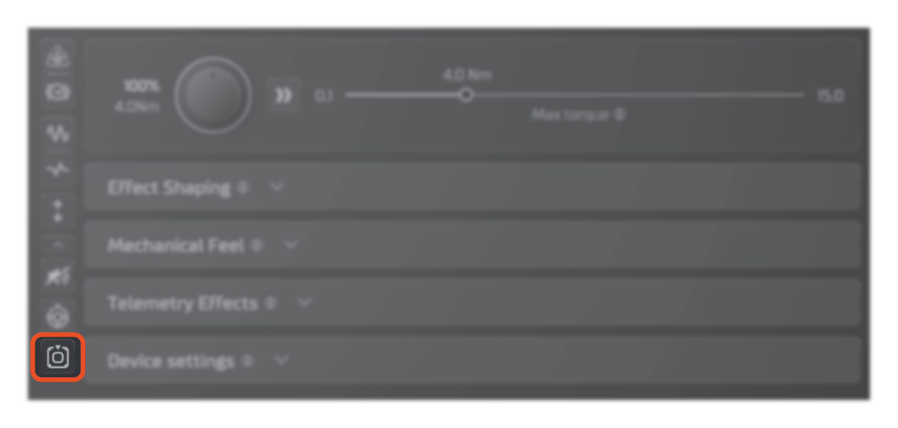

## Device startup

### Firmware update

When Simucube 3 is first connected to Tuner, a firmware update of the wheelbase and Link Hub is required. This is indicated by a pop-up in the top of the screen:

{width=600}

Open the firmware update window by clicking "Update device" on the firmware notification, or by selecting "Firmware Update" from the bottom left corner of Tuner. Update your devices by clicking "Update all" in the firmware update window.:

{width=650}

After the update is complete, click "close".

### Activating devices

After updating the device firmware, your wheelbase is in inactive mode. This is indicated by by a purple indicator light on the control box, and a pop-up notification in the top of the screen:

{width=600}

Activate all connected Simucube devices by clicking "Start all devices" on the notification pop-up, or by clicking the "sleep/wake" button on your Control Box.

!!! Warning
	If you have Simucube Active Pedals connected, clicking "Start all devices" in Tuner or the "sleep/wake" button on the Control Box will cause the pedals to automatically move to their rest position.

## Basic adjustments

### Enabling Active mode

By default, Simucube 3 starts in **Safe mode** indicated by a blue symbol next to the adjustment menu, as well as a symbol in the notification are above the steering range slider.

{width=700}

!!! Info "In safe mode:"
	
	- Maximum torque is limited
	- Maximum velocity is limited
	
If you want to activate **Active Mode**, click the "Active mode" -symbol above the blue "Safe mode" -symbol next to the adjustment menu. 

{width=700}

!!! Warning
	Active mode enables the full power of the wheelbase to be used by the simulation software, which can cause injuries if not handled with care. Please read and acknowledge the detailed safety dialogue presented by Tuner, before enabling Active mode.

### Adjusting Steering range & center

To adjust the steering range of Simucube 3, use the "Steering Wheel Range" -slider in the bottom of Tuner.

{width=600}

- Drag one of sliders to quickly adjust steering range.
- Click the center value to precisely input the desired steering range with a keyboard.

If you wish to change the center position of the wheelbase, first start by clicking the downwards arrow-shaped "show all settings" -button in the bottom of the tool button column.

After expanding the tool buttons, you can find the "Set center position" -button as shown in the picture below:

{width=700}

Using the "Set center position" -button sets the current wheelbase position to correspond to 0° steering input. If you wish to return to the factory calibration for the center position, click the "Reset to default center position" -button:

{width=700}

### Adjusting Max torque

To adjust the maximum force feedback torque Simucube 3 can output, use the torque slider in the top of the adjustment menu:

{width=700}

- Adjust **Profile torque** by using the Max torque -slider on the right
- Adjust **Torque override** by using the torque scaler knob next to the slider, or by using the Quick Adjust knob on the Control Box. *This adjustment does not make changes to your wheelbase profile.*

### Adjusting force feedback feel

To adjust how responsive and detailed the force feedback feels, adjust the "Effect feel" -slider located under "Effect shaping" -menu. Higher values result in a faster and more responsive feel, whereas lower values result in a smoother and more controlled feel.

{width=700}

- Use the "Effect feel" -slider to quickly adjust the feel of the force feedback.
- For fine tuning the force feedback feel, click the "expand" button next to the slider to see advanced adjustments.

## Advanced adjustments

To fine tune the force feedback your wheelbase outputs, use the different sliders and settings found under the drop-down menus on the right hand side of Tuner.

- **Effect Shaping:** Settings that control how the force feedback signal from the simulation software is processed and applied to the wheelbase.
- **Mechanical Feel:** Settings that control the baseline feel of the wheelbase, before any force feedback or effects are applied, such as friction and damping.
- **Telemetry Effects:** Settings that control the additional effects applied on top of the pure force feedback signal, such as engine vibration and ABS.
- **Device Settings:** Settings that control safety and general features of the wheelbase.

For a description of each adjustment, see [Tuner documentation](../../Tuner/index.md) for detailed documentation or hover over each setting for summarized descriptions of their functions.

