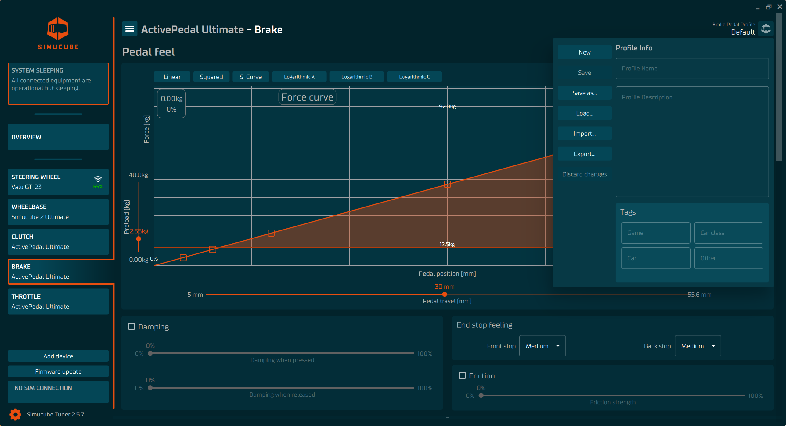
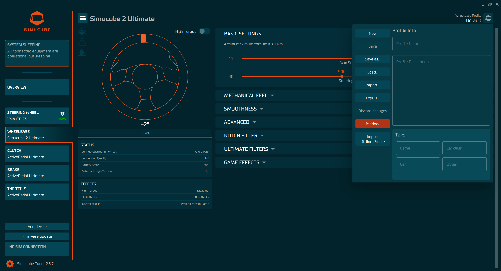

    
Tuner 2.5 contains profiles for Wheelbase and Pedal devices.

Profiles are quick and handy way to adjust parameters of your device to desired needs. Tuner contains built in default profiles, templates and even driver profiles, and creating your own profiles is also easy to do.

- Wheelbase profiles can be downloaded from **Paddock** (community-based profile sharing)
- Pedal profiles can be uploaded and downloaded from our discord server [Simucube Active Pedal Profiles](https://discord.gg/Hav8gd4U).

    :bulb: "Hamburger" menu in Overview has an option called [**Create shortcut for profiles**](Command line options.md).

Profiles have all the configurations of each device e.g. roles, force curves, travels and effects.

:warning: Tuner software will automatically preserve changes made to the active profile, and reopening the software will restore all devices to the same settings that were used previously. This doesn't modify the saved version of the profile, which is only done when Save-button is pressed or when switching to different profile and saving the changes to the previous profile when prompted. :warning:

- Unsaved changes are indicated by the orange dot over the **profile button** which can be found in top right corner of the device view or bottom button in device box in Overview.

## Modify Profiles

When wheelbase or pedal view has been opened, in top right corner is profile name and the role of the device. In case of pedals, they can be clutch, brake, throttle and handbrake.

When the button with icon is clicked, called **profile button**, the side panel will open. This side panel allows the modification of the profile name, description and tags.

- :bulb: Simucube 2 wheelbase profiles have also Paddock which provides a way to download various profiles made by the community.

### Tags

User can add tags which describe the profile and allow searching and categorizing profiles. Tags can be added either by pressing a section of Tags and selecting corresponding tag or by searching tags from tag categories by starting to write the name of a tag in the input field.

When a new tag is added to the profile, the related tags are also added automatically. For example, adding car class tag "Formula 1" will automatically also add "Open wheel" tag. 

Tags can be removed by clicking the red X that appears on the tag when hovered with the cursor.

### Tag categories

- Game
- Car class
- Car
- Other

## Buttons

### General
- **New**: creates a profile based on the defaulted values.
- **Save**: overwrites the current profile with the changes.
- **Save as**: creates a new profile based on the current profile.
- **Load**: Load a profile from a profile catalog which is saved on a computer. Loading is done by double-clicking profile.
- **Import**: Import a profile to local profile catalog.
- **Export**: Export a profile to a separate file for sharing.
- **Discard changes**: Resets the profile to when it was last saved.

### Simucube 2
- **Paddock**: opens a dialog which contains community made profiles for Simucube 2 wheelbases.
    - Only download is currently available true Tuner.
    - If you would like to upload Simucube 2 profiles to Paddock, use Simucube True Drive Software to do so.
- **Import offline profiles**: Lets you choose a profile you would like to import from Simucube True Drive software.
    - This needs to be done with one profile at the time.
        - Alternatively, if you would like to import all your offline profiles from True Drive to Tuner you can go to the folder where your True Drive profiles are (usually at C:\Users\Name\Documents\Simucube 2\cachedprofiles) select all and then drag them on top of the Tuner Software window and follow the steps. 

## Templates

Templates are integrated profiles that come with the Tuner software and cannot be changed. If you want to use a template as a base for profile, then just clone it and you have a base for a new profile.

## Search and load profile

Click the LOAD button to open a profile search view. Clicking profile name or moving selection by arrow keys expands profile details and shows the description of the profile. Double click selected profile to load it. The profile is instantly applied to the device. If your currently active profile contains unsaved changed, you will be prompted to either save or discard them.

Adding filter tags allows searching profiles that are meant for the specific car types or driving styles.

