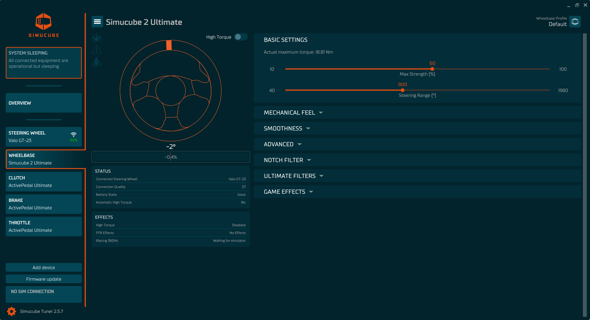
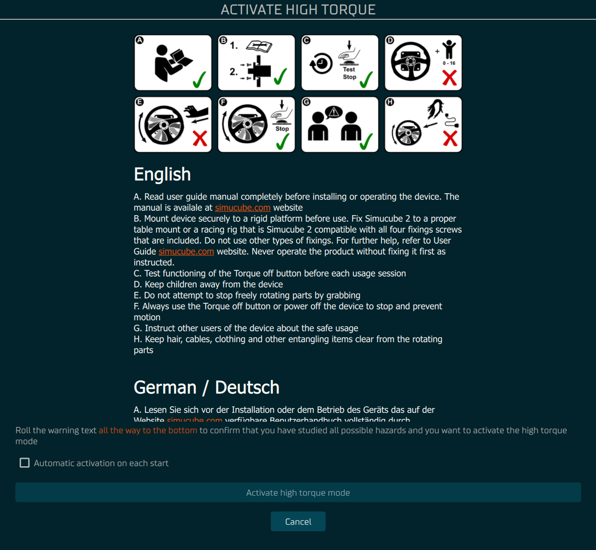

From version 2.5.0 onwards, the Tuner software supports Simucube 2 wheelbases.

Wheelbase view gives an option to change how Simucube 2 wheelbases (Ultimate, Pro, Sport) feel.

- In top left corner press "hamburger" menu to open the **Settings** or to reset the center of your steering wheel with **Reset Center** button.
- Below the "hamburger" menu is couple of icons:
    - **Power icon** = indicator if high torque mode is active.
    - **Fault icon** = indicates if there is an issue with the wheelbase.
    - **Torque-off icon** = indicates if the emergency button has been pressed.

### High Torque

- Clicking the **High Torque** toggle button, popup will appear descriping the dangers of this feature.
    - Scroll all the way down to unlock the **Activate high torque mode** button.

- You can avoid having to do this process each time you toggle the high torque mode:
    1. Scroll all the way down
    2. Tap the **Automatic activation on each start**
    3. Wait 10 seconds
    4. Tap the button again
    5. Follow popup message instructions to confirm

@Mika Ohjeita
   
    - Korvaa %% merkit ja laita otsikkoiden alle selitys mitä siinä sisältyy
    - Korvaa && merkit ja laita parametrin alle selitys mitä effekti tekee

## Basic Settings
%%
### Max Strength
&&
### Steering Range
&&

## Mechanical Feel
%%
### Damping
&&
### Friction
&&
### Inertia
&&
### Centering Force
&&

## Smoothness
%%
### Reconstruction Filter
&&
### Slew Rate Limit
&&
### Torque Bandwidth
&&

## Advanced
%%
### Static Force Reduction
&&
### Ultra Low Latency
&&
### Torque Linearity
&&
### Bumpstop Feel
&&
### Bumbstop Range
&&
### Combine accessory port with wireless wheel paddles toggle
&&

## Notch Filter
%%
### Center Frequency
&&
### Attenuation dB
&&
### Q Factor
&&

## Gamme/Ultimate Filter
%%
### Static Force Reduction Speed
&&
### Center Damping
&&
### Center Damping Angle Span
&&

## Game Effects
%%
### Damping
&&
### Friction
&&
### Spring
&&
### Sine Wave
&&
### Square Wave
&&
### Sawtooth Wave
&&
### Triangle Wave
&&