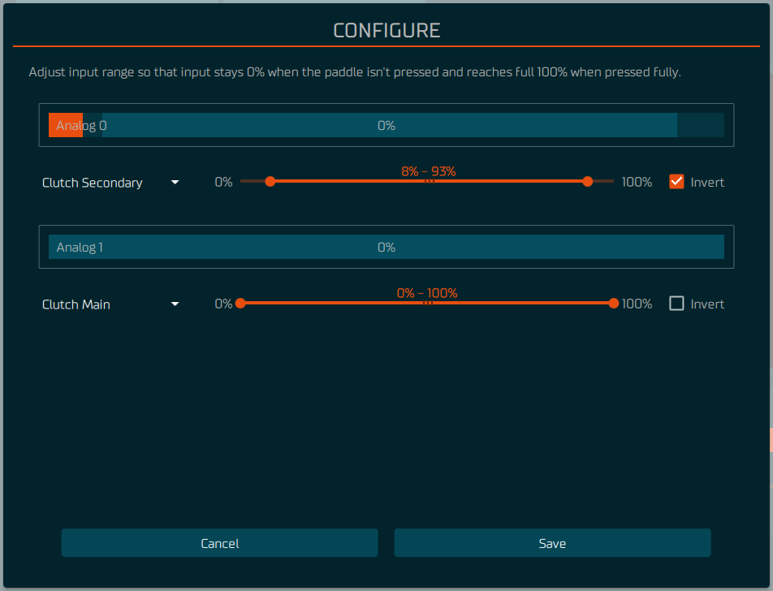
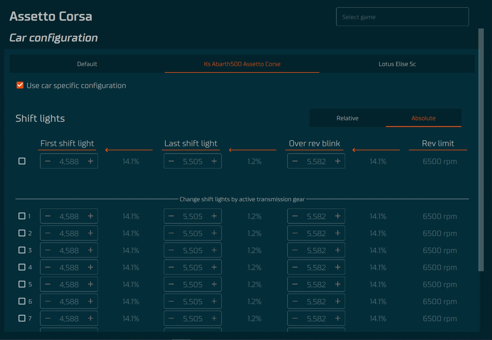

From version 2.0.0 onwards, the Tuner software Simucube supports wireless wheels trough [Simucube Link Hub](../Developers/Simucube%20Link.md#simucube-link-hub).

## Getting started

### Connect a new wheel

1. Press **Add device** button
2. Select **Wireless wheel** from list
3. Turn on the wheel
4. Select the wheel from the list and press **Connect** button

## Manage Connections menu
### Open Manage Connections menu
1. Select Wireless Wheel from the device list
2. Press **Configure** button

### Disconnect a wheel
1. From the wheel config menu press **Disconnect** button
2. Turn off the wheel

### Forget a connected wheel
1. From the wheel config menu press **Forget** button on the row of the wheel you want to forget

## Configure menu
### Open Configure menu
1. Select Wireless Wheel from the device list
2. Press **Configure** button

### Calibrate analog paddles
- Follow the instructions on the screen and adjust the maximum and minimum values of the analog paddles
so that in the end the resting position the output is 0% and when the paddle is fully pressed the output is 100%

### Change analog paddles function
- Select the desired function for each analog paddle from the drop-down menu

## Input configuration
### Open Input tab
1. Select Wireless Wheel from the device list
2. Select **Input** tab from the top of the wheel preview

### Bite point adjustment
- Use the slider labeled **Adjust Bite Point** to adjust the bite point
    - this will adjust max value of the secondary axis.
    - Test the bite point by pressing the analog paddles

## LED config
### Open LED config tab
1. Select Wireless Wheel from the device list
2. Select **LED** tab from the top of the wheel preview 

### Adjust LED brightness
- Use the slider labeled **LED Brightness** to adjust the brightness of the LEDs

### Select LED Profile
- Select the desired LED profile from the **LED Brightness** drop-down menu

### Test Telemetry effects
   - Press a **Test** button next to the effect you want to test
   - The effect will be displayed on the wheel LEDs

## Car configuration menu
### Open Car configuration menu
- Select **SIMULATOR CONNECTED** from the bottom of the left side menu

### Select game
- The game that is currently running will be automatically selected, 
but you can also adjust settings for other games by selecting them from the **Select game** drop-down menu in the top right corner

### Selecting a car profile
- If the game you are playing offers the car name through the telemetry, the current car will be automatically added as a tab to the car configuration menu.
  - 5 previously used cars will be displayed.
  - Check the **Use car specific profile** checkbox to use a car specific profile
  - If the game does not offer the car name through the telemetry or **Use car specific profile** is not checked the **Default** car will be used.

### RPM range values
#### First sift light
RPM value for when the first shift light turns on.
#### Last shift light
RPM value for when the last shift light turns on.
#### Over rev blink
RPM value for when the blinking starts.
#### Engine rev limit RPM or Rev limit  
RPM value for the maximum RPM of the car.

### Adjusting RPM range values
- If the game you are playing offers the car rpm range through the telemetry, the RPM values are ignored and can not be adjusted. 
  To adjust the RPM range, you need to unselect the **Use car specific profile** checkbox and adjust values in the Default car profile.
- The RPM range can be specified as **Relative** or **Absolute**.
  - **Relative** means that the RPM range values are relative to the **Engine rev limit RPM** and set as percentages between the different RPM values.
  - **Absolute** means that the RPM range values set as RPM values.
  - If desired, the RPM ranges can be adjusted separately for each gear using the table in section **Change shift lights by active transmission gear**.
