From version 2.0.0 onwards, the Tuner software Simucube supports wireless steering wheels through [Simucube Link Hub](../Developers/Simucube%20Link.md#simucube-link-hub).

## Getting started

### Connect a new wheel

1. Press **Add device** button

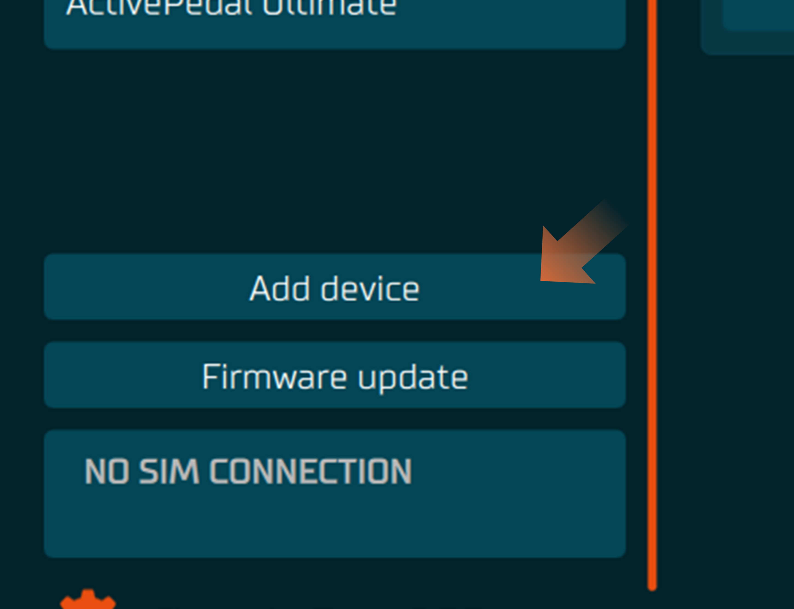

2. Select **Wireless wheel** from list
3. Turn on the wheel

## Manage Connections menu
### Open Manage Connections menu
1. Select Steering Wheel from the device list in overview or in left side panel
2. In top left corner press "hamburger" menu which will open the list of option and press **Manage Connections** button

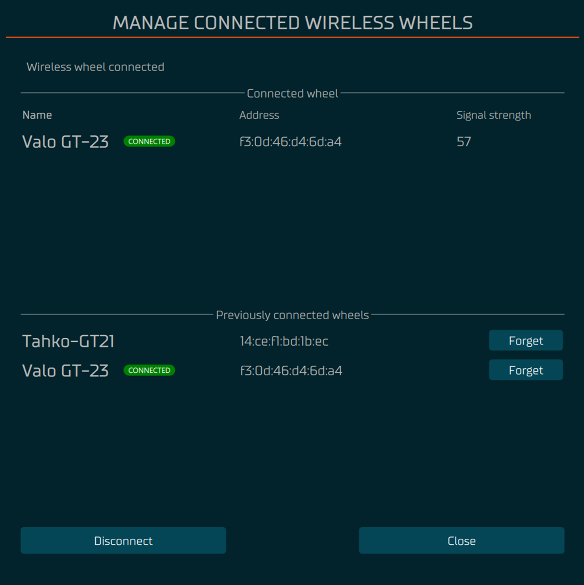

### Disconnect a wheel
1. From the wheel config menu press **Disconnect** button
2. Turn off the wheel

### Forget a connected wheel
1. From the wheel config menu press **Forget** button on the row of the wheel you want to forget

## Configure menu
### Open Configure menu
1. Select Steering Wheel from the device list in overview or in left side panel
2. In top left corner press "hamburger" menu which will open the list of option and press **Configure Wheel** button

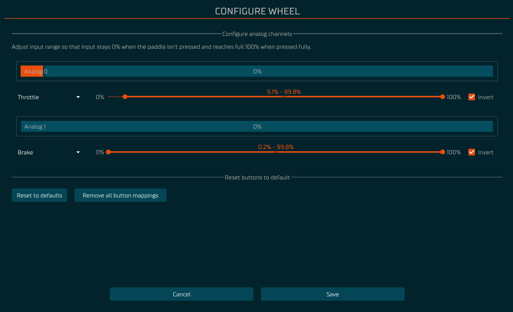

### Calibrate analog paddles
- Follow the instructions on the screen and adjust the maximum and minimum values of the analog paddles
so that in the end the resting position the output is 0% and when the paddle is fully pressed the output is 100%

### Change analog paddles function
- Select the desired function for each analog paddle from the drop-down menu

### Bite point adjustment
- Use the slider labeled **Adjust Bite Point** to adjust the bite point
    - this will adjust max value of the secondary axis.
    - Test the bite point by pressing the analog paddles

## Input
### Open Input tab
1. Select Steering Wheel from the device list in overview or in left side panel
2. In top left corner under the ”hamburger" menu is a tab called "**Input**". Usually when you open the steering wheel this tab is automatically selected.

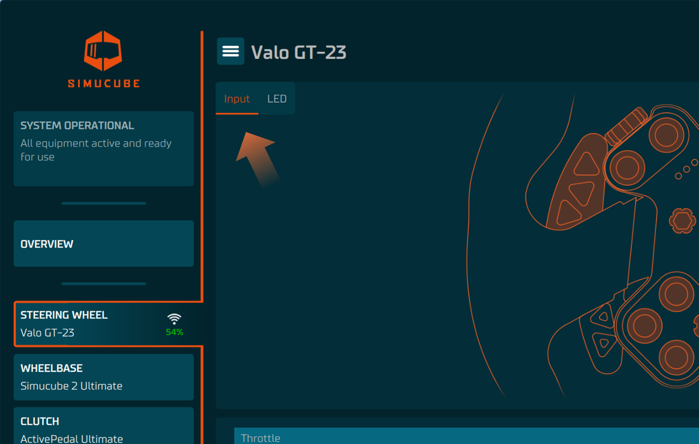

### Remap buttons

By pressing any highlighted part of the steering wheel image, submenu will appear. Here, you can change your button to function however you like based on the labels.

:bulb: **CW** = clockwise, **CCW** = counter clockwise

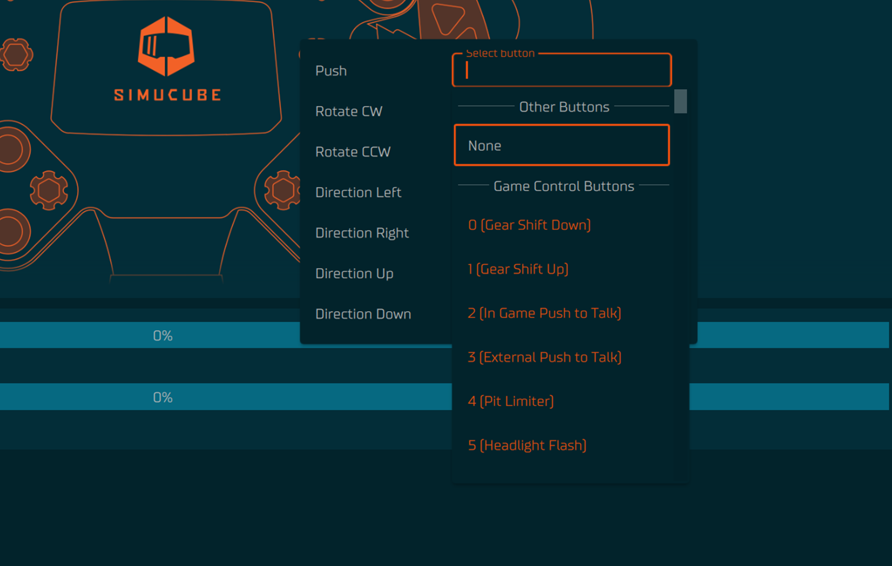

- If you see yellow color over a button, it means that the 

### Configure Button Labels

Button labels are useful for users who have multiple steering wheels. Button labels can be changed, added or deleted which will take affect also for other steering wheels, reducing the repetitive action of labeling all steering wheels from the scratch.

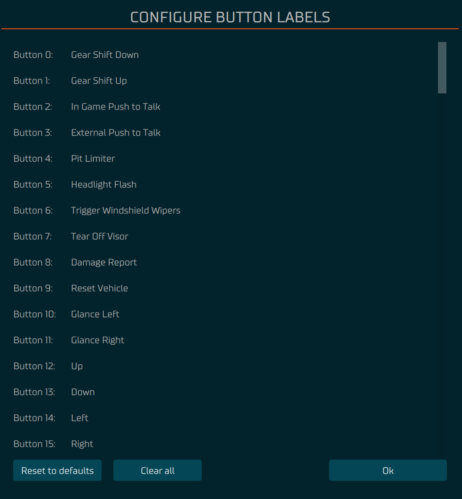

Colors and their meaning:

- Orange = has already been used
- Gray = Has not been used in anything

## LED
### Open LED config tab
1. Select Steering Wheel from the device list in overview or in left side panel
2. In top left corner under the ”hamburger" menu is a tab called "**LED**". Select the tab.

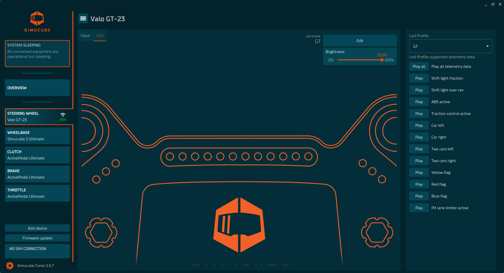

### Adjust LED brightness
- Use the slider labeled **LED Brightness** to adjust the brightness of the LEDs

### Select LED Profile
- In top right corner of the LED tab view, you may select the desired LED profile from the drop-down menu.

### Test Telemetry effects
   - Press a **Test** button next to the effect you want to test
   - The effect will be displayed on the wheel LEDs

### Edit LED profile
- Pressing the "**Edit**" button above the Brightness slider will give you an option to edit the LED profile that you chose.

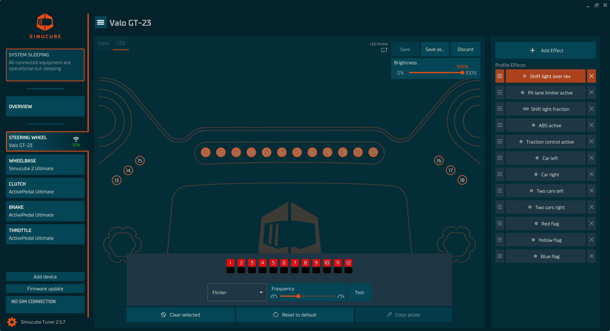

:bulb: Template profiles cannot be saved over, but they can be saved as new.

- In top right corner there is a button "Add Effect" which allows you to add new effect.
    - If there is already same type of effect, the other effects will be shown with dimmed down highlight color to help with visualization.

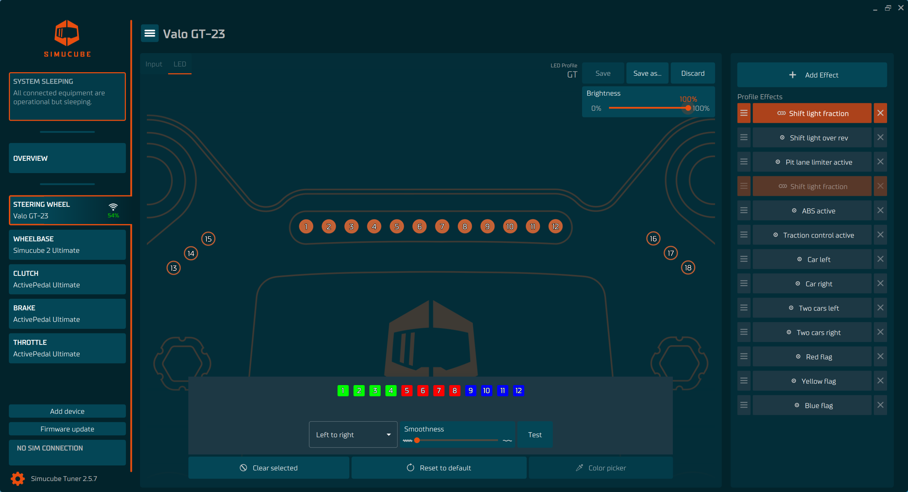

- The right-side panel is effect list and is in hierarchical order starting from the top.
    - Click any of the effects to select it, it will become highlighted with orange color.
    - Click and hold three (3) lines to move the effect up or down.
    - X on the right-side area will delete the effect from the list.

- Icon with three (3) hollowed circles indicate a ramping effect
- Icon with circle and dot in middle indicates non-ramping effect

### Editing LED colors ###

1. Select the LED(s) you would like to change from the image, by clicking the LED location area. 
    - Selected LEDs will appear at the bottom panel.
2. In the bottom panel you can now click the square. The square is divided into two parts, top and bottom (depending on the effect) and you can select them. 
    - When you select, a white indicator will tell you that that part of the LED has been selected.
3. Choose a color picker and pick the color you like.
    - Make sure you have color not selected as black, since darker color you choose, more dimmer it appears.
4. For visualization, press test button. 

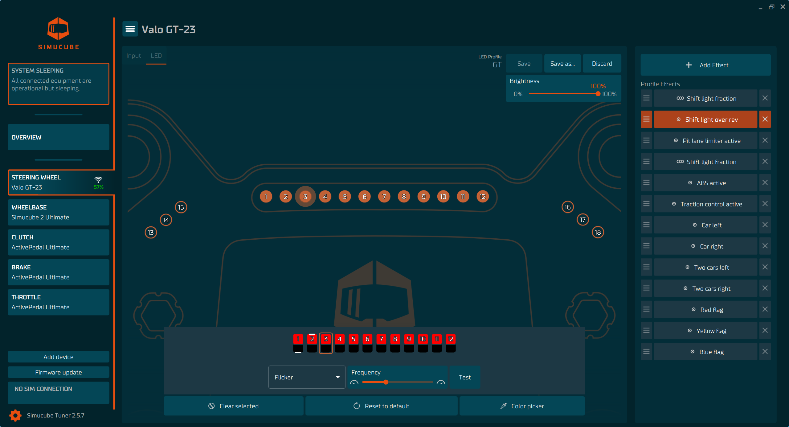

- Drop down menu next to the slider will give you an option how would you like to animate your effect.
- Slider gives frequency and smoothness options for the animations based on the animation type.
- "**Clear selected**" button removes all the selected LEDs giving you a clean slate.
- "**Reset to default**" changes to default parameters that the effect has.

:bulb: Non-ramping effects tend to have multi color option per led, unless led is chosen to be static.

Each LED can be used in up to eight (8) different effects and you can see which effect the LED has by hovering over the LED.

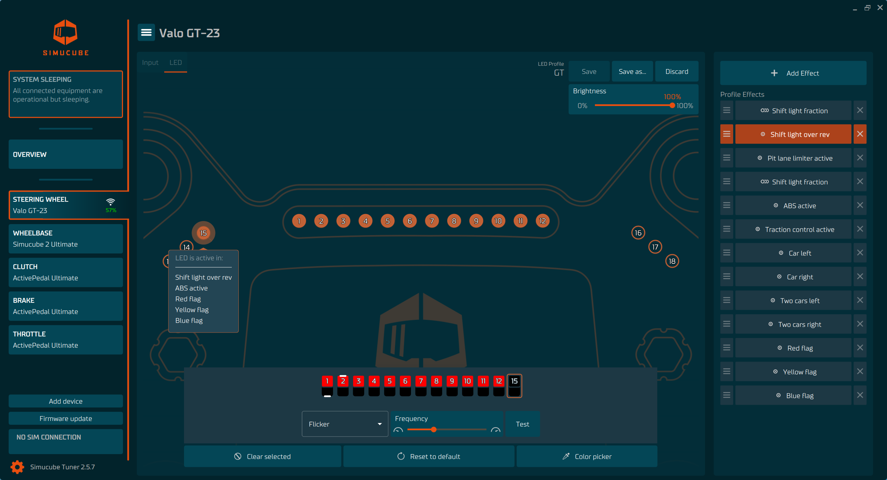

## Car configuration menu
### Open Car configuration menu
- Select **SIMULATOR CONNECTED** from the bottom of the left side menu

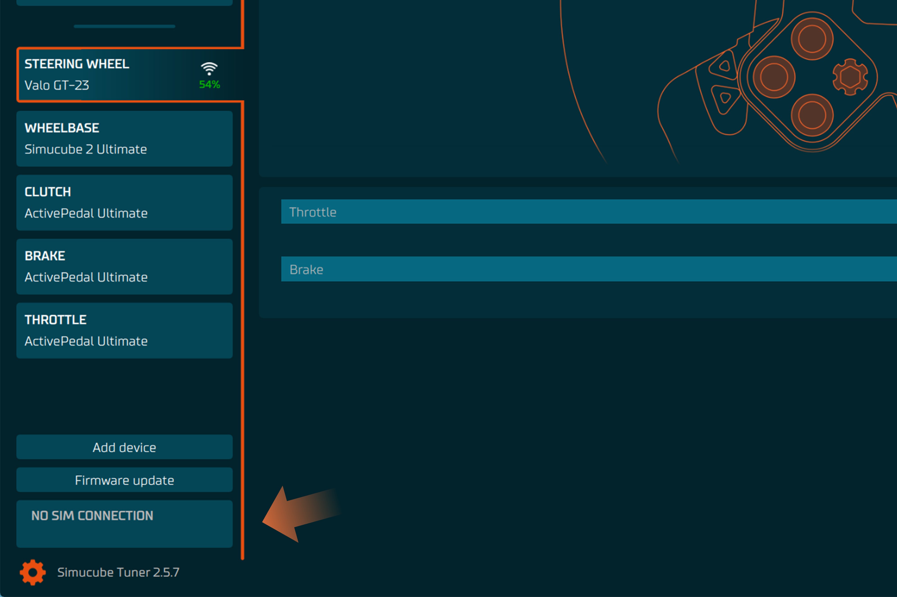

### Select game
- The game that is currently running will be automatically selected, 
but you can also adjust settings for other games by selecting them from the **Select game** drop-down menu in the top right corner

### Selecting a car profile
- If the game you are playing offers the car name through the telemetry, the current car will be automatically added as a tab to the car configuration menu.
  - 5 previously used cars will be displayed.
  - Check the **Use car specific profile** checkbox to use a car specific profile
  - If the game does not offer the car name through the telemetry or **Use car specific profile** is not checked the **Default** car will be used.

### RPM range values
#### First shift light
RPM value for when the first shift light turns on.
#### Last shift light
RPM value for when the last shift light turns on.
#### Over rev blink
RPM value for when the blinking starts.
#### Engine rev limit RPM or Rev limit  
RPM value for the maximum RPM of the car.

### Adjusting RPM range values
- If the game you are playing offers the car rpm range through the telemetry, the RPM values are ignored and cannot be adjusted. 
  To adjust the RPM range, you need to unselect the **Use car specific profile** checkbox and adjust values in the Default car profile.
- The RPM range can be specified as **Relative** or **Absolute**.
  - **Relative** means that the RPM range values are relative to the **Engine rev limit RPM** and set as percentages between the different RPM values.
  - **Absolute** means that the RPM range values set as RPM values.
  - If desired, the RPM ranges can be adjusted separately for each gear using the table in section **Change shift lights by active transmission gear**.

