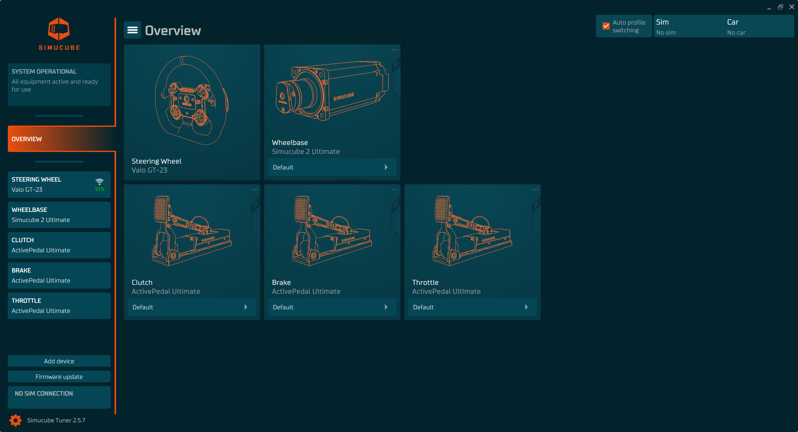

# Simucube Tuner

Tuner is the configuration sofware tool for Simucube Link based devices, such as ActivePedal, wireless steering wheels and simucube 2 wheelbases.

## Download

[:material-download-circle: Simucube Tuner](https://simucubetunerdownloads.s3.eu-west-1.amazonaws.com/SimucubeTunerSetup.exe) (latest release)

## User guides

[Using Tuner with ActivePedal](../ActivePedal/Software/First%20use.md)

## Chat with developers

Exchange your ideas with Tuner developers on Simucube Discord channel - [join now](https://discord.gg/simucube).