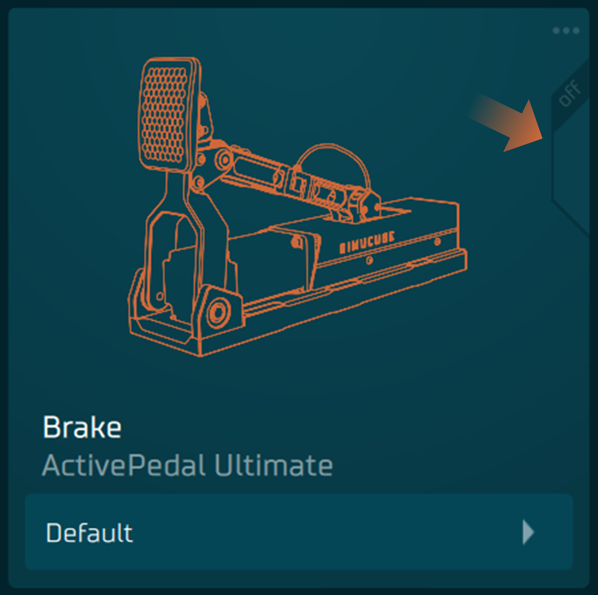

# Overview

Overview shows currently active devices and also which profile is selected for each device.

- Clicking any of the device boxes will open up that device's indepth view where all the parameters are available for readjustment.
- If the button at the bottom of the device box is clicked, it will instead open all the profiles available for that specific device.

E.g. 
Brake device will show only brake profiles.
Throttle device will show only throttle profiles
etc.

In left top corner is "hamburger" menu which enables profile imports and also shortcut export. Shortcut export is designed to work with Stream Decks and if users have their own other profile swithing methods.  Once exported, the file will be created from current devices setup.

Top right corner in other hand has and Automatic Profile Switch. Automatic Profile Switch enables users, like name suggest, to switch profiles automatically when specific simulator and car is being used. 

## How automatic profile switching works:

- Launch simulator session.
- Tuner will detect which car and simulator you are using. It will also remember the previously used car after sim is closed. This is shown in top right corner of Overview

- If you want to use the currently selected profiles for the currently or previously used car, then click the vertical slider in the device box in Overview. **Check the image below.**

If you click ••• near the vertical slider, you can also select some profile to be a sim specific default so that when used vehicle doesn't have a profile selected, then that sim specific default will be used instead.

Next time you launch the sim  with the same car, Tuner will check do you have the same profiles active and if not it will try to switch them to match your selections.

If you have unsaved changes in your current profiles, Tuner will prompt you to choose what you want to do.

You can enable or disable the switching by "Auto profile switching" checkbox. Even if the switching is disabled, you can still use you can still mark profiles for automatic switching by clicking sliders next to device boxes. 

Tuner is the configuration sofware tool for Simucube Link based devices, such as ActivePedal, wireless steering wheels and simucube 2 wheelbases.