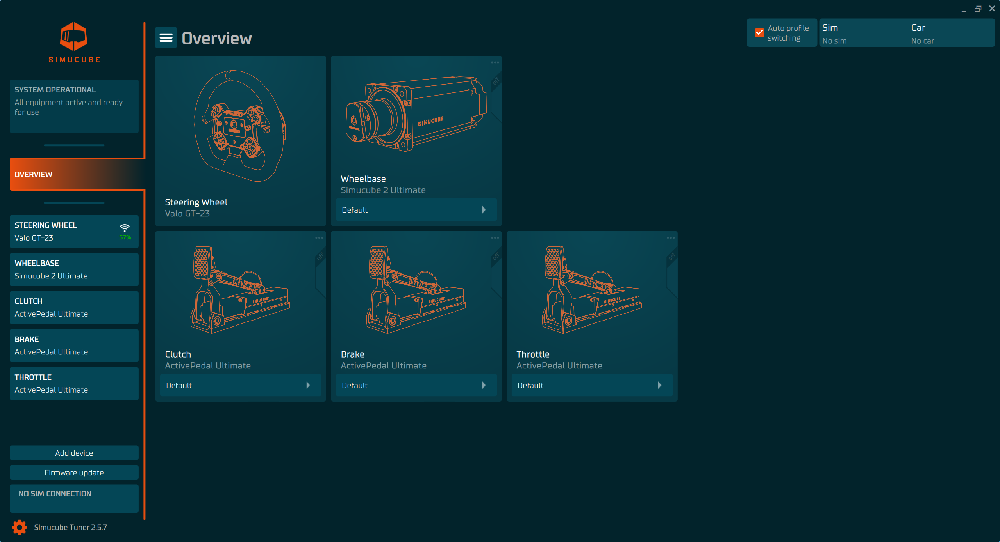

# Overview

Overview shows currently active devices, and which profile is selected for each device. [**Automatic Profile Switching**](#APS) is also controlled in this view.

## Selecting profiles
Clicking any of the device boxes will open that device's in-depth view where all the parameters are available for readjustment.

If the button at the bottom of the device box is clicked, it will instead open all the profiles available for that specific device.

Orange dot above this button indicates that the profile has unsaved changes.

E.g. 
Brake device will show only brake profiles.
Throttle device will show only throttle profiles
etc.

##  Automatic Profile Switching 

Top right corner shows the status of Automatic Profile Switching. This feature enables users, like name suggest, to switch profiles automatically when specific simulator and car is being used. 

Automatic Profile Switching works when you launch simulator session. Tuner will detect which car and simulator you are using. It will also remember the previously used car after sim is closed. This is shown in the top right corner panel in Overview. 

### Making a simulator and vehicle mapping
If you want to use the currently selected profiles for the currently or previously used car, then click the vertical slider in the device box in Overview. **Check the image below.**

Even if the simulator is closed, you are able to make the profile mapping on this previous simulator and vehicle detection.

Next time you launch the sim with the same car, Tuner will check if you have the same profiles active and if not, it will try to switch all device profiles to the ones selected.

### Making a sim specific default mapping
If you click ••• near the vertical slider, you can also select the profile to be a sim specific default so that when used vehicle doesn't have a profile selected, or simulator does not support detection of vehicle, then that sim specific default profile will be used instead.

### Unsaved changes?
If you have unsaved changes in your current profiles, Tuner will prompt you to choose what you want to do before switching the profiles, to avoid losing unsaved changes in your current profiles.

### Main switch for automatic profile switching
You can enable or disable the switching by "Auto profile switching" checkbox on the top right. Even if the switching is disabled, you can still mark profiles for automatic switching by clicking sliders next to device boxes.

## Useful tools for working with profiles

In left top corner is "hamburger" menu which enables profile imports ( from files) and "Create shortcut for profiles...". Shortcut export is designed to work if user has their own other profile switching method.  Once exported, a shortcut file will be created from current selection of profiles. These profiles will be set to be used when user then double click this shortcut in Windows and Tuner does not ask to save changes to the possibly unsaved profiles.