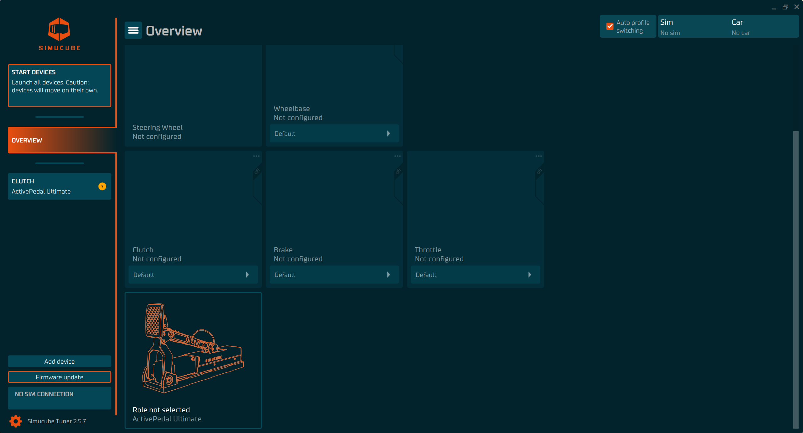
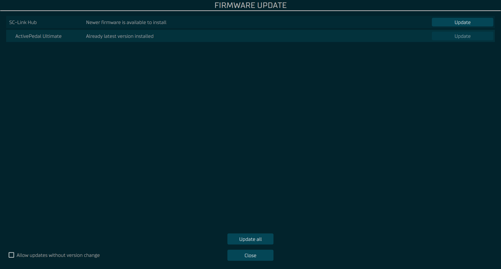
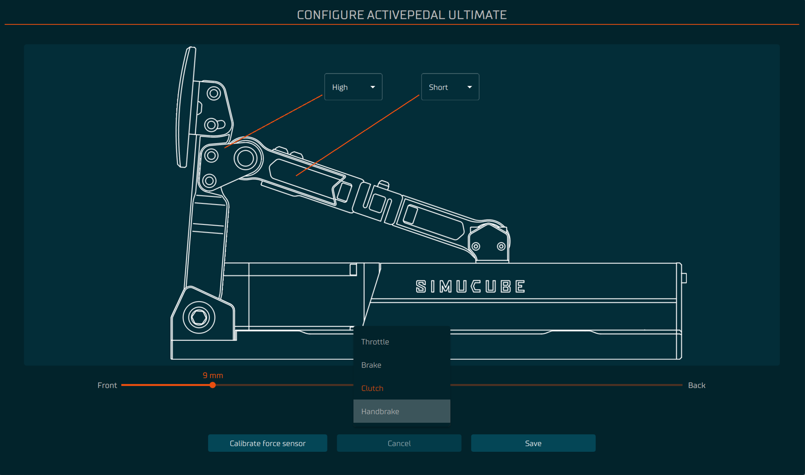
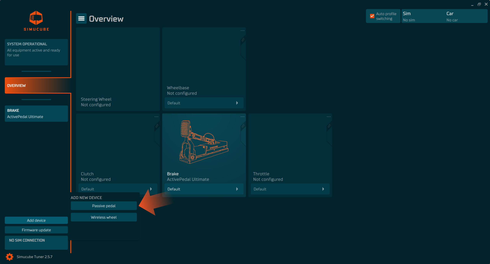
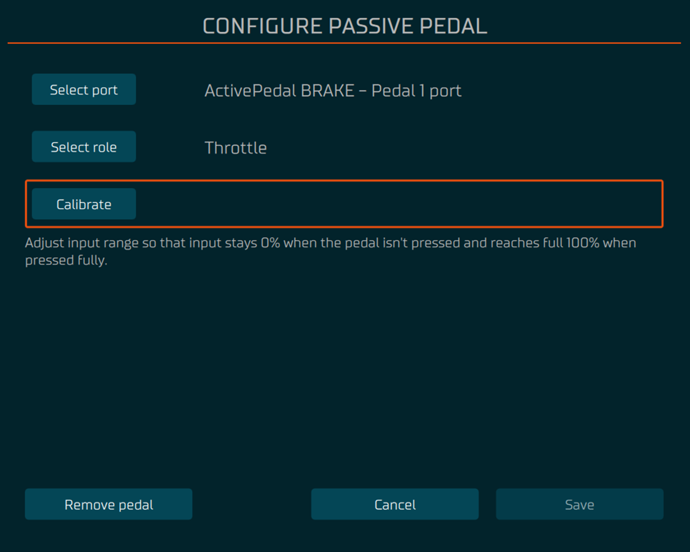
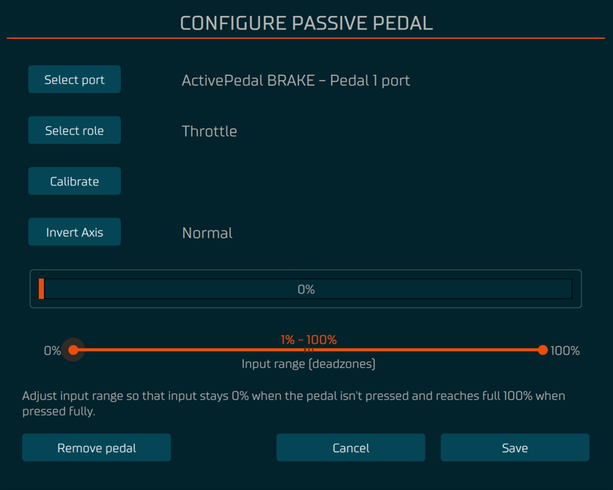
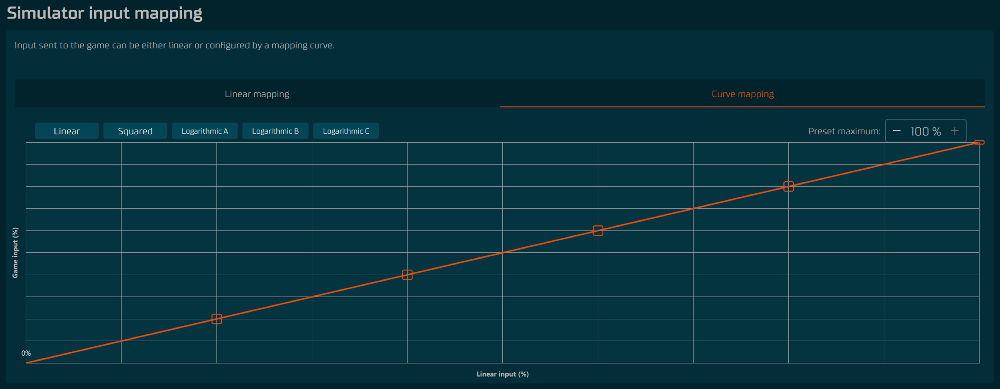

# Pedals

In Tuner you may control two (2) types of pedals: Active and Passive.

- Active Pedals give you real control to adjust the feeling to your liking via force curve adjustment, damping, endstop, effects and **Simulator Input Mapping**.

- Passive Pedals give you limited amount of options, mainly focusing on how the game receives the telemetry data with **Simulator Input Mapping**.

## First Time Setup

### Setting up the Active Pedal
1. When a pedal device has been connected it will appear at the bottom of the Overview device list.
2. Always remember to update the firmware, it will be highlighted with orange colored border if there is any updates available.
3. When you click the device bos in the overview which has "Role not selected" it will open up the configuration of that device.
    - Once the device has been started you may select the role. For safety reasons please pay attention to the instructions provided.

### Setting up the passive pedal

1. In the left bottom corner is a button **Add device**. By clicking the button a passive pedal can be added. 
    - Make sure the passive pedal is connected to Active Pedal.
2. Select the right port where you have attacked the cable from passive pedal to Active Pedal
3. Select the role
4. Press calibrate and follow the instruction provided
    - You may change the deadzones after calibration to your liking

## Simulator Input Mapping

Simulator input mapping is conversion from **measured input** of the device to **reported input** to the simulator. 

**Linear Mapping** will send the **measured input** straight to simulator based on the deadzones.
By default measured load-cell value or position of the pedal is transformed directly to simulator input taking into account the deadzones.

- For example, if high deadzone is at 70kg and low deadzone is at 10kg, then in this case under 10kg simulator input is always 0% and above 70kg is 100%. 50% game input would be 40kg in this example.

**Curve mapping** allows changing the mapping to be non-linear. Curve represents conversion from linear to the **reported input** to simulator.

- Curve mapping can be adjusted by pressing any of the **presets** in top left corner of the curve (Linear, Squared, Logarithmic A-C) or by manually adjusting the curve when dragging the small squares on top of the orange line to desired location.
- **Preset maximum** which is located in the top right corner of the curve, will adjust the **reported input** to the simulator. Follow the step below to make it work correctly:
    1. Add the value
    2. Click the presets (Linear, Squared, Logarithmic A-C)
    3. (Optional) adjust the curve to your liking.
 

