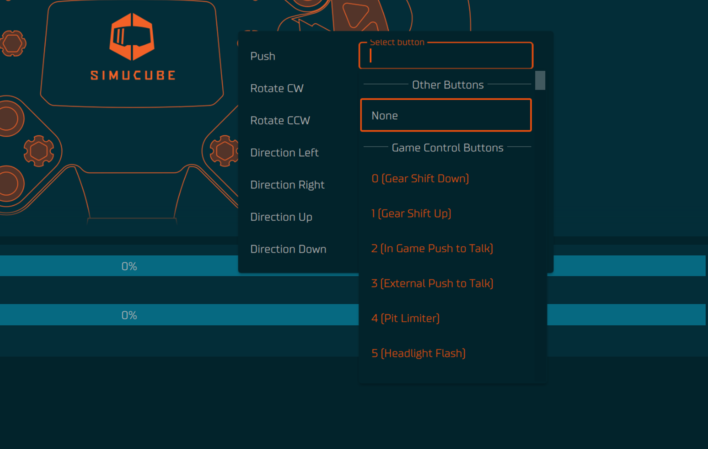

## Input
### Open Input tab
1. Select Steering Wheel from the device list in overview or in left side panel
2. In top left corner under the  "hamburger" menu is a tab called "**Input**". Usually when you open the steering wheel this tab is automatically selected.

### Remap buttons

By pressing any highlighted part of the steering wheel image, submenu will appear. Here, you can change your button to function however you like based on the assaigned labels.

:bulb: **CW** = clockwise, **CCW** = counter clockwise

### Configure Button Labels

Button labels are useful for users who have multiple steering wheels. Button labels can be changed, added or deleted and will affect also other steering wheels — reducing the repative action of labeling all steering wheels from the scratch.

:bulb: Colors and their meaning:

- Orange = has already been used
- Gray = Has not been used in anything

You may encouter an issue which is highlighted in the **Input** tab as yellow color on a button. This is an indication that the label isn't configured.

- To fix this, please make sure that you have assigned a label in **Configure Button Labels** window through the "hamburger" menu in top left corner.
- Or remap the button to some other label.

