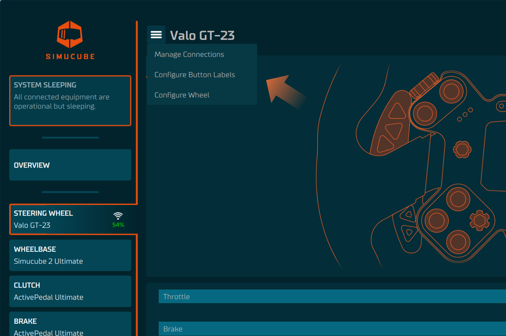
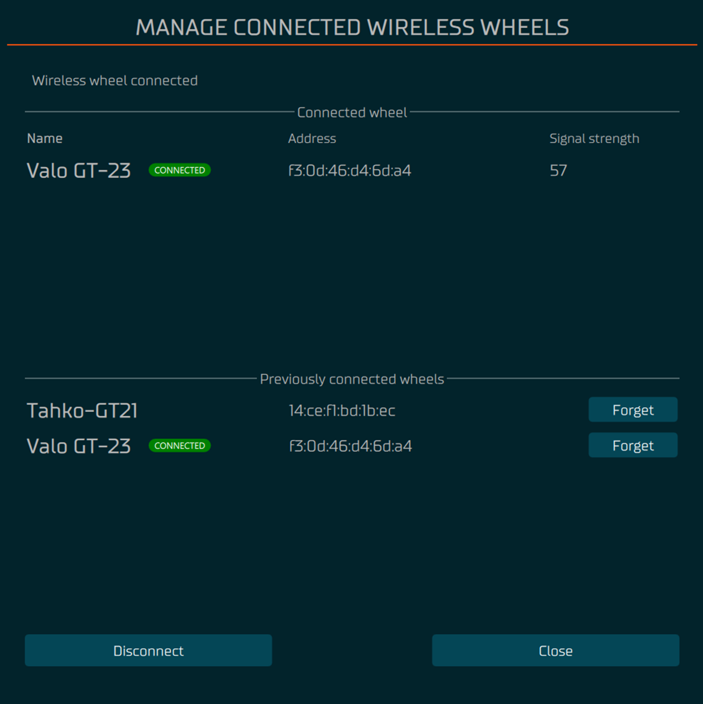

# Steering Wheel

From version 2.0.0 onwards, the Tuner software Simucube supports wireless steering wheels through [Simucube Link Hub](../Developers/Simucube%20Link.md#simucube-link-hub).

## Getting started

### Connect a new wheel

1. Press **Add device** button

2. Select **Wireless wheel** from list
3. Turn on the wheel

---

## Manage Connections menu
### Open Manage Connections menu
1. Select Steering Wheel from the device list in overview or in left side panel
2. In top left corner press "hamburger" menu which will open up the list of option and press **Manage Connections** button

### Disconnect a wheel
1. From the wheel config menu press **Disconnect** button
2. Turn off the wheel

### Forget a connected wheel
1. From the wheel config menu press **Forget** button on the row of the wheel you want to forget

---

## Configure menu
### Open Configure menu
1. Select Steering Wheel from the device list in overview or in left side panel
2. In top left corner press "hamburger" menu which will open up the list of option and press **Configure Wheel** button

### Calibrate analog paddles
- Follow the instructions on the screen and adjust the maximum and minimum values of the analog paddles
so that in the end the resting position the output is 0% and when the paddle is fully pressed the output is 100%

### Change analog paddles function
- Select the desired function for each analog paddle from the drop-down menu

### Bite point adjustment
- Use the slider labeled **Adjust Bite Point** to adjust the bite point
    - this will adjust max value of the secondary axis.
    - Test the bite point by pressing the analog paddles
