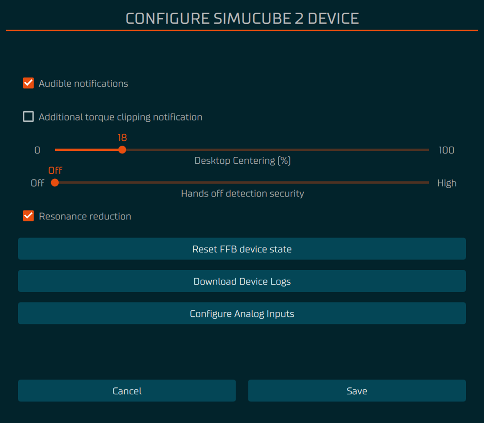

Wheelbase configure view allows to set some parameters that are typically not adjusted for each simulator.

### Audible notifications

Some audible notifications can be turned off with this setting. However no device safety related audible notifications such as high torque mode beeps are affected.

### Additional torque clipping notification

This setting allows to make the device give an audible notification whenever maximum torque is requested. This is useful to detect clipping (torque saturation) in simulators that do not have a visible in-simulator indicator for torque clipping. Typically clipping is to be avoided in normal driving conditions, and if you experience clipping, the in-simulator torque should be reduced and the maximum strength in FFB settings increased.

### Desktop centering spring

This adds a centering spring effect to the wheel. The setting only has effect when no simulator is running and there are no FFB effects. This can be useful if there is a simulator or a game that does not have FFB at all.

### Hands-off detection sensitivity

This setting controls how easily the wheel base will return into safe torque mode if driver lets go of the steering wheel. Wheel base returns to high torque mode again when hands are detected on the wheel.

### Resonance reduction

This sets a wheel base internal filter to cut off some frequencies that are known to audibly resonate some wheels, causing an unwanted constant faint beep type of tone from the combined wheel base + wheel system.

### Reset FFB device state

This button can be used to reset the internal FFB effect memory, 360 Hz data rate mode, and simulator-set steering angle. These can be left on the device if e.g. simulator or Windows has crashed but wheel base has stayed powered on.

### Download device logs

This downloads wheel base internal device state change logs. Logs have maximum of 1000 events, and are not saved. The log starts from the wheel base's latest startup.

### Configure analog inputs

This opens a window where the analog inputs from Simucube 2 Accessory Port can be configured and calibrated.

