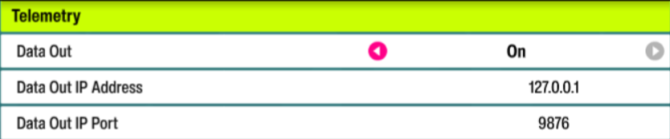

# Forza Horizon 6

## Setup

Telemetry needs to be enabled in-game from the settings menu for telemetry effects to work. Navigate to **SETTINGS > HUD & Gameplay > Telemetry** header and set:

1. Data Out: **ON**
2. Data Out IP Address: **127.0.0.1**
3. Data Out IP Port: **9876**

## FAQ

### Direct input FFB is not working
Please make sure that your FFB game controller is on the first controller ID in Windows, since otherwise FFB will not work properly out of the box. Some community solutions can work around this by modifying the input mapping file of the game, which may help if you can't get your device to be the first controller ID.

Note that the Steam version of the game is the preferred version for FFB compatibility, and other versions of the game might not work as expected.