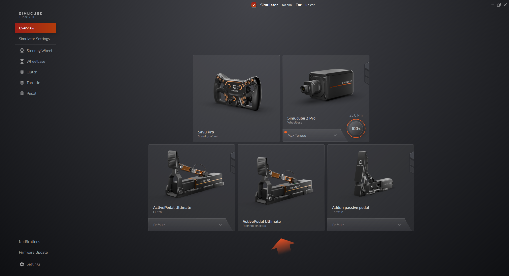

# Pedal Configuration View

In Tuner you may control two (2) types of pedals: Active and Passive.

- Active Pedals give you real control to adjust the feeling to your liking via force curve adjustment, damping, endstop, effects and **Simulator Input Mapping**.

- Passive Pedals give you limited amount of options, mainly focusing on how the game receives the telemetry data with **Simulator Input Mapping**.

## First Time Setup

### Setting up the Active Pedal
1. When a new pedal device has been connected it will appear at the Overview device selection with no role selected into a first available slot.
2. Update the firmware, there will be a notification to help you to get to right place. You can find the firmware window in the bottom left corner of Tuner Software called "Firmware Update".
3. When you click the device box in the overview which has "Role not selected" it will open up the configuration of that device.

!!! Warning "Pay Attention"
    Once the device has been started you may select the role. For safety reasons please pay attention to the instructions provided

### Setting up the passive pedal

1. To add a passive pedal, connected it to the Active Pedal ports and it will automatically appear in the device list or in the Overview device selection, and notification will appear asking you to configure the passive pedal.
2. Click the configuration button from notification 
3. Select the role for the passive pedal
4. Press calibrate and follow the instructions provided
5. If necessary, change the deadzones after calibration

!!! Tip "Add Device Button in Settings"
    If the passive pedal hasn't appeared in device list or in device selector in the Overview, you can add manually the passive pedal from the settings and under general tab. 

    You can also quickly remove pedals from here
    

## Simulator Input Mapping

Simulator input mapping is conversion from **measured input** of the device to **reported input** to the simulator. 

**Linear Mapping** will send the **measured input** straight to simulator based on the deadzones.
By default measured load-cell value or position of the pedal is transformed directly to simulator input taking into account the deadzones.

- For example, if high deadzone is at 70kg and low deadzone is at 10kg, then in this case under 10kg simulator input is always 0% and above 70kg is 100%. 50% game input would be 40kg in this example.

**Curve mapping** allows changing the mapping to be non-linear. Curve represents conversion from linear to the **reported input** to simulator.

- Curve mapping can be adjusted by pressing any of the **presets** in top left corner of the curve (Linear, Squared, Logarithmic A-C) or by manually adjusting the curve when dragging the small squares on top of the orange line to desired location.
- **Preset maximum** which is located in the top right corner of the curve, will adjust the **reported input** to the simulator. Follow the step below to make it work correctly:
    1. Add the value
    2. Click the presets (Linear, Squared, Logarithmic A-C)
    3. (Optional) adjust the curve to your liking.
 

