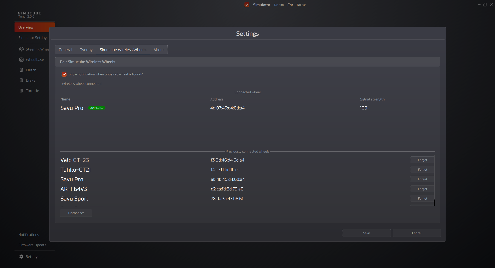
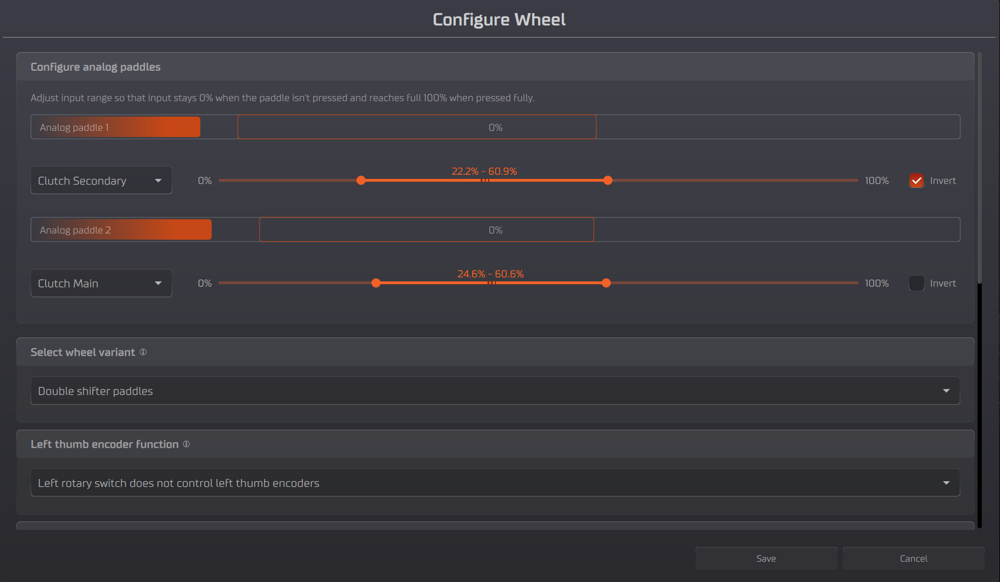

# Steering Wheel Configuration View

From version 3.0.0 onwards, the Tuner software will automatically connect wireless steering wheels through [Simucube Link Hub](../../Developers/Simucube%20Link.md#simucube-link-hub).

## Getting started

### Connect a new wireless wheel

1. Turn on the device
2. Wheel will be connected automatically and appear in both left side Main Navigator and also in the Overview in its own section.

!!! info "Managing the wireless steering wheel connections"
    Open the settings from the bottom left corner and go to the manage connectons. Here you can forget and switch between existing connections.

### Connect a steering wheel with Simucube 3 Quick Release

1. Attach a supported steering wheel to Simucube 3 Wheelbase
2. Turn on the device
3. Wheel will be connected automatically and appear in both left side Main Navigator and also in the Overview in its own section.

---

## Manage Connections menu
Wireless Steering Wheels connection manager can be found under **Settings** and "Simucube Wireless Wheels" tab.

### Disconnect a wheel
1. From the wheel config menu press **Disconnect** button in bottom left corner of thw window
2. Turn off the wheel

### Forget a connected wheel
1. From the wheel config menu press **Forget** button on the row of the wheel you want to forget

---

## Configure menu

### Open Configure Wheel
1. Select Steering Wheel from the device list in left side panel Main Navigator or from by clicking the device image in Overiview
2. In top left corner press "hamburger" menu which will open the list of option and press **Configure Wheel** button

### Calibrate analog paddles
- Follow the instructions on the screen and adjust the maximum and minimum values of the analog paddles
so that in the end the resting position the output is 0% and when the paddle is fully pressed the output is 100%

### Change analog paddles function
- Select the desired function for each analog paddle from the drop-down menu

### Bite point adjustment
- Use the slider labeled **Adjust Bite Point** to adjust the bite point
    - this will adjust max value of the secondary axis.
    - Test the bite point by pressing the analog paddles

!!! Note "Note" 
    Steering Wheel configurations may vary per device and its variation.

