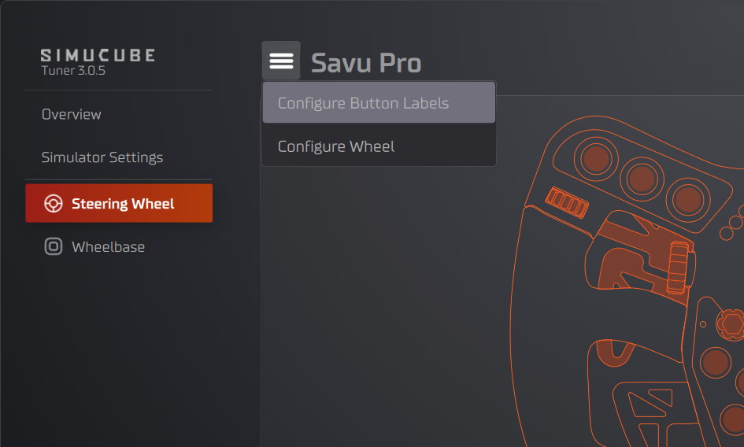
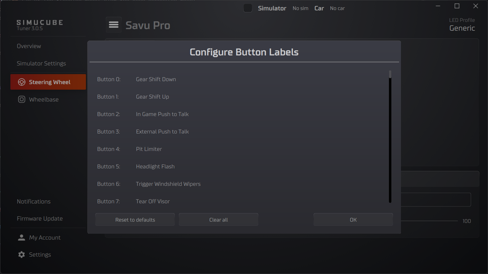
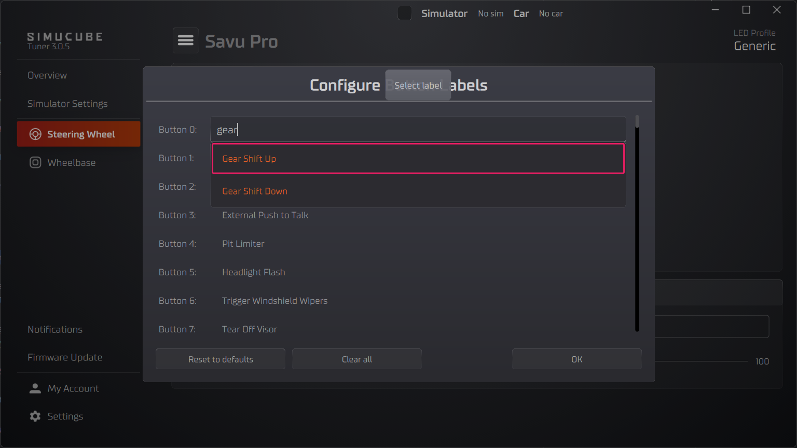
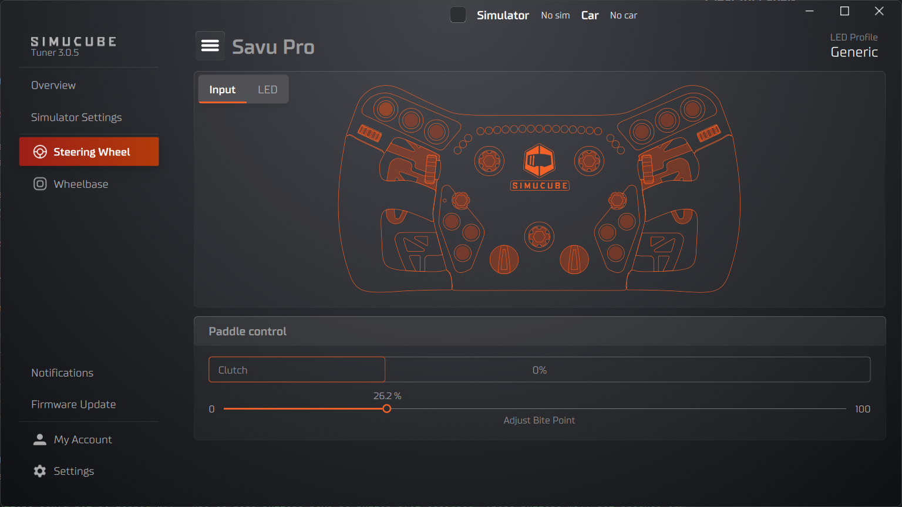
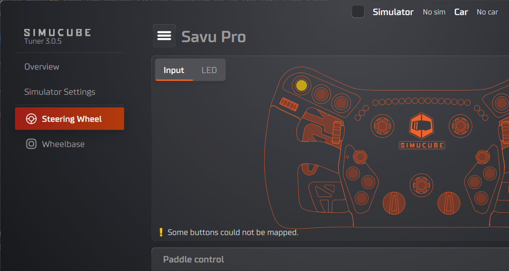
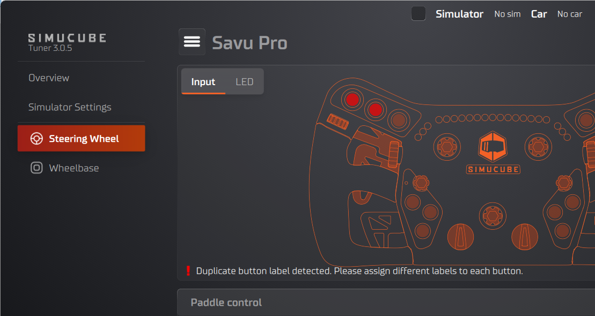
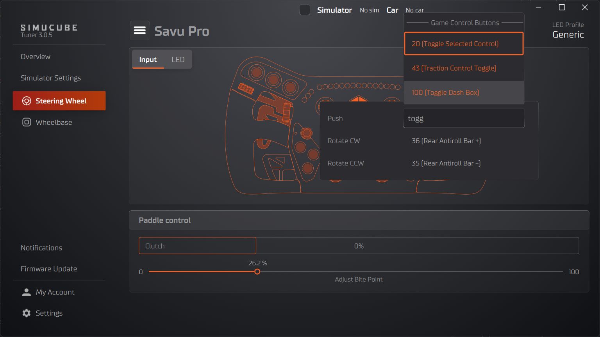
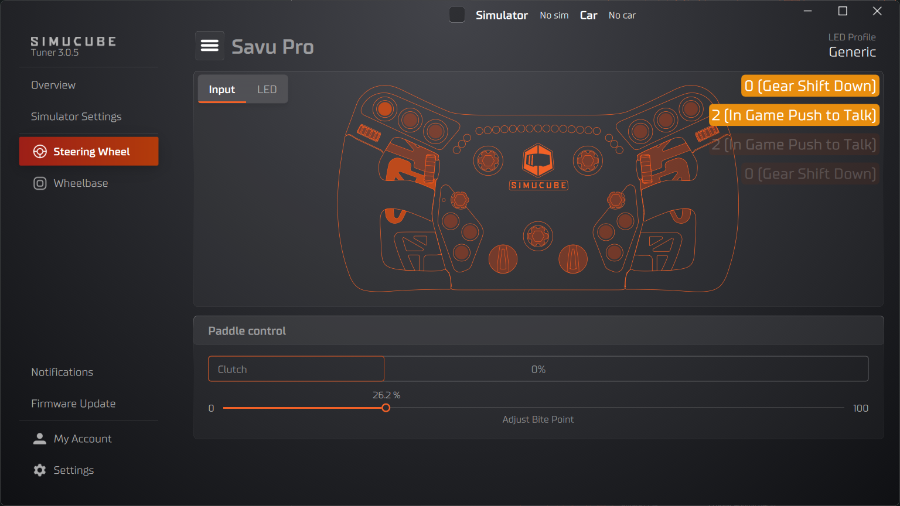

## How Button Mapping Works

The Simucube Link Hub appears to your PC as a game controller with **128 buttons** and 8 analog axes. Each button is identified only by a number (0–127) — the game has no built-in way to know what a button represents.

When you swap between wheels, each physical wheel button is automatically mapped to one of the 128 button slots. You can customize this mapping in Tuner.

Button mapping has three phases:

1. **Label the 128 button slots** — Assign meaningful labels (e.g., "DRS", "Gear Shift Up") to the Simucube Link Hub's button IDs. This labeling is **shared across all wheels**.
2. **Map physical wheel buttons to labeled slots** — For each wheel, assign which of the 128 labeled button slots each physical button activates. This mapping is **per-wheel**.
3. **Map buttons to functions in your game** — In the game's settings, bind each button to the corresponding in-game action.

The benefit of this approach: if you label button 5 as "DRS" and then map the DRS paddle on Wheel A and a different button on Wheel B both to button 5, pressing either one looks like the same button to the game. You only need to bind DRS once in the game, and it works with both wheels.

!!! info "About button labels and the Simucube Link API"
    The labels available in Tuner are predetermined — you cannot add or remove labels yourself. This is because the Simucube Link API provides the label of a pressed button along with its numerical ID, enabling games to automatically map buttons in the future. Labels are a fixed set that grows over time — new labels may be added, but existing labels will never be removed. If you need a label that isn't available yet, please let us know so we can add it.

---

## Quick Start

### Step 1: Configure Button Labels (shared across wheels)

1. Open the Steering Wheel view in Tuner
2. Click the "hamburger" menu and select **Configure Button Labels**
3. Click any button row (e.g., "Button 0") to open a searchable dropdown
4. Type to search, then select a label (e.g., "Gear Shift Up")
5. Click **OK** to save

### Step 2: Map Physical Buttons (per-wheel)

1. Open the **Input** tab of the Steering Wheel view for your connected wheel
2. Click a button on the wheel image
3. A popup appears listing the button's actions. Select which labeled button slot each action should map to.

### Step 3: Bind in Your Game

Open your game's control settings and bind each button to the corresponding in-game function.

---

## Configure Button Labels

Button labels assign meaning to the Simucube Link Hub's 128 button IDs. This configuration is **shared across all wheels** — you set it up once and it applies regardless of which wheel is connected.

### Opening the Dialog

In the Steering Wheel view, click the "hamburger" menu and select **Configure Button Labels**.

This opens a dialog where you can assign labels to the 128 button slots:

### The Button List

The dialog displays a list of 128 buttons (Button 0 through Button 127), corresponding to the Simucube Link Hub's button slots. Each row shows:

- The button number (e.g., "Button 0:")
- The currently assigned label, or "-" if no label is set

### Assigning a Label

1. Click anywhere on a button row
2. A searchable dropdown appears with all available labels
3. Type to filter the list (e.g., typing "gear" shows "Gear Shift Up" and "Gear Shift Down")
4. Click a label to assign it

### Clearing a Single Label

Hover over a button row to reveal a **Clear** button on the right side. Click it to remove the label from that button, resetting it to "-".

### Reset to Defaults

Click the **Reset to defaults** button at the bottom of the dialog. A confirmation dialog will ask you to confirm the action. Click **OK** to confirm or **Cancel** to keep your current labels.

### Clear All Labels

Click the **Clear all** button at the bottom of the dialog. A confirmation dialog will ask you to confirm the action. Click **OK** to confirm. All button labels are removed, resetting every button to "-".

---

## Map Physical Buttons

After labeling the button slots, map each physical wheel button to the appropriate labeled slot. This mapping is configured **separately for each wheel**.

### Open the Input Tab

1. Select **Steering Wheel** from the device list in overview or in the left side panel
2. In the top left corner under the "hamburger" menu is a tab called **Input**. Usually when you open the steering wheel this tab is automatically selected.

### Button Indicators

Each physical button on the wheel image is shown as a small interactive indicator. The indicator displays the button name or a short label.

Button indicator colors indicate button status:

| Button Indicator Color | Meaning |
|------------------------|---|
| Orange                 | Button is mapped normally |
| Yellow                 | Button is unmapped — it has no button slot assignment |
| Red                    | Mapping conflict — two or more physical buttons are mapped to the same button slot |

!!! warning "Button indicator colors may indicate conflicts"
    Warning messages appear below the wheel image when there are mapping issues:

    - **"Some buttons could not be mapped."** — One or more buttons have no button slot assigned. These buttons will not produce any input in games. The affected button indicators are highlighted with a yellow border.
    - **"Duplicate button label detected. Please assign different labels to each button."** — Two or more button actions are mapped to the same button slot. This causes conflicts where pressing either button activates the same input. The affected button indicators are highlighted with a red border.

### Mapping a Button

1. Click a button indicator on the wheel image. A popup opens.
2. The popup lists all actions for that physical button. A single button can have multiple actions depending on its type — for example, a rotary encoder has separate actions for clockwise and counter-clockwise rotation.
3. Each action row shows the current button slot assignment as a dropdown.
4. Click a dropdown and select a different labeled button slot to remap that action.

### Action Types

Physical buttons can have different action types depending on the hardware:

| Action Type | Description |
|---|---|
| Push | Standard push button |
| Rotate CW | Rotary encoder, clockwise rotation |
| Rotate CCW | Rotary encoder, counter-clockwise rotation |
| Direction Up / Down / Left / Right | Directional input (e.g., D-pad, funky switch) |
| Position | Multi-position switch (each position is a separate action) |

Each action maps independently to a button slot. For example, a rotary encoder occupies two slots — one for CW and one for CCW.

### Button Press Visualization

The top-right corner of the wheel image shows a live display of button activity:

- **Active buttons** appear as colored badges showing the button name or label
- **Released buttons** fade out over a few seconds, giving you a brief history of recent presses

This is useful for verifying that your mapping works correctly — press a button on the physical wheel and confirm the expected button appears in the visualization.

---

## Troubleshooting

### Button indicator is yellow (unmapped)

A yellow button indicator means the physical button has no button slot assigned. This typically happens when a wheel has more physical buttons than available slots, or after a firmware update adds new buttons.

To fix: click the button on the wheel image and assign an available button slot from the dropdown.

### Button indicator is red (conflict)

A red button indicator means two or more physical buttons are mapped to the same button slot. Pressing either physical button will produce the same input in games.

To fix: click one of the conflicting buttons and reassign it to a different, unused button slot.

### How mappings are saved

- **Button labels** are saved globally and shared across all wheels.
- **Physical button mappings** are saved per wheel automatically. Each Wheel retains its own mapping configuration. When you switch between wheels, Tuner loads the mappings for the connected wheel.

!!! info "Changing button labels may affect other wheels"
    If you change button labels and then switch to a different wheel, some buttons may appear unmapped if the per-wheel configuration references a label that has been removed. In this case, the missing label is automatically added back to the button label configuration if an empty slot is available.
