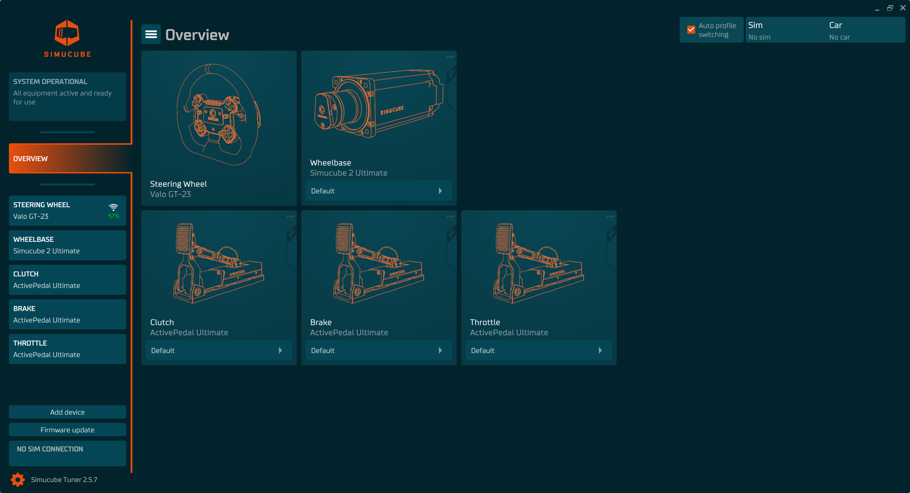

# Tuner Legacy Version

Tuner 2.5 is the configuration software for Simucube Link based devices, including Active Pedal, Simucube Throttle, wireless steering wheels, and Simucube 2 wheelbases.

!!! info "Tuner 3.0 Available"
    Tuner 3.0 is now available with support for Simucube 3 devices and an improved interface. [Learn more about Tuner 3.0 →](../index.md)
## About Tuner 2.5

Tuner 2.5 is the stable, configuration tool for:

- **Simucube 2 wheelbases**: Sport, Pro, and Ultimate
- **ActivePedal Ultimate**: Full haptic brake and clutch pedals
- **ActivePedal Pro**: Professional-grade active pedals
- **Simucube Throttle**: Active throttle pedal
- **Wireless Steering Wheels**: Simucube Link Hub connectivity

## Latest Version

[View complete changelog →](../Changelog.md)

## Quick Start Guides

- [Using Tuner with Simucube 2](../Simucube%202/Software/First%20use.md)
- [Using Tuner with ActivePedal](../ActivePedal/Software/First%20use.md)
- [Using Tuner with Simucube Throttle](../Simucube%20Throttle/setup.md)

## Community & Support

- **Discord**: Join [Simucube Discord](https://discord.gg/simucube) to chat with developers and community
- **FAQ**: [ActivePedal FAQ](../ActivePedal/FAQ.md) | [Simucube 2 Troubleshooting](../Simucube%202/simucube%202%20self%20service.md)

## Looking for Tuner 3.0?

If you have a Simucube 3 or want the latest features, check out [Tuner 3.0 documentation](../index.md).
