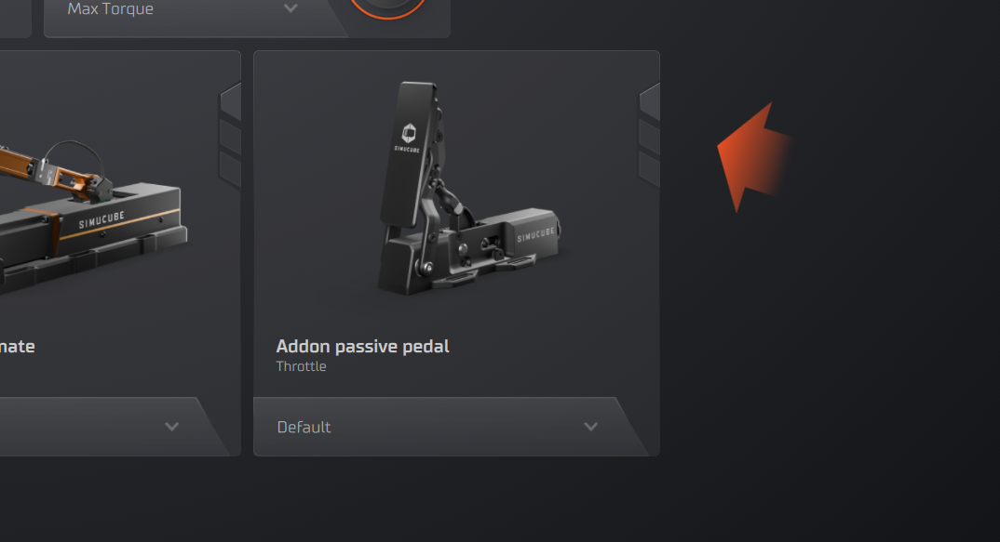
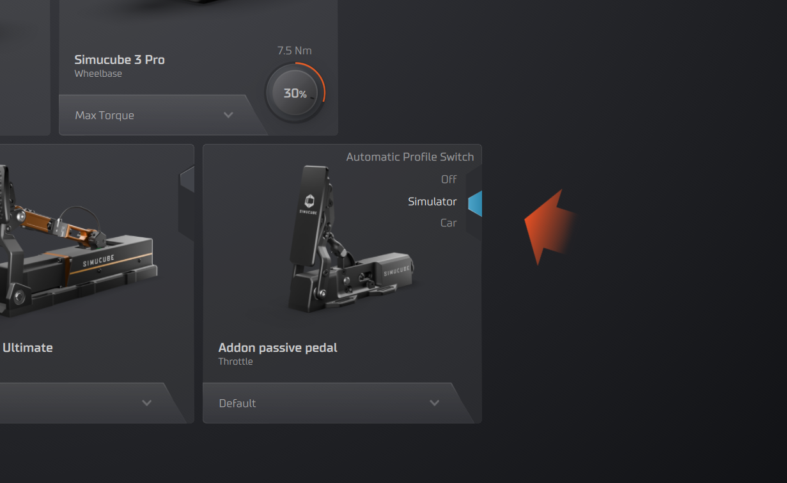

# Automatic Profile Switch

If no simulator is running, there will be 'block' preventing the automatic switch from working. 

### How It Works

1. Tuner monitors running processes
2. Detects when supported game launches
3. Matches game to profile assignments
4. Switches profile automatically
5. Reverts to default when game closes

### Use Automatic Profiles for Simulators

Start a simulator to remove the "blocks" from the vertical toggle called Automatic Profile Switch.

* If you set the Automatic Profile Switch to the middle position (cyan), the selected profile for a device will always switch to that profile when starting the same simulator.
* For another simulator, you will need to repeat this process once.
* If you don’t see a simulator listed, Tuner might not support that simulator.

### Use Automatic Profiles for Cars

Start a simulator to remove the "blocks" from the vertical toggle called Automatic Profile Switch.

* If you set the Automatic Profile Switch to the bottom position (orange), the selected profile for a device will always switch to that profile when using that car in that simulator.
* For another car, you will need to repeat this process once.  
    * If you have the same car in another simulator, due to simulator differences, the profile will not switch automatically. Instead, it will return to the “off” position.

!!! warning "Automatic Profile Overwrites"
    When switching a profile while Automatic Profile has been set, the overwrite will occur, and from that point onward, the Automatic Profiles will use the newly selected profile.

    Other overwrites may also occur in some misclick scenarios. The Tuner team will expand on Automatic Profiles in the near future to alleviate these issues.

### Supported Games

Automatic feature works with:

- All games with telemetry support
- Most popular racing simulators
- Games detected by process name

[See full list of supported games →](../games/index.md)
